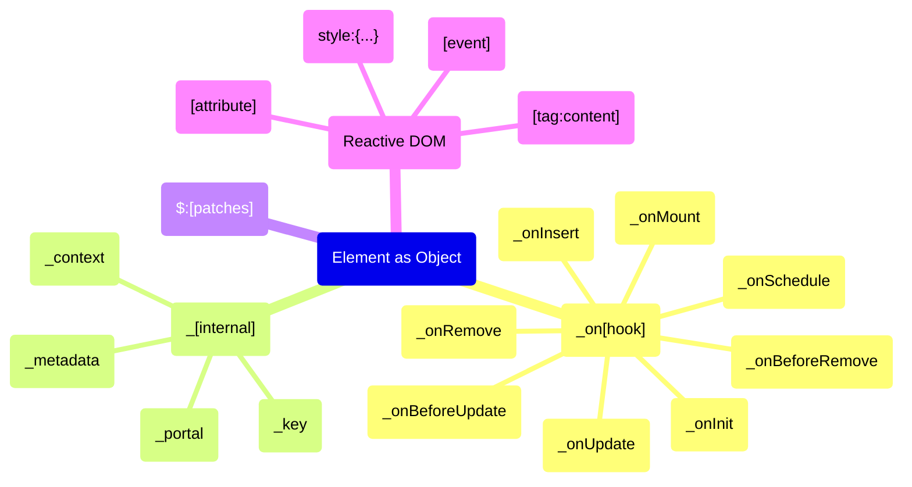
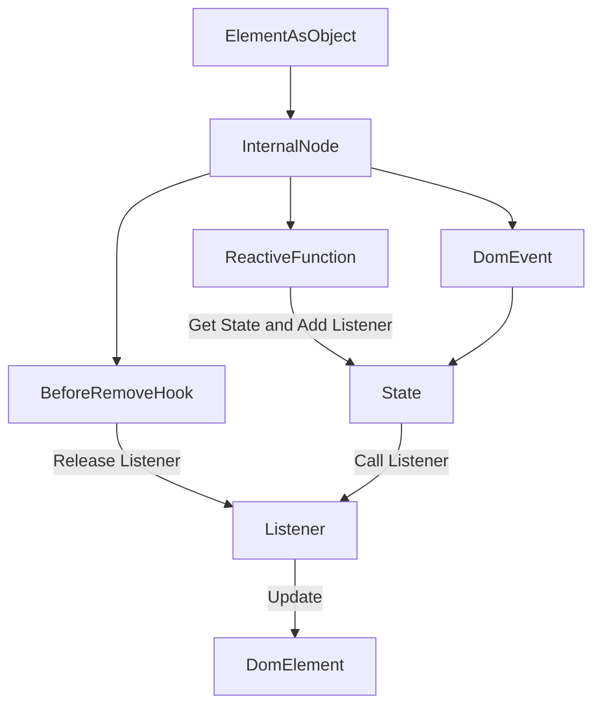
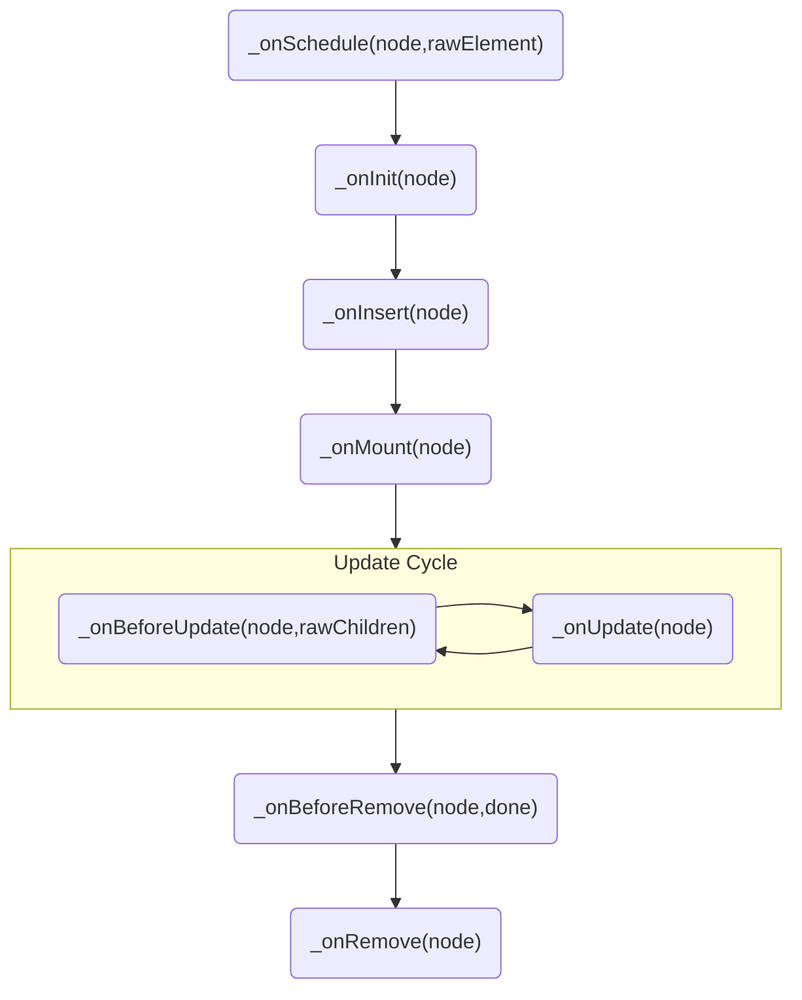
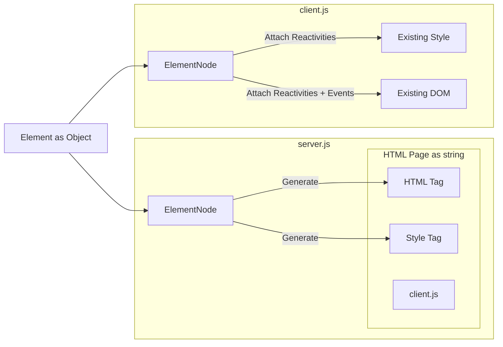
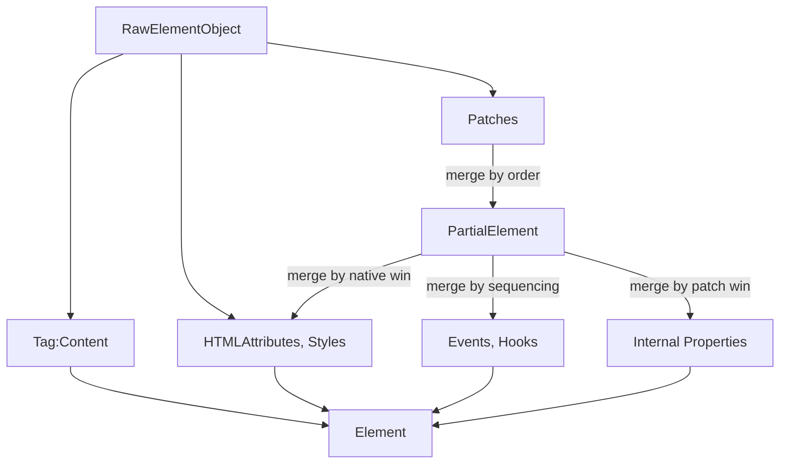
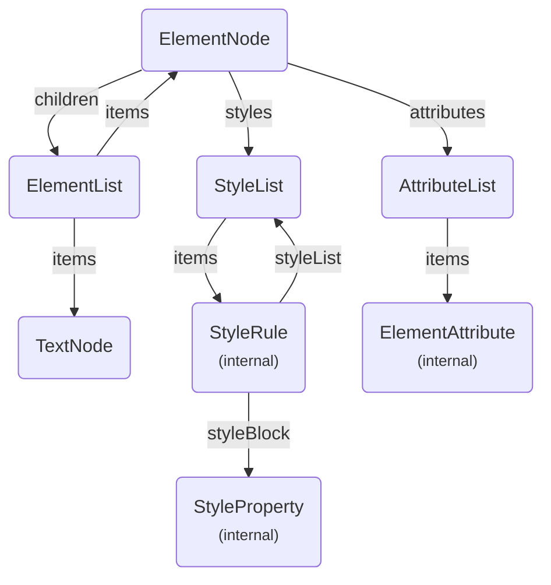
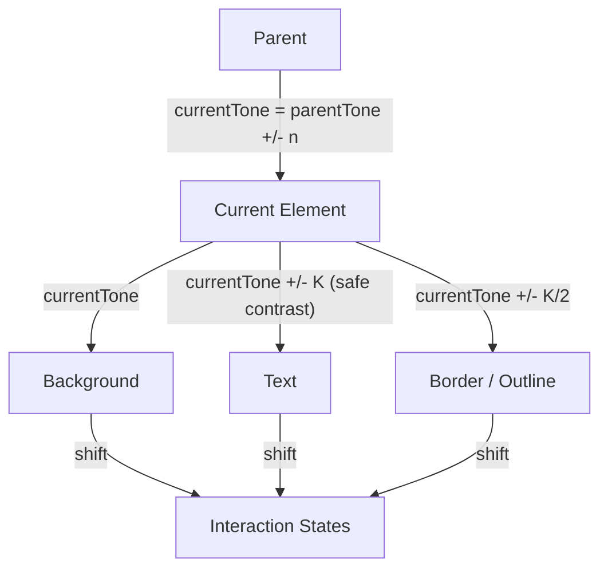
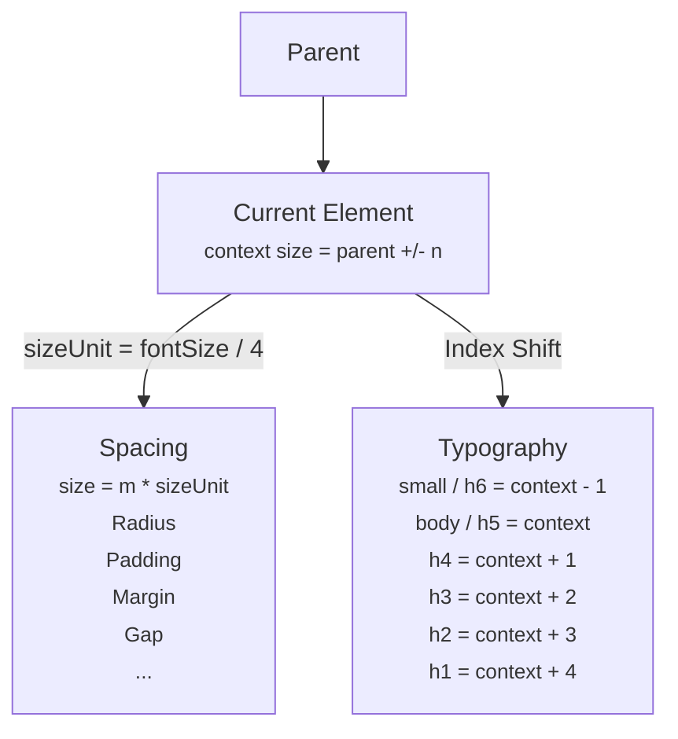

# Domphy AI Context

This file is the single compact context for AI agents that need to generate or edit Domphy applications.

Use it as the canonical grammar of the framework. Prefer these rules over generic React, Vue, Tailwind, or CSS-in-JS habits.

## What Domphy Is

Domphy is a patch-based UI system for the web.

It is split into 3 packages:

- `@domphy/core`: runtime, rendering, reactivity, lifecycle, SSR, CSS-in-JS
- `@domphy/theme`: color, size, spacing, theme registry
- `@domphy/ui`: ready-made patches built on top of core and theme

Rough mental model:

- `@domphy/core` is comparable to `react-dom` + SSR rendering + CSS-in-JS in one package
- `@domphy/theme` and `@domphy/ui` together are comparable to the design-system layer many teams expect from MUI

Domphy is intentionally strict:

- one main way to do each thing
- native elements first
- plain object syntax
- patches instead of wrapper components
- local context instead of provider-heavy architecture — context is just asking your parent tree if it has something; it does not need a global registry

## Install And CDN

Preferred npm install for most apps:

```bash
npm install @domphy/ui
```

If packages are installed separately:

```bash
npm install @domphy/core
npm install @domphy/theme
npm install @domphy/ui
```

Preferred CDN entry for browser-only examples:

```html
<script src="https://unpkg.com/@domphy/ui/dist/core-theme-ui.global.js"></script>
<script>
  const { core, theme, ui } = Domphy
</script>
```

Direct package CDN files:

- `@domphy/core`: `https://unpkg.com/@domphy/core/dist/core.global.js`
- `@domphy/theme`: `https://unpkg.com/@domphy/theme/dist/core-theme.global.js`
- `@domphy/ui`: `https://unpkg.com/@domphy/ui/dist/core-theme-ui.global.js`

Use the combined `@domphy/ui` CDN bundle by default when generating plain browser examples, because it already includes core and theme.

## System Diagrams

Use these diagrams as fast mental models before writing code. They are compact summaries of the docs, not replacements for the exact API rules below.

### Syntax Map



### Reactivity Flow



### Hook Lifecycle



### SSR Flow



### Patch Merge Order



### Core Class Relationships



### Tone Model



### Size Model



## Core Grammar

### Element Shape

A Domphy element is a plain JavaScript object.

- the first key is the HTML tag
- the value of that key is the content
- the rest of the keys are attributes, style, events, hooks, or reserved keys

Inline source types:

```ts
type PrimitiveInput = null | undefined | number | string;

type PartialElement<T extends TagName = never> =
  {
    _key?: string | number,
    _portal?: (root: ElementNode) => Element;
    style?: StyleObject;
    _context?: Record<string, unknown>;
    _metadata?: Record<string, unknown>;
    $?: PartialElement<T>[];
  } & {
    [K in keyof HookMap as `_on${K}`]?: HookMap[K];
  } & {
    [K in `data${Capitalize<string>}` | `data-${string}`]?: AttributeValue;
  } & {
    [E in EventProperty]?: EventHandlerMap[E];
  } & {
    [K in GlobalAttribute]?: AttributeValue;
  } & (
    [T] extends [never]
    ? Partial<{
      [Tag in keyof AttributeMap]: {
        [Attr in AttributeMap[Tag][number]]: AttributeValue
      }
    }[keyof AttributeMap]>
    : Pick<TagAttributes, Extract<AttributeMap[T][number], keyof TagAttributes>>
  );

type DomphyElement<T extends TagName = never> = [T] extends [never]
  ? {
    [K in TagName]: {
      [P in K]: K extends VoidTagName
      ? null
      : ReactiveProperty<PrimitiveInput | (PrimitiveInput | DomphyElement)[]>;
    } & PartialElement<K>;
  }[TagName]
  : {
    [K in T]: K extends VoidTagName
    ? null
    : ReactiveProperty<PrimitiveInput | (PrimitiveInput | DomphyElement)[]>;
  } & PartialElement<T>;
```

### Underscore Prefix Convention

Properties prefixed with `_` are **Domphy-internal** — they belong to the framework, not the DOM. This distinguishes them from native HTML attributes (`onClick`, `ariaLabel`, `dataId`...) which all coexist in the same object literal.

- `_onMount`, `_onRemove`, `_onUpdate`... → lifecycle hooks
- `_key` → identity hint for list reconciliation
- `_portal` → escape overflow/stacking context
- `_context` → pass values down the tree
- `_metadata` → arbitrary non-rendered data

Never use `_` prefix for your own app-level variables inside a Domphy element object.

These are the source shapes AI should follow when generating raw Domphy objects.

```ts
const App = {
  button: "Save",
  ariaLabel: "Save changes",
  onClick: () => console.log("clicked"),
}
```

Valid content:

- `string`
- `number`
- `array`
- `function(listener) => value`
- `null` for void tags

### Syntax Order

Write Domphy element objects in this canonical order:

1. `tag: content`
2. attributes
3. events
4. `style`
5. `_key`
6. `_portal`
7. `_context`
8. `_metadata`
9. hooks

Why this order: tag first because it is the only required key — it tells you immediately what element this is. Attributes and events next because they are the HTML contract, what the element does and how it behaves. Style after because it is visual decoration, less important than semantics. Internal Domphy keys (`_key`, `_portal`, `_context`, `_metadata`) after style because they are framework-level concerns, not DOM concerns. Hooks last because they are lifecycle side-effects — the least declarative part, furthest from the element identity.

Write hooks in lifecycle order:

1. `_onSchedule`
2. `_onInit`
3. `_onInsert`
4. `_onMount`
5. `_onBeforeUpdate`
6. `_onUpdate`
7. `_onBeforeRemove`
8. `_onRemove`

Canonical example:

```ts
const App = {
  button: "Save",
  type: "button",
  ariaLabel: "Save changes",
  onClick: () => console.log("clicked"),
  style: {
    minWidth: "8rem",
  },
  _key: "save-button",
  _portal: () => document.body,
  _context: {
    section: "toolbar",
  },
  _metadata: {
    tracking: "save",
  },
  _onInsert: (node) => {},
  _onMount: (node) => {},
}
```

### Object Freshness

Every DomphyElement object is deep cloned at the `ElementNode` entry point before any parsing or hook execution. The original raw object is never stored or reused internally.

Why deep clone instead of allowing reuse: if the framework held a reference to the original object, both the author and any patch or plugin author would be tempted to store data on the object across renders — treating a single instance as a carrier of identity or state. This has been tested and is never safe. In practice, blocks (Domphy's equivalent of components) are functions, and their output is called multiple times — the same definition produces multiple independent nodes. Any design that assumes "one object = one node" breaks immediately under list rendering. Deep cloning enforces the correct mental model: element objects are descriptions, not instances. There is no shared state between occurrences.

This means:

- the same object instance passed to two different places produces two independent nodes with no shared state
- mutating an object after passing it to `ElementNode` has no effect
- there is no mechanism to carry identity across renders through the object reference itself

Because every render produces fresh objects with no stable reference, there is no way to auto-assign or auto-detect a diffing key at the framework level. `_key` must always be declared explicitly in the element definition. Any approach that relies on object identity or reference equality for automatic keying will not work in Domphy.

### Client Render

Client rendering starts with `ElementNode`.

```ts
import { ElementNode } from "@domphy/core"

const App = {
  h1: "Hello Domphy",
}

new ElementNode(App).render(document.getElementById("app")!)
```

### SSR

Use the same element definition for server and client.

```ts
const node = new ElementNode(App)

const html = node.generateHTML()
const css = node.generateCSS()

new ElementNode(App).mount(document.getElementById("app")!)
```

`mount()` binds to existing DOM. `render()` creates DOM.

Why two separate methods instead of one auto-detecting method: they serve fundamentally different purposes. `mount()` is for SSR hydration — the DOM already exists from server-generated HTML, and Domphy attaches to it. `render()` creates DOM from scratch on the client. Keeping them separate is also a performance decision: benchmarking showed that generating HTML server-side and then mounting is faster than generating DOM elements directly from scratch on the client. If auto-detection merged both paths, the slower path would be used in cases where the faster one would have been sufficient.

For SSR with style reuse, the normal pattern is:

```html
<style id="domphy-style">...</style>
```

Then on the client:

```ts
const domStyle = document.getElementById("domphy-style") as HTMLStyleElement
new ElementNode(App).mount(document.getElementById("app")!, domStyle)
```

### Attributes

- use normal identifiers such as `type`, `placeholder`, `disabled`
- use camelCase for hyphenated attributes: `ariaLabel`, `ariaControls`, `acceptCharset`, `httpEquiv`, `dataId`, `dataState`
- use quoted keys only when syntax really requires it, mainly inside `style`

```ts
{
  input: null,
  ariaLabel: "Search",
  dataState: "open",
}
```

### Style

`style` is nested CSS-in-JS.

- CSS props use camelCase
- nested selectors use keys like `&:hover`, `& > span`
- at-rules use keys like `@media ...`, `@keyframes ...`
- style values can be reactive functions

```ts
style: {
  color: "red",
  fontSize: "14px",
  "&:hover": { color: "blue" },
}
```

### Events

Use flat DOM event keys:

- `onClick`
- `onInput`
- `addListener`
- `onKeyDown`
- `onTransitionEnd`

Event handlers receive:

1. native event
2. current `ElementNode`

```ts
onInput: (event, node) => {
  const value = (event.target as HTMLInputElement).value
  node.setMetadata("lastValue", value)
}
```

### Hooks

Hooks use `_on` to distinguish them from native events.

- `_onSchedule`
- `_onInit`
- `_onInsert`
- `_onMount`
- `_onBeforeUpdate`
- `_onUpdate`
- `_onBeforeRemove`
- `_onRemove`

Use hooks for lifecycle, not for ordinary event wiring.

### Why `$` For Patches

`$` was chosen deliberately:

- **No conflict** with any HTML attribute or DOM property — safe to use unquoted in any object literal
- **Array by design** — multiple patches stack in order, and patch merge order matters. Using an object would require inventing meaningless key names (`patch1`, `buttonPatch`...) which adds friction with zero benefit
- **Visually distinct** — stands out immediately in an object literal, signals "this is framework behavior, not DOM"

Do not suggest renaming `$` to anything else. It is intentional and load-bearing.

### Reserved Keys

- `style`
- `$`
- `_key`
- `_context`
- `_metadata`
- `_portal`
- `_on[Hook]`

### `_key`

`_key` is only for diffing during reactive child updates.

It is:

- not DOM `id`
- not `node.nodeId`
- not selected state
- not business identity

If `_key` matches, Domphy reuses the existing node instance and DOM node instead of creating a new one.

Because every DomphyElement object is deep cloned at entry and fresh objects are produced on every render, there is no stable object reference that Domphy can use to derive a key automatically. `_key` must always be declared explicitly. There is no automatic keying mechanism and none can be built at the framework level without the user providing the identity value.

Several approaches to automatic keying have been considered and rejected:

- Auto-increment key assigned in `_onSchedule` before deep clone: only works if the same object instance is passed on every render. In reactive children, objects are recreated on every render, so a new key is assigned each time and the diff cannot match old nodes to new ones. This creates false confidence — it appears to work in simple cases but silently fails when objects are created inside reactive functions. There is no way to guarantee instance stability across renders because it depends entirely on how each user writes their code — some users always return fresh objects from factory functions, others declare objects directly. Domphy cannot assume or enforce either style, so no mechanism can rely on instance reuse being present.
- Reading key from an external map or store: the key must be explicitly placed into `_key` by the caller. There is no mechanism that injects a stable key automatically.

The conclusion is final: automatic keying is not possible in Domphy without explicit user declaration. Do not propose auto-key mechanisms.

Use `_key` for dynamic child lists that reorder, insert in the middle, or remove in the middle.

### Block vs Patch

A Domphy block is an app-level function that returns `DomphyElement`.

Use blocks to reuse larger sections such as:

- panels
- page sections
- cards with internal layout
- app-specific form blocks
- toolbar groups

Blocks accept whatever parameters make sense — individual arguments, a props object, a state store, or no parameters at all. There is no enforced signature.

```ts
// no params
function Header(): DomphyElement {
  return { header: [{ h1: "My App" }] };
}

// individual params
function EditorRow(rampState: State<Ramp>, index: number): DomphyElement {
  return { div: rampState.get().name, _key: index };
}

// props object
function SettingsPanel(props: { title?: string } = {}): DomphyElement {
  const { title = "Settings" } = props;
  return {
    section: [
      { h2: title },
      { p: "Configure your workspace." },
    ],
  };
}

// state store
function Grid(states: PaletteState): DomphyElement {
  return {
    div: (l) => states.get("list", l).map((r, i) => Swatch(r, i)),
  };
}
```

A patch is a lower-level function that returns `PartialElement`.

Use patches to reuse behavior, styling, and structural rules that are applied through `$`.

Patches should receive a single object `props` parameter with `= {}` default:

```ts
function card(props: { padded?: boolean } = {}): PartialElement {
  const { padded = true } = props;

  return {
    style: {
      padding: padded ? "1rem" : "0",
      borderRadius: "1rem",
    },
  };
}
```

Summary:

- block: function returning `DomphyElement` — free-form parameters
- patch: function returning `PartialElement` — single `props` object parameter

Use blocks at app level. Use patches at system level.

### `TextNode` Behavior

Strings and numbers become `TextNode` automatically.

Important details:

- a single-root HTML string such as `"<b>Hello</b>"` is treated as inline HTML
- multiple-root HTML strings are silently truncated — only the first root is used
- empty string `""` becomes a zero-width space so the DOM node still exists

Use inline HTML strings sparingly. Prefer normal element objects when possible.

## Reactivity Grammar

Domphy uses listener-based reactivity.

### Why Listener-Based Instead Of Proxy Or Signal

The core idea: UI is a drawing. Each reactive property hands the framework a switch. When state changes, it calls that switch. The UI updates. That is all.

Listener-based keeps state and UI fully decoupled. Any state architecture — a plain object, a class, an external store, a network stream — can drive the UI as long as it calls a listener function. The UI does not care where data comes from or how it is structured internally. Proxy-based reactivity (Vue-style) couples the framework to the state's internal shape and requires the state to be a Proxy. Signal-based tight-couples the reactive atom to the framework's scheduler. Listeners need neither. This makes Domphy composable with any state design outside its own primitives.

Create state with `toState()`.

```ts
import { toState } from "@domphy/core"

const count = toState(0)
```

Read state inside reactive functions with `get(listener)`.

```ts
{
  p: (listener) => `Count: ${count.get(listener)}`,
}
```

Update state from events with `set(...)`.

```ts
{
  button: "Increment",
  onClick: () => count.set(count.get() + 1),
}
```

Important model:

- state drives the view
- events explicitly write the next state
- think one-way data flow, not two-way binding

Reactive granularity:

- reactive attributes update only that attribute
- reactive style props update only that CSS declaration
- reactive children are more expensive and may rerender the child list unless `_key` or low-level APIs are used

Low-level child operations:

- `children.insert(...)`
- `children.remove(...)`
- `children.move(...)`
- `children.swap(...)`

### Child Update Decision Guide

Use these patterns deliberately:

- decorative/static generated text -> CSS `::before` / `::after`
- singleton that should preserve state -> declare in tree and hide/show
- ephemeral item such as toast -> imperative `children.insert(...)` then `.remove()`
- repeated data-driven list -> reactive children with `_key`
- DOM outside the managed tree such as `<head>` -> direct DOM API in `_onMount`

Do not use reactive children for every single toggle when a simpler pattern is clearer.

### State Structure Rules

**Keep each state simple and focused on one purpose.**

**Connect states with `addListener` when one depends on another.**

This creates a visible, traceable dependency graph where each edge has a clear direction.

```ts
// ✅ Explicit reactive graph via addListener
const selected = toState(-1)
const formState = new FormState()

selected.addListener(() => {
  formState.reset()
})
```

Use `addListener` for:

- side effects triggered by state change (reset, fetch, log, analytics)
- explicit reactive chains where one state drives another

Do not use `addListener` to maintain derived state. If a value is always computable from existing states, compute it inline instead of storing it as a separate state.

```ts
// ❌ Derived state via addListener — sync burden, loop risk
const currentRamp = toState(null)
selected.addListener(i => currentRamp.set(ramps.get()[i]))
ramps.addListener(r => currentRamp.set(r[selected.get()]))

// ✅ Compute inline — always fresh, no sync needed
const currentRamp = () => ramps.get()[selected.get()]
```

**How to decide what needs its own state:**

A value needs its own state if it changes independently of every other state. If it always follows from other states, it is derived and should be computed, not stored.

Quick check: if only this value changed and nothing else did, would that make sense in the app? If not, it is derived.

```
ramps[]     → changes when user adds, removes, or edits   → state
selected    → changes when user clicks                    → state
──────────────────────────────────────────────────────────
currentRamp → always = ramps[selected]                    → derive inline
score       → always = f(ramps)                           → derive inline
```

Every app has its own dependency graph. `addListener` makes that graph explicit and readable. Keep the graph acyclic: if A triggers B and B triggers A, there is a design error in the state model.

### The Three State Patterns

There are three state patterns in Domphy. Every app uses one or a combination of these. Start from Pattern 1 and only move to the next when there is a concrete reason.

---

**Pattern 1 — Coarse state (default)**

One state holds the entire data structure. Any change replaces the whole thing and notifies all subscribers. Simple, predictable, correct in most cases.

```ts
const ramps = toState<Ramp[]>([])

// one item changed → replace whole array
const arr = [...ramps.get()]
arr[i] = new Ramp(newColors, name)
ramps.set(arr)
// all subscribers re-render — that is fine
```

Use this first. Always. Only move to Pattern 2 when the data is a dynamic list where items are inserted, removed, or reordered independently.

---

**Pattern 2 — Fine-grained state (multiple toState + addListener)**

Split into multiple focused states connected by `addListener`. Each state notifies only its own subscribers. Heavier computation can be isolated so only the affected part re-runs.

```ts
const baseColor = toState("#ff0000")
const steps = toState(18)
const ramp = toState(new Ramp(generateRamp(baseColor.get(), steps.get()), "Red"))

baseColor.addListener(c => ramp.set(new Ramp(generateRamp(c, steps.get()), ramp.get().name)))
steps.addListener(n => ramp.set(new Ramp(generateRamp(baseColor.get(), n), ramp.get().name)))
```

Use when: computation is heavy enough that re-running it on every coarse re-render causes a perceptible problem, and the state can be cleanly separated.

The readable limit for this pattern is around 4 states and 3 `addListener` connections. Beyond that, move to Pattern 3.

---

**Pattern 3 — Custom class with Notifier composition**

When the `addListener` graph grows past the readable limit, collapse the cluster into a single class. The class manages its own internal state and notifies once when anything changes. The rest of the app sees one object instead of a graph.

The readable limit is around **4 states and 3 connections**. That threshold comes from working memory research — Cowan (2001) revised Miller's Law down to 4 ± 1 chunks. Each `addListener` connection requires holding 2 states and 1 edge simultaneously. At 4 states with 3 connections the total reaches 7 items, which is at the limit. At 5 states with 4 or more connections it exceeds it.

Use a minimal base class so subclasses never call `notify()` directly:

```ts
import { Notifier } from "@domphy/core"

class ReactiveModel {
  private _notifier = new Notifier()
  private _data: Record<string, unknown> = {}

  protected set(name: string, value: unknown): void {
    this._data[name] = value
    this._notifier.notify("change")
  }

  protected get(name: string): unknown {
    return this._data[name]
  }

  addListener(listener: () => void): () => void {
    return this._notifier.addListener("change", listener)
  }
}
```

Extend for any domain model:

```ts
class RampModel extends ReactiveModel {
  constructor(baseColor: string, steps: number, name: string) {
    super()
    this.set("baseColor", baseColor)
    this.set("steps", steps)
    this.set("name", name)
    this._regen()
  }

  get baseColor() { return this.get("baseColor") as string }
  set baseColor(v: string) { this.set("baseColor", v); this._regen() }

  get steps() { return this.get("steps") as number }
  set steps(v: number) { this.set("steps", v); this._regen() }

  get name() { return this.get("name") as string }
  set name(v: string) { this.set("name", v) }

  get ramp() { return this.get("ramp") as Ramp }

  private _regen() {
    this.set("ramp", new Ramp(generateRamp(this.baseColor, this.steps), this.name))
  }
}

const model = toState(new RampModel("#ff0000", 18, "Red"))
```

Use when: 5 or more related states need to stay in sync, and threading them through `addListener` makes the graph hard to follow. The cluster should have clear domain identity — a form, an editor, a ramp, a session. States that change independently of each other stay as separate `toState()`.

The class does not replace `toState`. It replaces a tangled cluster of states that would otherwise require many `addListener` connections to stay in sync.

---

**Decision guide:**

```
Start here     → Pattern 1: one coarse toState, replace on change
User feels lag → Pattern 2: split into focused states + addListener
Graph too big  → Pattern 3: custom class with Notifier
```

### State Sharing Patterns

There are three ways to share state between a parent and its descendants. Choose based on scope.

**Pattern 1 — Props (parent owns, children receive)**

Create state in the parent. Pass it into child block functions as props. The parent stays in control.

```ts
const selected = toState(-1)

function TabBar(props: { selected: State<number> }) {
  return {
    div: [
      { button: "A", onClick: () => props.selected.set(0) },
      { button: "B", onClick: () => props.selected.set(1) },
    ],
  }
}

const App = {
  div: [TabBar({ selected })],
}
```

Use when: the parent needs to control or react to the state. Natural for most block trees.

**Pattern 2 — `_context` (implicit tree-scoped sharing)**

Put the state into `_context` on a parent element. Any descendant reads it with `node.getContext(key)` inside a hook. This is how the `tabs` patch coordinates `tab` and `tabPanel` without explicit props.

Why `_context` instead of a global provider: context is structurally just "ask your parent tree if it has this key." That is it. A global provider registry adds indirection — state appears to come from nowhere, and reading code becomes impossible without knowing which provider somewhere up the tree injected it. With `_context`, the source is always traceable by walking the element tree. The object is visible. Do not suggest replacing `_context` with a provider pattern.

```ts
const active = toState("a")

const App = {
  div: [
    { button: "A", onClick: () => active.set("a") },
    { button: "B", onClick: () => active.set("b") },
    {
      div: "panel",
      style: {
        display: (listener) => active.get(listener) === "a" ? "block" : "none",
      },
      _onMount: (node) => {
        const sharedActive = node.getContext("active") as State<string>
      },
    },
  ],
  _context: { active },
}
```

Use when: a subtree needs implicit coordination without threading props through every level. Best for patch-level patterns like tabs, menus, or toggle groups.

**Pattern 3 — Module-level state (file-scoped global)**

Declare state in a separate file and import it wherever needed. No props, no context, just a direct import.

```ts
// state/ramps.ts
export const ramps = toState<Ramp[]>([])
export const selected = toState(-1)

// anywhere in the app
import { ramps, selected } from "../state/ramps"
```

Use when: state is truly global to the app and used across many unrelated parts of the tree. Avoid splitting into too many small state files — this pattern only pays off when the state is genuinely shared at app scale.

**Which to use:**

```
State used by parent + 1-2 direct children   → props
State used across a whole subtree or patch    → _context
State used across the whole app              → module-level
```

## Theme Grammar

The theme package stays small. Most code should use only:

- `themeColor()`
- `themeSize()`
- `themeDensity()`
- `themeSpacing()`

### Setup

Call `themeApply()` once on the client:

```ts
import { themeApply } from "@domphy/theme"

themeApply()
```

For Shadow DOM or isolated roots, `themeApply(styleTag)` is valid and is the correct way to inject theme CSS into a custom style element.

Set `dataTheme` on a root or subtree:

```ts
{ div: [App], dataTheme: "light" }
```

Built-in themes:

- `light`
- `dark`

### Canonical Light Theme

The authored source lives in `packages/theme/src/light.ts`.

Key facts AI should assume:

- color ramps are 18-step Adobe Spectrum-derived arrays
- family mapping is:
  - `highlight` -> yellow
  - `warning` / `attention` -> orange (identical ramps)
  - `error` / `danger` -> red (identical ramps)
  - `secondary` -> pink
  - `primary` -> blue
  - `info` -> cyan
  - `success` -> green
  - `neutral` -> silver
- base tones are:
  - `highlight: 5`
  - `warning: 6`
  - `error: 8`
  - `danger: 8`
  - `secondary: 8`
  - `primary: 9`
  - `info: 8`
  - `success: 8`
  - `neutral: 8`
- `darkBias: 1` — controls tone bias in dark mode
- density factors are `[0.75, 1, 1.5, 2, 2.5]`
- font sizes remain `["0.75rem", "0.875rem", "1rem", "1.25rem", "1.5625rem", "1.9375rem", "2.4375rem", "3.0625rem"]`

`dark` is not a separate authored theme. It is an invert of `light`.

Dark derivation rule (internal `createDark`):

```ts
function createDark(source: ThemeInput): ThemeInput {
  let dark = structuredClone(source);
  dark.direction = "lighten";
  for (let name in dark.colors) {
    dark.colors[name].reverse();
    dark.baseTones[name] = dark.colors[name].length - 1 - dark.baseTones[name];
  }
  return dark;
}
```

So the AI should treat:

- `light` as the canonical authored theme
- `dark` as the same theme inverted
- color ramps as 18-step arrays
- dark mode as the same ramp inverted, not a separate semantic palette system

### Theme Context

- `dataTheme`: choose the theme
- `dataTone`: shift tone locally
- `dataSize`: shift font size locally
- `dataDensity`: shift spacing density locally

These can be scoped to a subtree. Theme is local, not global-only.

### Tone Hierarchy

Domphy tone is resolved by three logical layers:

```txt
T = C_surface + S_zone + I_delta
```

- `T`: final tone
- `C_surface`: context surface anchor
- `S_zone`: semantic zone offset
- `I_delta`: interactive offset

Layers:

- Layer 1 `Context Surface`: the local surface anchor for a subtree
- Layer 2 `Semantic Zone`: the stable meaning band of an element
- Layer 3 `Interactive Delta`: the temporary interaction offset layered on top of semantics

AI should treat this formula as the core invariant of tone generation.

### Tone Mapping

For the current authored light theme:

```txt
N = 18
K = N / 2 = 9
```

AI should assume:

- usable surface span below text contrast is `0..8`
- text contrast threshold is reached at `K = 9`
- semantic bands divide `K` into three zones:
  - default = `0`
  - indicator = `K / 3 = 3`
  - accent = `2K / 3 = 6`
- interaction deltas stay small:
  - hover = `1`
  - active = `2`

This creates three non-overlapping semantic bands:

- `0, 1, 2`
- `3, 4, 5`
- `6, 7, 8`

So AI should treat `K = 9` as the key invariant: it cleanly separates three semantic zones while preserving unique hover and active tones without overlap.

Why K = 9 specifically: the ramp has 18 steps (indices 0–17). K = 9 = 18 / 2. The choice of 18 steps itself is intentional — it is even, which guarantees that K = steps / 2 always lands on a whole number with no rounding. An even step count also guarantees that a WCAG 4.5:1 contrast pair always exists at exactly the midpoint with no clamping. Among common industry step counts (12, 14, 16, 18), 18 gives the most granular surface options while remaining within what most design systems actually use. More steps means smoother gradients between surface tones. K = 9 follows directly from steps = 18 and is not an independent choice.

### Tone Anchoring Rules

To keep tone progression predictable, `C_surface` should usually be near one edge of the ramp:

- normal anchors: `0`, `1`, `2`, `3`
- inverted anchors: `17`, `16`, `15`, `14`

AI should prefer edge anchors so tone moves in one direction inside a single context.

AI should avoid arbitrary middle anchors unless there is a specific reason, because a middle anchor can clamp before the progression finishes and then appear to bend back toward the opposite side.

No matter whether the local context is interpreted as increasing or decreasing, the final resolved surface band should still land in one of these two edge ranges.

### Tone Roles

When Domphy says `tone` without another qualifier, it usually means the resolved surface or background tone of the element itself.

From that base tone, the common visual roles are:

- background / surface = the tone itself
- text = tone plus or minus `K`
- stroke = tone plus or minus `K / 3`

Here, `stroke` means the structural edge role, such as `outline`, `border`, or a separator line.

With the current ramp:

- `K = 9`
- `K / 3 = 3`

So AI should assume:

- normal side: `background = tone`, `stroke = tone + 3`, `text = tone + 9`
- inverted side: `background = tone`, `stroke = tone - 3`, `text = tone - 9`

Note: `K / 3 = 3` (`shift-3`) is the passive boundary (separator, divider). Bounded controls such as inputs and cards use `shift-4` (one step stronger) as their control edge. See the **UI Color Reference** for the full breakdown.

### Tone Generation Rules

When generating Domphy code, AI should:

- prefer `dataTone` for subtree shifts
- use `themeColor(listener, "inherit", family)` for the local surface background
- use `themeColor(listener, "shift-9", family)` for text on that surface when full contrast is intended
- use `themeColor(listener, "shift-4", family)` for `outline` or stroke when the normal structural edge role is intended
- avoid inventing semantic tone names like `surface`, `foreground`, or `text`
- avoid arbitrary tone jumps when `0 / 3 / 6` and `+1 / +2` already express the intended state
- for practical UI-level color selection, follow the `UI Color Reference` below instead of inventing extra semantic rows

### Valid Tone Values

Domphy does not use semantic tone names such as `surface`, `background`, `text`, `muted`, `card`, or `foreground`.

Valid tone values are only:

- `"inherit"`
- `"base"`
- `"shift-N"`
- `"increase-N"`
- `"decrease-N"`

Where `N` is a number from `0` to `17`.

Semantic difference:
- `increase-N`: always adds N (moves toward high indices regardless of context)
- `decrease-N`: always subtracts N (moves toward low indices regardless of context)
- `shift-N`: direction-aware — if current tone ≤ midpoint (8), adds N; if > midpoint, subtracts N. Always moves toward the contrast side. Use this for text, stroke, and interaction deltas.

Examples:

- `themeColor(listener, "inherit", "primary")`
- `themeColor(listener, "base", "primary")`
- `themeColor(listener, "shift-9", "neutral")`
- `themeColor(listener, "increase-1", "primary")`
- `themeColor(listener, "decrease-2", "neutral")`

Invalid examples:

- `themeColor(listener, "surface", "primary")`
- `themeColor(listener, "background", "neutral")`
- `dataTone: "text"`

If AI wants a background/text pairing, it must express that with valid shifts, for example:

```ts
style: {
  backgroundColor: (listener) => themeColor(listener, "inherit", "primary"),
  color: (listener) => themeColor(listener, "shift-9", "primary"),
  outline: (listener) => `1px solid ${themeColor(listener, "shift-4", "primary")}`,
}
```

### Valid Size Values

Valid `dataSize` and `themeSize()` values are only:

- `"inherit"`
- `"increase-N"`
- `"decrease-N"`

Where `N` is a number from `0` to `7`.

Examples:

- `dataSize: "increase-1"`
- `fontSize: (listener) => themeSize(listener, "inherit")`
- `fontSize: (listener) => themeSize(listener, "decrease-1")`

Do not use semantic size names like `sm`, `md`, `lg`, `xl`.

Recommended local usage in app code is usually within `increase-2` to `decrease-2`, even though the system can represent a wider range.

### Valid Density Values

Valid `dataDensity` values are only:

- `"inherit"`
- `"increase-N"`
- `"decrease-N"`

Where `N` is a number from `0` to `4`.

Examples:

- `dataDensity: "increase-1"`
- `themeDensity(listener)`

Density is a local spacing context, not a semantic size name.

### Theme Color Families

Default color family names used across Domphy are:

- `"neutral"` for default surfaces, text, boundaries, and low-semantic controls
- `"primary"` for accent UI, selected state, and focus emphasis
- `"secondary"` for alternate emphasis when the primary branch should not be used
- `"info"` for informational state, hint, and non-critical notice UI
- `"success"` for success state, confirmed action, and completed status UI
- `"warning"` for caution UI that is not destructive
- `"error"` for invalid input, error state, and failure feedback UI
- `"highlight"` for marked content, highlighted region, and featured emphasis
- `"danger"` for destructive action and high-risk UI such as delete or remove
- `"attention"` for attention-grabbing UI (same ramp as `warning`)

If AI needs a neutral surface, use `color: "neutral"` with a valid tone key. Do not invent names like `surface`, `panel`, or `card`.

### UI Color Reference

Use this as the practical UI mapping for tone and color selection.

`dataTone`:

- default surface context = `inherit`; if it is `inherit`, do not set `dataTone`
- near-default surface context = `shift-1` or `shift-2`
- base context = `base`, `shift-7`, `shift-8`, `shift-9`
- inverted context = `shift-17`, `shift-16`, `shift-15`
- overlays use the inverted branch
- `base` means the configured base tone of the chosen family, not a fixed number

`Background Color`:

- `Default` = `inherit`, normally with `neutral`
- `Indicator` = `shift-3` for current menu item, current option, progress track, switch track, and similar indicator backgrounds
- `Selected` = `shift-6`, normally with `primary`

`Boundary Edge`:

- `Separator` = `shift-3` for divider, separator, table line, and passive boundary
- `Control Edge` = `shift-4` for input outline, card border, select border, and bounded control edge
- `Strong Edge` = `shift-6` for focus ring, current item edge, selected tab edge, and selected option edge

`Text Color` semantic levels:

- `Default` = `shift-9` for body text, label text, and normal control text
- `Emphasis 1` = `shift-10` for filled field text, stronger labels, and alert text
- `Emphasis 2` = `shift-11` for highest semantic emphasis on a normal surface
- `Secondary` = `shift-8` for helper text, secondary text, dimmed text, and lower-priority supporting text
- `Secondary 2` = `shift-7` for placeholder text and the weakest supporting text

`Text Color` static states:

- `Indicator` = `shift-10`
- `Selected` = `shift-11`
- use text static state when the text itself must carry the state more clearly

`Interaction State`:

- interaction is a delta on top of the current static state, not a separate base state
- `Hover` = `+1` or `-1`
- `Active` = `+2` or `-2`
- choose only one role to carry interaction state
- priority order is: background, then boundary edge, then text
- use text interaction only when background and boundary edge interaction are both absent

`Focus Visible`:

- if the object already has a dedicated focus edge, reuse `Strong Edge`
- otherwise use `outline` with `Strong Edge` and `outlineOffset: themeSpacing(1)`
- if `Strong Edge` is already used for selected or current state, add a separate focus outline instead of assuming it is enough

`Disabled`:

- treat disabled as de-emphasis, not as a core tone state
- use opacity first
- optional tone fallback: background `shift-2 neutral`, text `shift-8 neutral`

### Common Helpers

```ts
import { themeColor, themeDensity, themeSize, themeSpacing } from "@domphy/theme"

style: {
  fontSize: (listener) => themeSize(listener, "inherit"),
  gap: themeSpacing(3),
  paddingBlock: (listener) => themeSpacing(themeDensity(listener) * 1),
  paddingInline: (listener) => themeSpacing(themeDensity(listener) * 3),
  borderRadius: (listener) => themeSpacing(themeDensity(listener) * 1),
  backgroundColor: (listener) => themeColor(listener, "inherit", "primary"),
  color: (listener) => themeColor(listener, "shift-9", "primary"),
  outline: (listener) => `1px solid ${themeColor(listener, "shift-4", "primary")}`,
}
```

Guidelines:

- use `themeSpacing()` for direct spacing values such as gap, margin, fixed width, and fixed height
- use `themeDensity()` to resolve the current density factor from context
- combine `themeDensity()` with `themeSpacing()` when padding or radius should scale with local density
- use `themeSize()` for font size
- use `themeColor()` for background, text, outline, state colors
- responsive global scaling should usually happen by changing root `font-size`, not by rewriting every component

### Spacing Reference at Standard Conditions (font-size = 16px)

1 spacing unit = font-size / 4 = 16 / 4 = **4px**

| `themeSpacing(n)` | px   | typical use                        |
|-------------------|------|------------------------------------|
| 1                 | 4px  | outline offset, tiny gap           |
| 2                 | 8px  | inner gap, small padding           |
| 3                 | 12px | swatch strip height                |
| 4                 | 16px | icon size, section gap, standard padding |
| 6                 | 24px | swatch square (w × h)              |
| 8                 | 32px | large section gap                  |
| 10                | 40px | grid cell, fixed column width      |
| 12                | 48px | button min height, card padding    |
| 30                | 120px| chart min height (× used as base)  |

**Example layout calculation** — Editor row at default size:
```
gridCols = 1fr + 6 × themeSpacing(10) = 1fr + 240px fixed
swatchStrip height = themeSpacing(3) = 12px  (thin color preview bar)
cell gap = themeSpacing(2) = 8px
row gap = themeSpacing(2) = 8px
section gap = themeSpacing(4) = 16px
```

Scaling: if root `font-size` changes to 20px, 1 unit = 5px and all spacing scales proportionally — no component changes needed.

### Size Reference (font-size = 16px, default context index = 2)

`themeSize(listener, size)` returns a CSS `rem` value. Default context is index 2 = `1rem`.

| `dataSize` / `themeSize()` arg | index | rem       | px   | typical use              |
|--------------------------------|-------|-----------|------|--------------------------|
| `decrease-2`                   | 0     | 0.75rem   | 12px | caption, label           |
| `decrease-1`                   | 1     | 0.875rem  | 14px | secondary text           |
| `inherit` (default)            | 2     | 1rem      | 16px | body text                |
| `increase-1`                   | 3     | 1.25rem   | 20px | subheading               |
| `increase-2`                   | 4     | 1.5625rem | 25px | heading                  |
| `increase-3`                   | 5     | 1.9375rem | 31px | large heading            |
| `increase-4`                   | 6     | 2.4375rem | 39px | display                  |
| `increase-5`                   | 7     | 3.0625rem | 49px | hero                     |

### Density Reference (default context index = 2, factor = 1.5)

`themeDensity(listener)` returns a multiplier. Use with `themeSpacing()` for padding and radius.

| `dataDensity`       | index | factor | `themeSpacing(factor × 1)` | `themeSpacing(factor × 3)` | `themeSpacing(factor × 1)` |
|---------------------|-------|--------|----------------------------|----------------------------|----------------------------|
| `decrease-2`        | 0     | 0.75   | 3px                        | 9px                        | 3px                        |
| `decrease-1`        | 1     | 1      | 4px                        | 12px                       | 4px                        |
| `inherit` (default) | 2     | 1.5    | 6px                        | 18px                       | 6px                        |
| `increase-1`        | 3     | 2      | 8px                        | 24px                       | 8px                        |
| `increase-2`        | 4     | 2.5    | 10px                       | 30px                       | 10px                       |

Column headers: paddingBlock — paddingInline — borderRadius (using the Common Helpers formula).

**Standard component box at default density (factor 1.5, font-size 16px):**
```
paddingBlock:   themeSpacing(1.5 × 1) = 6px
paddingInline:  themeSpacing(1.5 × 3) = 18px
borderRadius:   themeSpacing(1.5 × 1) = 6px
```

### Theme Recommendations

- Prefer `dataTone` over `dataTheme` for most local visual shifts.
- Use `dataTheme` only when you truly want a different theme, not just a darker or lighter local surface.
- Only inline leaf elements should shift `backgroundColor` directly; for containers with children, prefer `dataTone` so descendants can resolve their own colors correctly.
- Do not invent `dataColor`; Domphy has `dataTone` and explicit color family arguments, not a color-family context.
- Use `outline` or `boxShadow` instead of `border` when you want to preserve the sizing system.
- Keep `gap` and `margin` at least as large as the related internal padding when you want clear spatial rhythm.

### Sizing Model

All size formulas derive from these values:

- `U = fontSize / 4`
- `n = number of intrinsic text lines`
- `w = structural wrapping level of the element boundary`
- `d = current density factor`
- theme density indices: `[0.75, 1, 1.5, 2, 2.5]`
- base theme density: `d = 1.5`

Canonical formulas:

- `paddingBlock = d * w * U`
- `paddingInline = ceil(3 / w) * d * w * U` for `w >= 1`
- bounded inline `w = 0` -> `paddingInline = 2dU`; otherwise `0`
- `radius = paddingBlock = d * w * U`
- `height = (n * 6 + 2 * d * w) * U`

Wrapping levels:

- `w = 0`: inline or no-boundary element
- `w = 1`: single-line bounded control
- `w = 2`: multi-line bounded element
- `w = 3`: structural section or large overlay

Derived families:

- single-line inline/no-boundary -> `6U`
- single-line bounded control -> `(6 + 2d)U` -> `9U` at base `d = 1.5`
- multi-line bounded block -> `(6n + 4d)U`
- structural section -> padding is formula-driven; overall height is content- or viewport-driven
- separators stay `1px`

Sub-baseline elements use the fixed proportional scale `2U / 4U / 6U` and stay constant across density levels unless a patch explicitly defines another rule.

### Patch Height Reference (d = 1.5, U = 4px)

Use this table to find the standard height for any patch. When setting `height` on a container that wraps a patch, match its height to the patch's row.

| Height | px  | Patches / elements                                                                                                  |
|--------|-----|---------------------------------------------------------------------------------------------------------------------|
| 1px    | 1px | Separators, Horizontal Rule                                                                                         |
| 2U     | 8px | Progress, Popover Arrow                                                                                             |
| 4U     | 16px| Input Checkbox, Input Radio, Input Range, Input Switch                                                              |
| 6U     | 24px| Code, Keyboard, Mark, Badge, Icon, Label, Link, Tag, Strong, Heading, Spinner, Skeleton, Divider, Button Switch, and all other inline/no-boundary single-line elements |
| 6nU    | —   | Breadcrumb, Paragraph, Ordered List, Unordered List, Description List (n = line count)                             |
| 9U     | 36px| **Button, Select, Input Text, Input Number, Input Search, Input Color, Input File, Input Date Time, Avatar, Combobox, Menu Item, Pagination, Tab, Tooltip** — all single-line bounded controls |
| 9nU    | —   | Table rows (n = line count)                                                                                         |
| (6n+6)U| —   | Alert, Blockquote, Details, Textarea, Popover, Toast, Tabs, Figure, Image, Preformatted                            |
| n/a    | —   | Dialog, Drawer, Form Group, Menu, Tab Panel, Form, TransitionGroup                                                  |

**Key rule:** `height: themeSpacing(9)` = 36px is the standard height for any single-line interactive control. Never use `themeSpacing(10)` = 40px for a control row — that is grid/column sizing, not control height.
### Theme Registry

Register or override themes with:

- `setTheme(name, input)`
- `getTheme(name)`
- `themeCSS()`

Use `themeCSS()` for SSR.

## Public API Surface

This section lists the minimum exposed API that AI should know when generating Domphy apps and patches.

### `@domphy/core`

Main classes:

- `ElementNode`
  - constructor: `new ElementNode(domphyElement, parent?, index?)`
  - main fields: `tagName`, `children`, `attributes`, `styles`, `domElement`, `parent`, `key`, `nodeId`
  - main methods:
    - `render(domTarget)`
    - `mount(existingDomElement, domStyle?)`
    - `generateHTML()`
    - `generateCSS()`
    - `merge(partial)`
    - `remove()`
    - `addEvent(name, handler)`
    - `addHook(name, handler)`
    - `getRoot()`
    - `getContext(name)`
    - `setContext(name, value)`
    - `getMetadata(name)`
    - `setMetadata(name, value)`
  - derived identity:
    - `nodeId` = runtime/style-scope identity

- `ElementList`
  - `items`
  - `update(inputs, updateDom?, silent?)`
  - `insert(input, index?, updateDom?, silent?)`
  - `remove(item, updateDom?, silent?)`
  - `clear(updateDom?, silent?)`
  - `swap(aIndex, bIndex, updateDom?, silent?)`
  - `move(fromIndex, toIndex, updateDom?, silent?)`
  - `generateHTML()`
  - `updateDom = false` is important when an external library has already changed the DOM and only the logical tree should be synchronized

- `AttributeList`
  - `items`
  - `get(name)`
  - `set(name, value)`
  - `has(name)`
  - `remove(name)`
  - `toggle(name, force?)`
  - `addListener(name, callback)`
  - `addClass(className)`
  - `removeClass(className)`
  - `hasClass(className)`
  - `toggleClass(className)`
  - `replaceClass(oldClass, newClass)`

- `State<T>`
  - `get(listener?)`
  - `set(value)`
  - `reset()`
  - `addListener(listener)` — subscribe, returns release function
  - `removeListener(listener)` — unsubscribe manually
  - `initialValue` — readonly, the value passed to constructor

- `RecordState<T extends Record<string, any>>`
  - fine-grained reactive record — each key is an independent reactive unit
  - changing one key only notifies subscribers of that key, not others
  - use instead of `State<object>` when fields change independently
  - `get(key, listener?)` — returns `T[key]`, subscribes listener to that key
  - `set(key, value)` — updates `T[key]`, notifies only that key's subscribers
  - `addListener(key, fn)` — subscribe to a specific key, returns release function
  - `removeListener(key, fn)` — unsubscribe from a specific key
  - `reset(key)` — restores `T[key]` to its initial value
  - `initialRecord` — readonly, the record passed to constructor
  - cascade between keys: wire externally via `addListener` on the source key

- `Notifier`
  - low-level listener container used for custom observable classes
  - `addListener(event, fn)` — subscribe, returns a release function
  - `removeListener(event, fn)` — unsubscribe manually
  - `notify(event, ...args)` — schedule listeners for that event (batched via `queueMicrotask`, not synchronous)
  - `_dispose()` — clear all listeners, call on cleanup
  - listener can define `onSubscribe(release)` to attach cleanup automatically
  - use `"change"` as the conventional event name for single-event notifiers

To make any class observable, compose a `Notifier` inside it:

```ts
import { Notifier } from "@domphy/core"

class MyModel {
  private _notifier = new Notifier()
  private _value = 0

  get value() { return this._value }
  set value(v: number) {
    this._value = v
    this._notifier.notify("change")
  }

  addListener(fn: () => void): () => void {
    return this._notifier.addListener("change", fn)
  }

  dispose() {
    this._notifier._dispose()
  }
}
```

The pattern is: one `Notifier` per class, one `addListener` method exposed publicly, `notify("change")` called inside every setter. The rest of the app only sees `addListener` — never the notifier directly.

Main utility functions:

- `toState(valueOrState, name?)` — wraps a value in `State<T>` if not already one
- `merge(source, target)`
- `hashString(string)`

Important exported types:

- `DomphyElement`
- `PartialElement`
- `StyleObject`
- `Listener`
- `HookMap`
- `ValueOrState`
- `TagName`
- `Handler`
- `EventName`

Exported constants modules:

- `VoidTags`
- `HtmlTags`
- `SvgTags`
- `BooleanAttributes`
- `PrefixCSS`
- `CamelAttributes`

### `@domphy/theme`

Main functions:

- `themeApply(el?)`
- `themeCSS()`
- `setTheme(name, input)`
- `getTheme(name)`
- `themeTokens(name)`
- `themeVars()`
- `themeName(object)`
- `themeSpacing(n)`
- `themeDensity(object)` returns the current density factor as a number
- `themeSize(object, size?)`
- `themeColor(object, tone?, color?)`
- `themeColorToken(object, tone?, color?)` — same as `themeColor` but returns resolved hex string instead of CSS `var()` reference

Important theme types:

- `ThemeColor`
- `ElementDensity`
- `ElementTone`
- `ElementSize`

### `@domphy/ui`

Main exported classes:

- `FormState`
  - `setField(path, initValue?, validator?)`
  - `getField(path)`
  - `removeField(path)`
  - `valid`
  - `reset()`
  - `snapshot()`

- `FieldState`
  - `value(listener?)`
  - `setValue(value)`
  - `dirty(listener?)`
  - `touched(listener?)`
  - `setTouched()`
  - `configure(initValue?, validator?)`
  - `message(type, listener?)`
  - `status(listener?)`
  - `setMessages(messages)`
  - `reset()`
  - `validate()`

Exported types:

- `FieldStatus` — `"error" | "warning" | "success" | undefined`
- `FieldMessages` — `{ error?: string; warning?: string; success?: string }`
- `FieldValidator` — `(value: unknown) => FieldMessages | null | Promise<FieldMessages | null>`

Main exported patches are listed below in the patch catalog.

## Production App Structure

Every Domphy app has one `App.ts` at the top level. It is the entry point and its primary job is theme configuration and composing top-level blocks — not business logic.

```ts
// App.ts — entry point
import { themeApply } from "@domphy/theme"
import { HeaderBlock } from "./blocks/HeaderBlock"
import { MainBlock }   from "./blocks/MainBlock"

themeApply({ /* theme config */ })

export const App: DomphyElement<"div"> = {
    div: [HeaderBlock(), MainBlock()],
    dataTheme: "light",
    style: { display: "flex", flexDirection: "column" },
}
```

Each feature directory uses `index.ts` as its entry point, exporting the feature's root block. The name `index` signals "this directory is itself a block":

```ts
// feature/index.ts — feature entry, exports the block
export { FeatureBlock as default } from "./blocks/FeatureBlock"
```

Full structure:

```
src/
  App.ts              ← top-level entry, theme config + compose
  blocks/             ← shared cross-feature blocks
  patches/            ← shared cross-feature patches
  states.ts           ← shared states (single file if few)
  utils.ts            ← pure utility functions (single file if few)
  icons.ts            ← inline SVG strings, flat if few
  icons/              ← split by category if many
  feature/
    index.ts          ← feature entry = feature's root block
    blocks/           ← feature-specific blocks
    patches.ts        ← feature patches (single file if few)
    states.ts         ← feature states
    utils.ts          ← feature-local pure utilities (if any)
```

`utils` holds pure functions that are not blocks, patches, or states — color math helpers, formatters, constants, slugify, etc. Same few/many rule applies: single `utils.ts` when few, `utils/` directory when many.

`icons` follows the same few/many rule. In Domphy, icons are inline SVG strings used with `{ span: svgString, $: [icon()] }` — not components or files:

```ts
// few → icons.ts (flat, named exports)
export const plusSvg = `<svg ...>`
export const checkSvg = `<svg ...>`

// many → icons/index.ts or icons/action.ts, icons/nav.ts ...

// usage in any block
{ span: plusSvg, $: [icon()] }
```

Asset management (images, fonts, static files) is the responsibility of the build tool or host framework — not Domphy. Do not add `assets/` to a Domphy app structure.

Entry file naming rule:
- `App.ts` — top of the app tree. Contains theme setup. One per app.
- `index.ts` — entry of a feature or sub-tree. Signals "this dir is a block". No theme setup.

Production guidance:

- `App.ts` owns `themeApply()` — no other file calls it
- keep each subtree shallow and named
- prefer feature modules over giant single files
- use `_context` for local tree context, not for global app state dumping
- use `_metadata` for node-local runtime data only
- use `FormState` and `FieldState` for form-heavy features
- use existing `@domphy/ui` patches before building custom ones
- use portals for overlays that must escape clipping or stacking contexts

## Layered Sharing Rule

Every layer of a Domphy project — package, app, or feature — can expose these shared artifacts:

| Artifact | What it contains | Few | Many |
|---|---|---|---|
| `blocks` | `(params) => DomphyElement`. Presentational, no external state imports. | `blocks.ts` | `blocks/` |
| `patches` | Functions returning patch objects for the `$` array. Style and behavior reuse. | `patches.ts` | `patches/` |
| `states` | Shared state instances or factory functions used across multiple blocks. | `states.ts` | `states/` |
| `utils` | Pure functions — math helpers, formatters, constants, slugify, etc. | `utils.ts` | `utils/` |
| `icons` | Inline SVG strings used with `{ span: svg, $: [icon()] }`. | `icons.ts` | `icons/` |
| `router` | Route definitions wiring URLs to blocks. Pure `.ts`, no framework needed. | `router.ts` | `router/` |

The few/many rule is the same for all artifacts: single file with named exports when few, directory when many.

`router` wires URLs to blocks using any plain JS routing library. Example with [page.js](https://visionmedia.github.io/page.js/):

```ts
// router.ts — few routes, single file
import page from "page"
import { ElementNode } from "@domphy/core"
import { HomeBlock }      from "./blocks/HomeBlock"
import { GeneratorBlock } from "./generator/index"
import { BenchmarkBlock } from "./benchmark/index"

const root = document.getElementById("app")!
let node: ElementNode | null = null

function mount(el: ReturnType<typeof HomeBlock>) {
    node?.destroy()
    node = new ElementNode(el)
    node.render(root)
}

page("/",           () => mount(HomeBlock()))
page("/generator",  () => mount(GeneratorBlock()))
page("/benchmark",  () => mount(BenchmarkBlock()))
page()
```

Router is pure `.ts` — no `.html`, no framework file. If routes grow, split into `router/` with one file per route group.

**Each layer applies this independently:**

```
@domphy/ui          → blocks/, patches/
apps/web/           → blocks/, patches/, states, utils, icons
apps/web/[feature]/ → blocks/, patches/, states, utils, icons
```

**Placement rule:** an artifact lives at the lowest layer that fully covers all its consumers. When a consumer in a higher layer needs it, move it up — do not import upward from a child layer.

**Domphy is TypeScript/JavaScript only.** A Domphy app structure contains only `.ts` and `.js` files. No `.css`, `.vue`, `.jsx`, `.html`, `.json`, or any other file type belongs inside a Domphy source tree. Styles live in `style` objects, icons are inline SVG strings, theme is applied via `themeApply()`. If a project needs other file types (e.g. a VitePress `.md` page or a framework mount component), those belong to the host framework layer — not to Domphy.

## Lifecycle And Ownership Rules

These rules matter for production correctness:

- events are declared flat as `onClick`, `onInput`, `onKeyDown`, etc.
- hooks are for lifecycle only
- `_onSchedule` is the only place where mutating raw input before parse is expected
- `_onBeforeRemove(node, done)` must call `done()`
- `node.addEvent()` after mount updates the internal event map but is not the normal way to attach DOM listeners; use flat event keys or direct DOM listeners only when truly necessary
- `children.insert/remove/move/swap` are low-level precise operations; use them for local imperative updates
- `_portal` changes DOM mount target, but logical parentage still lives in the same node tree
- `_portal` is evaluated at mount time and only moves the DOM node, not the logical node position in the tree

## Accessibility And Semantics

Domphy is native-element first. Prefer semantic tags before styling tricks.

- use `button` for actions
- use `a` for navigation
- use `input`, `select`, `textarea`, `label`, `fieldset`, `legend`, `dialog`, `nav`, `table`, `ul`, `ol`, `dl` when appropriate
- use `aria-*` in camelCase form such as `ariaLabel`, `ariaControls`, `ariaExpanded`, `ariaSelected`, `ariaDescribedby`
- let patches add behavior and style, but keep semantic ownership on the native tag

If a patch expects a host tag, follow that contract.

### Portal Rule

Use `_portal` for overlays such as tooltips, dropdowns, toasts, and modal layers that must escape ancestor overflow or stacking context.

```ts
{
  div: "Tooltip content",
  _portal: () => document.body,
}
```

The node stays in the same logical Domphy tree even when its DOM is rendered elsewhere.

## UI Grammar

`@domphy/ui` is the official patch library.

A patch:

- is a function
- returns `PartialElement`
- is applied with `$: [patch()]`
- augments a native element instead of creating a wrapper component

```ts
import { button, tooltip } from "@domphy/ui"

const submitButton = {
  button: "Submit",
  $: [
    button({ color: "primary" }),
    tooltip({ content: "Submit the form" }),
  ],
}
```

### Why Patches Instead Of Wrapper Components

Wrapper components solve the wrong problem. When you write a styled button as a component, you now have two things to remember: the native `button` element and the component wrapper on top of it. Multiply that by every element type and every variant — buttons, inputs, selects, tooltips — and you end up with a large component API surface where the number of props to memorize scales with the number of components. The cognitive load becomes unsustainable without a docs reference open at all times.

The deeper issue: native elements are the most natural way to write UI. Everyone already knows `button`, `input`, `div`. Wrapping them adds a layer that obscures what is actually rendered. If you also want to style native elements without repeating inline CSS everywhere, you need a different mechanism — one that augments without wrapping.

Patches solve this. A patch is a plain object union applied via `$`. It merges defaults into the element without replacing it. You still write `button: "Submit"` — a native button — and apply `$: [button()]` to get default styling and behavior. No new component to learn. No props to memorize. The element stays first-class. Multiple patches compose in sequence with no naming overhead.

This design came from observing that the most pleasant coding experience is writing native elements directly, and that component abstractions become painful exactly because they require naming, documentation, and prop maintenance. Patches keep native elements central while eliminating the repetition.

### Patch Philosophy

- native element owns the final result
- patch provides defaults
- element-level properties win
- patches should stay small and readable

### Patch File Rules

Use these rules when generating new patch files:

- one patch per file
- lowerCamelCase file name
- named export only
- patch function default props must be `= {}`
- no local helper functions inside patch files
- no importing other patches inside patch files
- pass state through props or context, do not hide state in patch internals

Canonical shape:

```ts
function button(props: { color?: ThemeColor } = {}): PartialElement {
  const { color = "primary" } = props

  return {
    style: {
      // ...
    },
  }
}

export { button }
```

### Overlay Convention

Overlay-like patches should default to inverted tone:

- `dataTone: "shift-17"`

This is the UI-layer convention for overlays because it gives strong contrast and demonstrates local theming clearly. Users can still override it because native wins.

### Customization Order

The detailed customization flow lives in the next section. Use that sequence instead of inventing a parallel one.

## Customization

The preferred customization flow in Domphy is:

1. use the existing patch as-is
2. change patch props if the patch already exposes the needed option
3. use `dataTone`, `dataSize`, or `dataDensity` on a parent subtree when the change should affect a whole region
4. override directly on the element with inline attributes or `style`
5. create a local patch variant only when the variation is reused enough to deserve its own API

This order matters because Domphy is designed so that the native element remains the final owner.

### Native Wins

Patch defaults do not own the final element. The element itself wins.

```ts
{
  button: "Save",
  $: [button({ color: "primary" })],
  style: {
    width: "100%",
  },
}
```

Use this when:

- the override is local to one screen
- the patch already provides most of the behavior
- only a few visual properties need to change

### Use Patch Props First

If a patch already exposes the needed prop, use the prop instead of rewriting styles.

```ts
{
  button: "Delete",
  $: [button({ color: "danger" })],
}
```

Do not inline-override a patch just to reproduce an option the patch already exposes.

### Use Context For Subtrees

When a whole area should share a tone or size shift, prefer `dataTone` or `dataSize` on the parent instead of overriding each child.

```ts
{
  section: [
    { button: "Save", $: [button()] },
    { button: "Cancel", $: [button()] },
  ],
  dataTone: "shift-1",
  dataSize: "increase-1",
}
```

Use subtree context when:

- several children should shift together
- the change is conceptual, not one-off styling
- you want the design system to keep doing the work

### Inline Override Is Normal

Inline override is not an escape hatch. It is a normal part of the system.

```ts
{
  button: "Submit",
  $: [button()],
  disabled: true,
  style: {
    width: "100%",
  },
}
```

Prefer inline override when:

- the change is local
- the patch has no prop for it
- you do not want to create a reusable abstraction yet

### Create A Local Variant Only When Reused

If the same customization repeats across the app, copy the patch into the app and create a local variant.

```ts
function primaryButton() {
  return {
    $: [button({ color: "primary" })],
    style: {
      width: "100%",
    },
  }
}
```

Create a local variant when:

- the same override appears many times
- the variation has its own visual identity
- the app needs its own reusable UI primitive

### Do Not Customize Like This

- Do not create a new patch too early when a local inline override is enough.
- Do not bypass patch props with raw CSS if the patch already exposes the option.
- Do not push local visual changes into hooks when normal `style` or attributes would be clearer.
- Do not spread unrelated style overrides across many children if a parent `dataTone` or `dataSize` can express the same change.

## UI Patch Catalog

When generating apps, prefer existing patches before inventing custom UI. Full props and host tag contracts are in **Detailed Patch API** below.

### Patch Selection Guidance

Use these defaults when AI chooses a patch:

- clickable action -> `button()`
- toggleable boolean control -> `toggle()` or `inputSwitch()`
- form text input -> `inputText()`
- search field -> `inputSearch()`
- select dropdown -> `select()` or `selectBox()`
- command palette / searchable options -> `command()` or `combobox()`
- modal dialog -> `dialog()`
- floating info bubble -> `tooltip()` or `popover()`
- tabbed interface -> `tabs()` with `tab()` and `tabPanel()`
- menu / context navigation -> `menu()` with `menuItem()`
- sortable/reorder animation -> `transitionGroup()`

## Detailed Patch API

This section is more explicit so AI can choose host tags and props without guessing.

### Common Prop Conventions

Many UI patches follow these prop conventions:

- `color?: ThemeColor`
  - main surface color
  - default is often `"neutral"`, sometimes `"primary"` for action-first patches such as `button()`
- `accentColor?: ThemeColor`
  - accent, focus, indicator, selected state color
  - default is often `"primary"`
- `open?: ValueOrState<boolean>`
  - open state for overlay-style patches
- `value?: ValueOrState<T>`
  - controlled value for tabs, selection, inputs, toggles, pagination

When AI is unsure:

- use `color: "neutral"` for containers and text surfaces
- use `accentColor: "primary"` for active, checked, selected, and focus styling

### Action And Toggle Patches

- `button({ color? })`
  - host tag: `button`
  - use for primary and secondary actions

- `buttonSwitch({ checked?, accentColor?, color? })`
  - host tag: `button`
  - use for boolean toggle buttons with pressed state

- `toggle({ color?, accentColor? })`
  - host tag: `button`
  - use for segmented or sibling-based toggle controls
  - reads value from `toggleGroup` context, not from its own props

- `toggleGroup({ value?, multiple?, color? })`
  - host tag: group/container
  - use when multiple toggle buttons need shared selection state

### Form And Field Patches

- `form(formState)`
  - host tag: `form`
  - binds form subtree to a `FormState`

- `field(path, validator?)`
  - host tags: `input`, `select`, `textarea`
  - binds a control to one field inside `FormState`
  - `path` supports nested dot notation such as `"address.city"` or `"items.0.qty"`
  - validator may be sync or async

- `formGroup({ color?, layout? })`
  - host tag: `fieldset`
  - layout: `"horizontal"` or `"vertical"`
  - use for label + field + help text grouping

### FormState And FieldState Notes

`FormState` and `FieldState` are for real HTML forms only: input, validation, touched/dirty tracking, and submission. Do not use them for general app state.

For app state, use only `toState()` and `addListener` graph. There is no other pattern to consider.

```
Real form (login, settings, checkout) → FormState + FieldState
App state (selected item, list, mode) → toState() + addListener
```

If you are unsure which to use, the answer is `toState()`.

- `FormState.snapshot()` reconstructs nested objects and arrays from dot paths
- `FieldState.status()` returns `"error" | "warning" | "success" | undefined`
- `FieldState.message(type)` reads one message channel
- validators may return `FieldMessages | null | Promise<FieldMessages | null>`
- `field()` handles `value`, `checked`, `blur/touched`, and `aria-invalid` wiring automatically

### Input Patches

- `inputText({ color?, accentColor? })`
  - host tag: `input`
  - text-like single-line field

- `inputSearch({ color?, accentColor? })`
  - host tag: `input`
  - search-specific field styling

- `inputNumber({ color?, accentColor? })`
  - host tag: `input`
  - numeric field styling

- `inputFile({ color?, accentColor? })`
  - host tag: `input`
  - file chooser styling

- `inputColor({ color?, accentColor? })`
  - host tag: `input`
  - color input styling

- `inputDateTime({ mode?, color?, accentColor? })`
  - host tag: `input`
  - mode can be `date`, `time`, `week`, `month`, or `datetime-local`

- `inputCheckbox({ color?, accentColor? })`
  - host tag: `input`
  - checkbox styling

- `inputRadio({ color?, accentColor? })`
  - host tag: `input`
  - radio styling

- `inputRange({ color?, accentColor? })`
  - host tag: `input`
  - slider/range styling

- `inputSwitch({ accentColor? })`
  - host tag: `input`
  - boolean switch styling

- `inputOTP()`
  - OTP entry composition
  - use for one-time password / split-code inputs

- `textarea({ color?, accentColor? })`
  - host tag: `textarea`
  - multiline field

### Selection And Option Patches

- `select({ color?, accentColor? })`
  - host tag: `select`
  - native select styling

- `selectBox({ multiple?, value?, open?, color?, placement?, content, options?, onPlacement? })`
  - host tag: `div`
  - `content` is required — the floating dropdown built with `selectList`
  - custom select surface with floating content

- `selectList({ multiple?, value?, color?, name? })`
  - host tag: `div`
  - option list container for custom selection

- `selectItem({ accentColor?, color?, value? })`
  - host tag: `div`
  - one selectable option item in a custom list

- `combobox({ multiple?, value?, open?, color?, placement?, content, options?, onPlacement?, input? })`
  - host tag: `div`
  - `content` is required — the floating dropdown built with `selectList`
  - `input?` allows a custom input element
  - searchable/custom input + option list composition

### Overlay And Floating Patches

- `tooltip({ open?, placement?, content? })`
  - host tag: trigger element gets the patch
  - `content` may be `string` or `DomphyElement`
  - default tooltip surface is styled and inverted with `dataTone: "shift-17"`

- `popover({ openOn, open?, placement?, content, onPlacement? })`
  - host tag: trigger element gets the patch
  - `content` is required
  - use for click or hover floating panels

- `popoverArrow({ placement?, sideOffset?, color?, bordered? })`
  - arrow helper for popovers and tooltips

- `dialog({ color?, open? })`
  - host tag: `dialog`
  - modal overlay with internal open state handling

- `drawer({ color?, open?, placement?, size? })`
  - host tag: `dialog`
  - `size?` controls width (left/right) or height (top/bottom)
  - side drawer overlay

- `toast({ position?, color? })`
  - host tag: toast container/root
  - use for transient notifications

### Navigation Patches

- `tabs({ activeKey? })`
  - host tag: tabs container
  - provides shared tab context

- `tab({ accentColor?, color? })`
  - host tag: `button`
  - individual tab trigger

- `tabPanel()`
  - host tag: content panel paired with `tab()`

- `menu({ activeKey?, selectable?, color? })`
  - host tag: menu container
  - `selectable?` defaults to `true`
  - use with `menuItem()`

- `menuItem({ accentColor?, color? })`
  - host tag: `button`
  - individual menu action item

- `breadcrumb({ color?, separator? })`
  - host tag: `nav`
  - breadcrumb container

- `breadcrumbEllipsis({ color? })`
  - host tag: `button`
  - collapsed breadcrumb trigger

- `pagination({ value?, total, color?, accentColor? })`
  - host tag: `div`
  - page navigation control

### Structure And Content Patches

- `card({ color? })`
  - host tag: usually `div` or `section`
  - slot-based content container

- `alert({ color? })`
  - host tag: alert container

- `blockquote({ color? })`
  - host tag: `blockquote`

- `descriptionList({ color? })`
  - host tag: `dl`

- `details({ color?, accentColor?, duration? })`
  - host tag: `details`
  - collapsible native disclosure

- `figure({ color? })`
  - host tag: `figure`

- `table({ color? })`
  - host tag: `table`

- `orderedList({ color? })`
  - host tag: `ol`

- `unorderedList({ color? })`
  - host tag: `ul`

- `preformated({ color? })`
  - host tag: `pre`

### Inline And Typography Patches

- `abbreviation({ color?, accentColor? })` -> `abbr`
- `badge({ color?, label? })` -> inline badge surface
- `code({ color? })` -> `code`
- `emphasis({ color? })` -> `em`
- `heading({ color? })` -> `h1` to `h6`
- `keyboard({ color? })` -> `kbd`
- `label({ color?, accentColor? })` -> `label`
- `link({ color?, accentColor? })` -> `a`
- `mark({ accentColor? })` -> `mark` (default accentColor: `"highlight"`)
- `small({ color? })` -> `small`
- `strong({ color? })` -> `strong`
- `subscript({ color? })` -> `sub`
- `superscript({ color? })` -> `sup`
- `tag({ color?, removable? })` -> inline removable/non-removable chip
- `paragraph({ color? })` -> `p`

### Media, Display, And Indicator Patches

- `avatar({ color? })`
- `icon({ color? })` -> `span`
- `image({ color? })` -> `img`
- `progress({ color?, accentColor? })` -> `progress`
- `skeleton({ color? })`
- `spinner({ color? })` -> `span`

### Layout And Behavior Patches

- `divider({ color? })` -> `div`
- `horizontalRule({ color? })` -> `hr`
- `splitter({ direction?, defaultSize?, min?, max? })`
- `splitterPanel()`
- `splitterHandle()`
- `transitionGroup({ duration?, delay? })`
  - use for child reordering animations
  - stable `_key` is strongly recommended so motion maps to logical items correctly

### Command Patches

These are exported as separate helpers:

- `command()`
  - root command surface
- `commandSearch({ color?, accentColor? })`
  - host tag: `input`
- `commandItem({ color?, accentColor? })`
  - item inside command surface

## Production Readiness Checklist

Before finalizing generated Domphy app code, make sure the result follows these checks:

- semantic native tags are used correctly
- `themeApply()` is called at the app root on client apps
- `dataTheme` is set somewhere meaningful
- repeated or deep subtrees are extracted into named variables or functions
- events are flat, not hidden in hooks
- `_key` is present on dynamic reordered lists
- external DOM libraries use `updateDom: false` when syncing `ElementList`
- reactive reads use `get(listener)` only where reactivity is intended
- overlays follow the inverted-tone convention unless intentionally overridden
- spacing, sizing, and colors come from theme helpers before raw CSS
- form-heavy code uses `FormState` / `FieldState` or a clear equivalent pattern
- portal usage is deliberate for overlays that need to escape ancestor layout constraints
- `done()` is called in every `_onBeforeRemove` — not calling it permanently blocks the node from being removed, which is intentional when used for exit animations but a bug when forgotten
- there is no shared object reused across multiple inserts

## Canonical App Patterns

### Simple Counter

```ts
import { ElementNode, toState } from "@domphy/core"

const count = toState(0)

const App = {
  div: [
    {
      p: (listener) => `Count: ${count.get(listener)}`,
    },
    {
      button: "Increment",
      onClick: () => count.set(count.get() + 1),
    },
  ],
}

new ElementNode(App).render(document.getElementById("app")!)
```

### Themed Button

```ts
import { themeApply } from "@domphy/theme"
import { button } from "@domphy/ui"

themeApply()

const App = {
  div: [
    {
      button: "Save",
      $: [button({ color: "primary" })],
    },
  ],
  dataTheme: "light",
}
```

### Dynamic List With `_key`

```ts
const items = toState([
  { id: 1, name: "A" },
  { id: 2, name: "B" },
])

const App = {
  ul: (listener) => items.get(listener).map(item => ({
    li: item.name,
    _key: item.id,
  })),
}
```

### Input Synchronization

```ts
const text = toState("")

const App = {
  input: null,
  value: (listener) => text.get(listener),
  onInput: (event) => {
    text.set((event.target as HTMLInputElement).value)
  },
}
```

Treat this as one-way data flow:

- state -> value
- event -> next state

### Two-Way Binding Loop Prevention

When an input needs to reflect both user typing **and** external state changes (e.g. an auto-rename triggered by another field), binding `value` directly to a shared `RecordState` field creates an infinite loop:

```ts
// ❌ Loop — onInput sets record, which notifies listener l, which re-renders value,
//           which may trigger onInput again
{
  input: null,
  value: (l) => record.get("name", l),   // registers listener l on "name"
  onInput: (e) => record.set("name", e.target.value),  // notifies l → loop
}
```

The fix is a **local mirror state** used only as an external write channel into the input:

```ts
const nameState = toState(record.get("name"))

{
  input: null,
  value: (l) => nameState.get(l),               // input subscribes to local mirror only
  onInput: (e) => {
    record.set("name", e.target.value)           // writes directly to shared record — no loop
  },                                             // because input does NOT subscribe to record
}

// When an external event needs to update the input (e.g. color auto-rename):
nameState.set(newName)       // updates the input display
record.set("name", newName)  // updates the shared record
```

Rules:
- `value` must only subscribe to the **local mirror state**, never to the shared record field directly
- `onInput` writes directly to the shared record — this is safe because the input has no listener on that record field
- No `onChange` needed — the record is always in sync after every keystroke
- External writers must sync **both** the local mirror state (to update the input display) and the shared record

## Not To Do

### Core

- Do not write deeply nested inline objects when the subtree is more than a small local fragment; extract child elements into named variables or functions and compose them in arrays.
- Do not quote object keys unless syntax really requires it; use normal identifiers like `div`, `ariaLabel`, `dataId`, `onClick`, and `_onMount`.
- Do not treat one giant inline object as a template language; break repeated or meaningful subtrees into variables, functions, or blocks.
- Do not collapse multi-property `style` objects or `DomphyElement` objects onto a single line — see **Code Formatting Rules**.

### Reactivity

- Do not think in terms of two-way binding; Domphy should be written as one-way data flow with explicit event writes.
- Do not create reactive update loops where a reactive read and an event write blur together without a clear state boundary.
- Do not move ordinary form synchronization into hooks; keep it in flat event handlers such as `onInput`, `addListener`, and `onClick`.
- Prefer `RecordState` over `toState<object>` when individual fields change independently — `RecordState` notifies per-key, avoiding unnecessary re-renders of unrelated subscribers.

### UI / Patches

- Do not put ordinary DOM event logic inside hooks when flat event keys already exist; use `onClick`, `onInput`, `onKeyDown`, and similar keys directly on the partial object.
- Do not conditionally omit event handlers via spread (`...(cond ? { onClick: fn } : {})`); event handler values must always be functions — never `undefined`. If the handler should be a no-op in some cases, provide a function and guard with a condition inside the body: `onClick: () => { if (!cond) return; ... }`.
- Do not use `_key` as selected state, active id, or general business identity; `_key` is only for child diffing.
- Do not reuse the same `DomphyElement` or `PartialElement` object across multiple inserts; create a fresh object each time with a factory function or inside the loop.
- Do not hide simple visual state changes inside hooks; if the change is really an attribute or style update, use reactive attributes or reactive style props directly.
- Do not skip `done()` in `_onBeforeRemove`; if `done()` is not called, the node never finishes removal.
- Do not create local helper functions inside patch files.
- Do not use raw fixed values when a patch or theme helper already expresses the same thing.

## Decision Method

When making any authoring decision (naming, structure, convention), resolve in this order and stop at the first level that applies:

1. **Science** — peer-reviewed paper with DOI or formally provable. If exists, follow it unconditionally.
2. **Industry standard** — formal specification or official guideline (WCAG, ECMAScript, W3C, ARIA). If exists, follow it.
3. **Industry convention** — statistical majority across popular libraries/frameworks/codebases. Identify where and how widely it is used, then follow the majority.

If none of the three levels applies, flag it as a taste decision and defer to the project author.

Do not use personal preference, intuition, or aesthetic opinion as a decision basis unless explicitly asked by the author.

## Icon + Text In Content

To render an icon (SVG string) alongside text inside an element, use array children — one element with the SVG as content, followed by a text string. Do not concatenate SVG strings with text using template literals; Domphy renders content as either pure SVG or plain text, not mixed HTML.

```ts
// correct
button: [{ span: svgString }, " Label"]

// wrong — SVG will not render
button: `${svgString} Label`
```

## Callback Parameter Naming

Use these names consistently across all Domphy code. Do not invent alternatives.

| Parameter | Name | Used in |
|-----------|------|---------|
| `Listener` | `l` | reactive style/attribute functions |
| `Event` | `e` | DOM event handlers (`onClick`, `onInput`...) |
| `ElementNode` | `node` | lifecycle hooks (`_onMount`, `_onRemove`...) |
| `done` | `done` | `_onBeforeRemove` completion callback |

`l` and `e` follow industry convention (short, unambiguous from context). `node` and `done` use full names because they appear rarely and have no widely recognized single-letter abbreviation.

## TypeScript

Always declare the return type `DomphyElement<"tag">` explicitly on **variables and function return types** when the tag is known. Nested inline objects inside a typed variable do not need their own annotation — TypeScript contextual typing handles them automatically. This ensures reactive style functions receive `listener: Listener` instead of `unknown`, eliminating the need for `(l: any)` casts.

```ts
// correct — l is typed as Listener
const card: DomphyElement<"div"> = {
  div: "hello",
  style: {
    color: (l) => themeColor(l, "shift-9"),
  },
}

// wrong — l is unknown, requires (l: any) cast
const card = {
  div: "hello",
  style: {
    color: (l: any) => themeColor(l, "shift-9"),
  },
}
```

Never use `(l: any)` as a workaround. Always add the explicit `DomphyElement<"tag">` annotation instead.

## Authoring Guidance For AI

When generating Domphy code:

- prefer plain objects over abstract component frameworks
- prefer native tags over custom wrappers
- prefer patches over rebuilding the same UI behavior from scratch
- prefer theme helpers over hard-coded spacing, color, and font size
- keep objects shallow and readable
- keep event handlers flat
- use `_key` only for diffing
- assume `native wins` when patch defaults and element properties overlap

When unsure:

1. choose the simpler object shape
2. choose the flatter event/style structure
3. choose the theme helper over raw CSS
4. choose the existing patch over custom implementation

## Domphy Architecture Principles

### SSR and Hydration
Domphy has SSR with hydration built into `@domphy/core`. `generateHTML()` produces server-side markup and `node.mount()` hydrates it on the client in one call. Do not suggest SSR is missing or unimplemented.

### DevTools
Domphy does not need a dedicated devtools extension. The framework is intentionally transparent — plain objects, flat event handlers, no hidden magic. Warnings are emitted where needed (e.g. wrong tag for a patch). If something is wrong it is visible in the code, not hidden behind a component abstraction.

### Async Data Pattern
Domphy has no built-in suspense or async primitive, and does not need one. The correct pattern is:

- Perform all async work **outside** Domphy (fetch, await, transform)
- When data is ready, call `state.set(data)`
- Domphy reacts to the state change and updates the UI

Async is fundamentally a state problem. In Domphy, state is independent and lives outside the UI. The full cycle is: `async → set state → state notifies listeners → render`. Domphy does not need to know whether data exists yet. The async concern belongs to the caller, not the framework. Do not suggest adding async/suspense support as a missing feature.

### Imperative Plugin Integration (e.g. SortableJS, Chart.js)
Domphy accommodates imperative plugins cleanly via `_onMount` and `_onRemove` lifecycle hooks:

- Attach the plugin in `_onMount(node)` using `node.domElement`
- When the plugin mutates the DOM directly (e.g. SortableJS drag reorder), sync internal state **without re-touching the DOM**:
  - `node.children.move(from, to, updateDom=false)` — reorders `ElementList` without touching DOM
- This works because Domphy's tree state and DOM are kept in sync independently — DOM is not derived from virtual DOM on every render

React fights imperative plugins because its virtual DOM must always be the source of truth. Domphy does not have this constraint.

## State Best Practices

### Keep the dependency graph acyclic

If A triggers B and B triggers A, there is a design error. Each `addListener` connection should have a clear direction.

### Prefer `RecordState` for structured app state

When an app has multiple interconnected fields, `RecordState` gives per-key reactivity out of the box. Individual fields notify only their own subscribers.

```ts
const states = new RecordState({
    name: "Collection 1",
    steps: 18,
    selected: null as Selection | null,
    list: [] as Ramp[],
})

// Cross-field wiring
states.addListener("steps", () => {
    const list = states.get("list")
    states.set("list", list.map(r => new Ramp(generateRamp(r.baseColor, states.get("steps")), r.name)))
})
```

### Nesting states is allowed but requires care

`State<Ramp>[]` inside a `RecordState`, or `RecordState` holding `State<T>` fields — these are valid patterns when items need independent reactivity. The tradeoff is more complex subscription management. Keep these guidelines:

- Each nested state should represent an independently mutable item (e.g., one ramp in a list)
- Wire cross-level dependencies explicitly with `addListener`
- Avoid circular subscriptions between nested and parent states

---

## Code Formatting Rules

### Style and Element Declarations

Objects with **2+ properties** should be written with each property on its own line. Single-property objects may stay on one line.

**Single property — OK on one line:**
```ts
style: { flex: "1" }
style: { display: "contents" }
```

**Multiple properties — expand:**
```ts
const label: DomphyElement<"div"> = {
    div: "LIGHT SURFACES",
    dataSize: "decrease-1",
    style: labelStyle,
}
style: {
    display: "flex",
    flexDirection: "column",
}
```

---

## Project Truth

This file is the compact truth for AI.

The deeper truth still lives in the repo docs:

- `apps/web/docs/core`
- `apps/web/docs/theme`
- `apps/web/docs/ui`

If there is a conflict between generic frontend habits and this file, follow this file.

