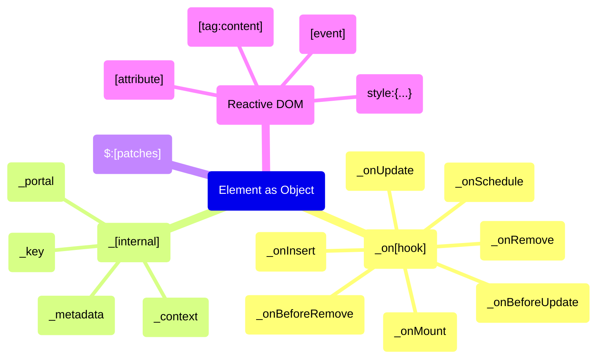
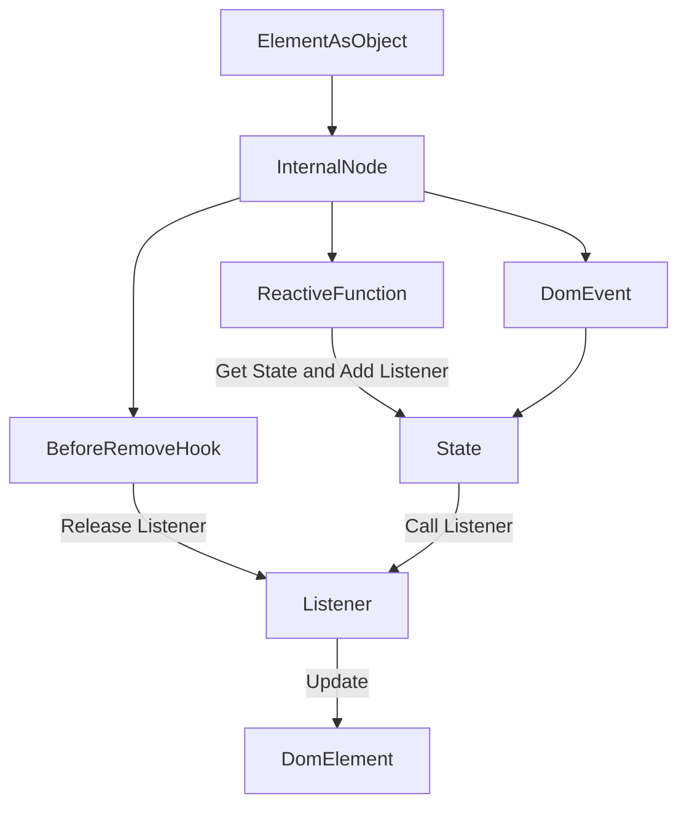
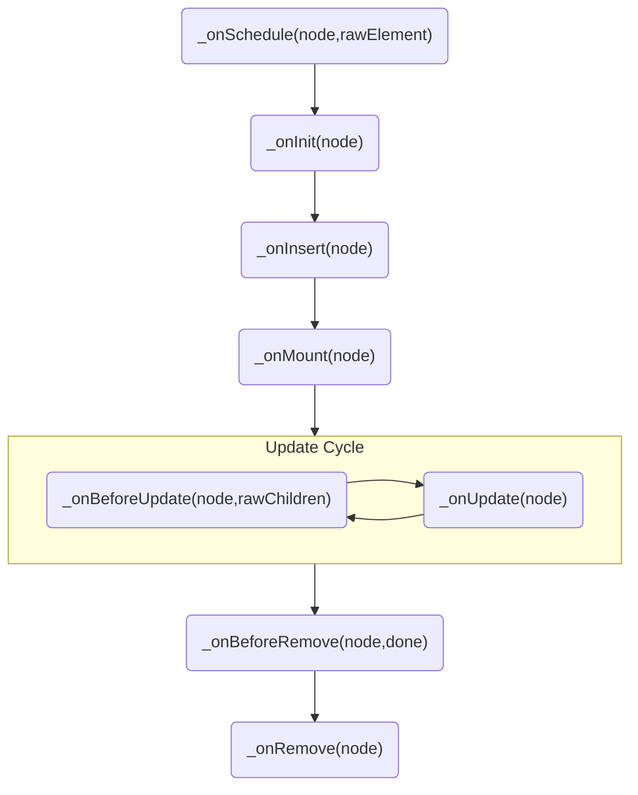
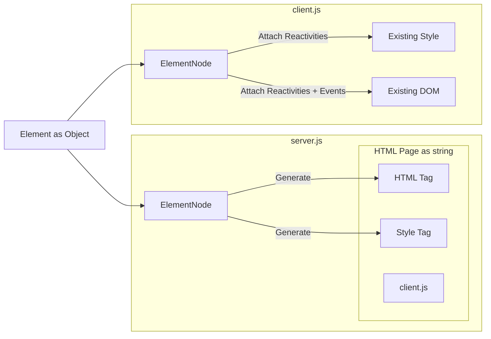
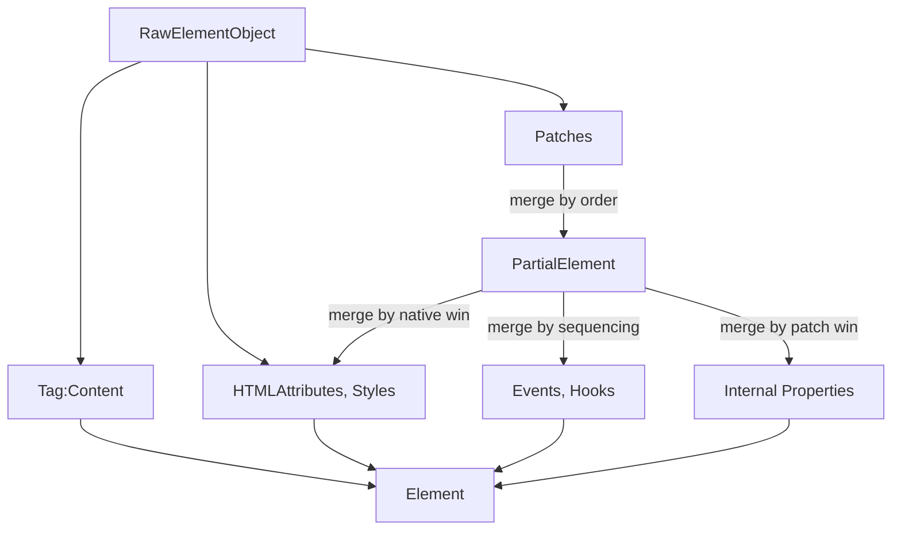
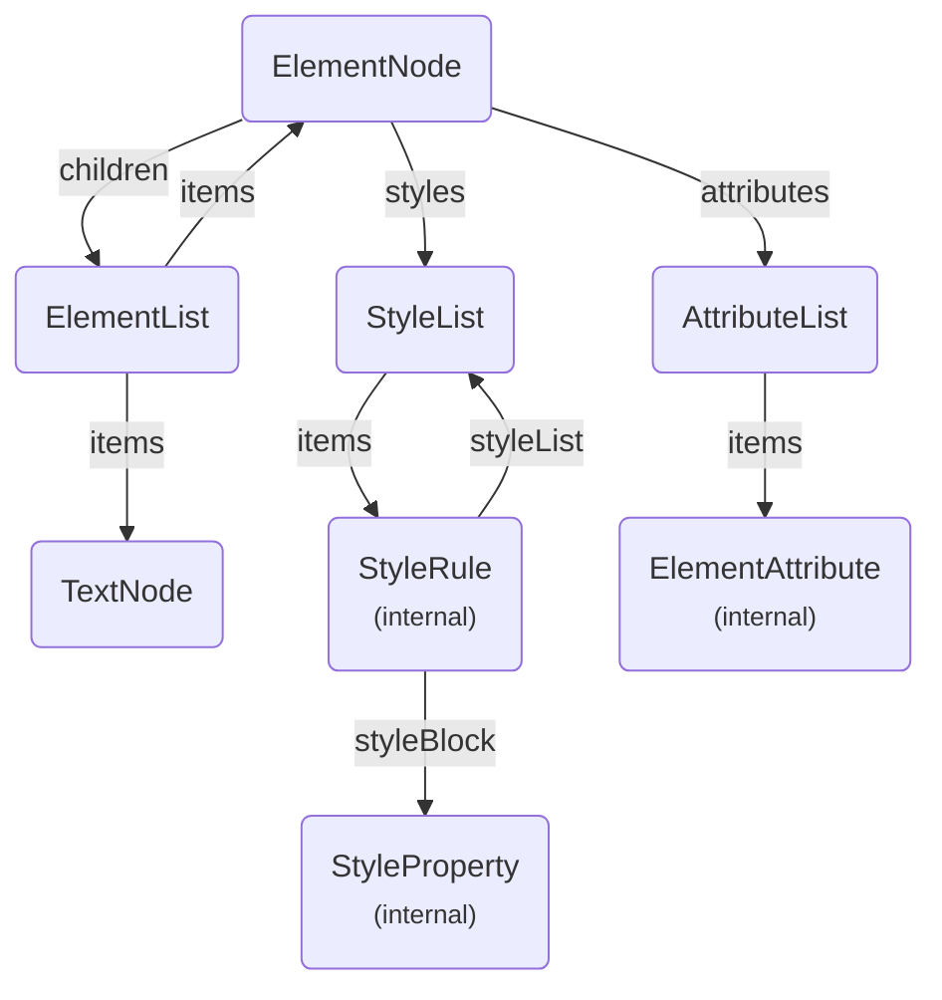
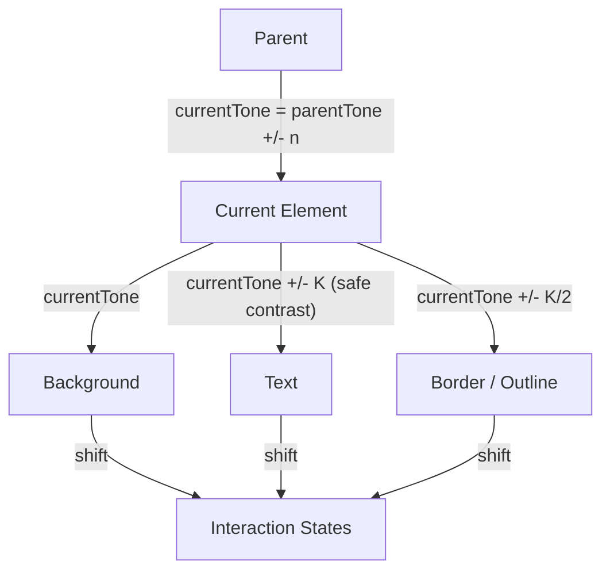
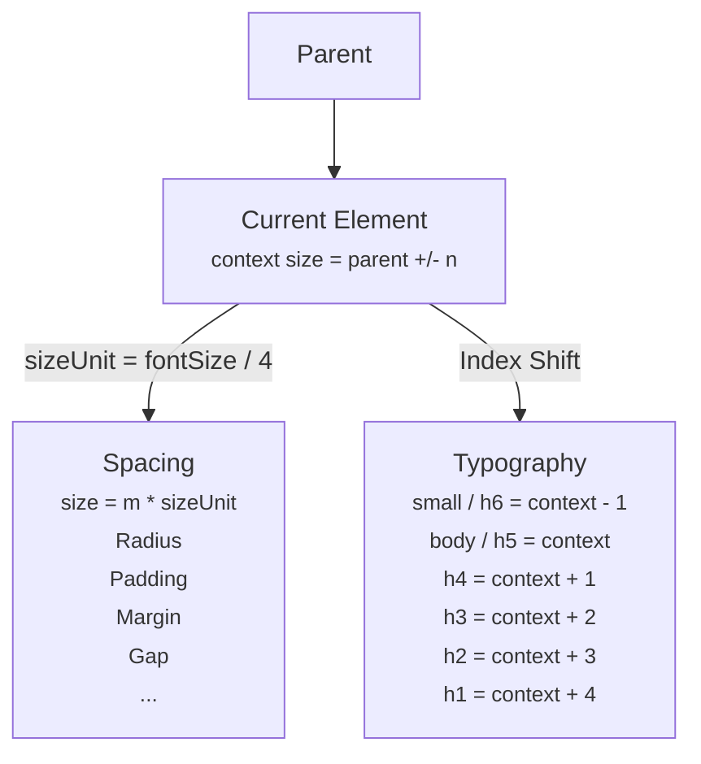

# Domphy AI Context

This file is the single compact context for AI agents that need to generate or edit Domphy applications.

Use it as the canonical grammar of the framework. Prefer these rules over generic React, Vue, Tailwind, or CSS-in-JS habits.

## What Domphy Is

Domphy is a patch-based UI system for the web.

It is split into 3 packages:

- `@domphy/core`: runtime, rendering, reactivity, lifecycle, SSR, CSS-in-JS
- `@domphy/theme`: color, size, spacing, theme registry
- `@domphy/ui`: ready-made patches built on top of core and theme

Rough mental model:

- `@domphy/core` is comparable to `react-dom` + SSR rendering + CSS-in-JS in one package
- `@domphy/theme` and `@domphy/ui` together are comparable to the design-system layer many teams expect from MUI

Domphy is intentionally strict:

- one main way to do each thing
- native elements first
- plain object syntax
- patches instead of wrapper components
- local context instead of provider-heavy architecture

## Install And CDN

Preferred npm install for most apps:

```bash
npm install @domphy/ui
```

If packages are installed separately:

```bash
npm install @domphy/core
npm install @domphy/theme
npm install @domphy/ui
```

Preferred CDN entry for browser-only examples:

```html
<script src="https://unpkg.com/@domphy/ui/dist/core-theme-ui.global.js"></script>
<script>
  const { core, theme, ui } = Domphy
</script>
```

Direct package CDN files:

- `@domphy/core`: `https://unpkg.com/@domphy/core/dist/core.global.js`
- `@domphy/theme`: `https://unpkg.com/@domphy/theme/dist/core-theme.global.js`
- `@domphy/ui`: `https://unpkg.com/@domphy/ui/dist/core-theme-ui.global.js`

Use the combined `@domphy/ui` CDN bundle by default when generating plain browser examples, because it already includes core and theme.

## System Diagrams

Use these diagrams as fast mental models before writing code. They are compact summaries of the docs, not replacements for the exact API rules below.

### Syntax Map



### Reactivity Flow



### Hook Lifecycle



### SSR Flow



### Patch Merge Order



### Core Class Relationships



### Tone Model



### Size Model



## Core Grammar

### Element Shape

A Domphy element is a plain JavaScript object.

- the first key is the HTML tag
- the value of that key is the content
- the rest of the keys are attributes, style, events, hooks, or reserved keys

Inline source types:

```ts
type PrimitiveInput = null | undefined | number | string;

type PartialElement<T extends TagName = never> =
  {
    _key?: string | number,
    _portal?: (root: ElementNode) => Element;
    style?: StyleObject;
    _context?: Record<string, unknown>;
    _metadata?: Record<string, unknown>;
    $?: PartialElement<T>[];
  } & {
    [K in keyof HookMap as `_on${K}`]?: HookMap[K];
  } & {
    [K in `data${Capitalize<string>}` | `data-${string}`]?: AttributeValue;
  } & {
    [E in EventProperty]?: EventHandlerMap[E];
  } & {
    [K in GlobalAttribute]?: AttributeValue;
  } & (
    [T] extends [never]
    ? Partial<{
      [Tag in keyof AttributeMap]: {
        [Attr in AttributeMap[Tag][number]]: AttributeValue
      }
    }[keyof AttributeMap]>
    : Pick<TagAttributes, Extract<AttributeMap[T][number], keyof TagAttributes>>
  );

type DomphyElement<T extends TagName = never> = [T] extends [never]
  ? {
    [K in TagName]: {
      [P in K]: K extends VoidTagName
      ? null
      : ReactiveProperty<PrimitiveInput | (PrimitiveInput | DomphyElement)[]>;
    } & PartialElement<K>;
  }[TagName]
  : {
    [K in T]: K extends VoidTagName
    ? null
    : ReactiveProperty<PrimitiveInput | (PrimitiveInput | DomphyElement)[]>;
  } & PartialElement<T>;
```

These are the source shapes AI should follow when generating raw Domphy objects.

```ts
const App = {
  button: "Save",
  ariaLabel: "Save changes",
  onClick: () => console.log("clicked"),
}
```

Valid content:

- `string`
- `number`
- `array`
- `function(listener) => value`
- `null` for void tags

### Syntax Order

Write Domphy element objects in this canonical order:

1. `tag: content`
2. attributes
3. events
4. `style`
5. `_key`
6. `_portal`
7. `_context`
8. `_metadata`
9. hooks

Write hooks in lifecycle order:

1. `_onSchedule`
2. `_onInit`
3. `_onInsert`
4. `_onMount`
5. `_onBeforeUpdate`
6. `_onUpdate`
7. `_onBeforeRemove`
8. `_onRemove`

Canonical example:

```ts
const App = {
  button: "Save",
  type: "button",
  ariaLabel: "Save changes",
  onClick: () => console.log("clicked"),
  style: {
    minWidth: "8rem",
  },
  _key: "save-button",
  _portal: () => document.body,
  _context: {
    section: "toolbar",
  },
  _metadata: {
    tracking: "save",
  },
  _onInsert: (node) => {},
  _onMount: (node) => {},
}
```

### Client Render

Client rendering starts with `ElementNode`.

```ts
import { ElementNode } from "@domphy/core"

const App = {
  h1: "Hello Domphy",
}

new ElementNode(App).render(document.getElementById("app")!)
```

### SSR

Use the same element definition for server and client.

```ts
const node = new ElementNode(App)

const html = node.generateHTML()
const css = node.generateCSS()

new ElementNode(App).mount(document.getElementById("app")!)
```

`mount()` binds to existing DOM. `render()` creates DOM.

For SSR with style reuse, the normal pattern is:

```html
<style id="domphy-style">...</style>
```

Then on the client:

```ts
const domStyle = document.getElementById("domphy-style") as HTMLStyleElement
new ElementNode(App).mount(document.getElementById("app")!, domStyle)
```

### Attributes

- use normal identifiers such as `type`, `placeholder`, `disabled`
- use camelCase for hyphenated attributes: `ariaLabel`, `ariaControls`, `acceptCharset`, `httpEquiv`, `dataId`, `dataState`
- use quoted keys only when syntax really requires it, mainly inside `style`

```ts
{
  input: null,
  ariaLabel: "Search",
  dataState: "open",
}
```

### Style

`style` is nested CSS-in-JS.

- CSS props use camelCase
- nested selectors use keys like `&:hover`, `& > span`
- at-rules use keys like `@media ...`, `@keyframes ...`
- style values can be reactive functions

```ts
style: {
  color: "red",
  fontSize: "14px",
  "&:hover": { color: "blue" },
}
```

### Events

Use flat DOM event keys:

- `onClick`
- `onInput`
- `onChange`
- `onKeyDown`
- `onTransitionEnd`

Event handlers receive:

1. native event
2. current `ElementNode`

```ts
onInput: (event, node) => {
  const value = (event.target as HTMLInputElement).value
  node.setMetadata("lastValue", value)
}
```

### Hooks

Hooks use `_on` to distinguish them from native events.

- `_onSchedule`
- `_onInit`
- `_onInsert`
- `_onMount`
- `_onBeforeUpdate`
- `_onUpdate`
- `_onBeforeRemove`
- `_onRemove`

Use hooks for lifecycle, not for ordinary event wiring.

### Reserved Keys

- `style`
- `$`
- `_key`
- `_context`
- `_metadata`
- `_portal`
- `_on[Hook]`

### `_key`

`_key` is only for diffing during reactive child updates.

It is:

- not DOM `id`
- not `node.nodeId`
- not selected state
- not business identity

If `_key` matches, Domphy reuses the existing node instance and DOM node instead of creating a new one.

Use `_key` for dynamic child lists that reorder, insert in the middle, or remove in the middle.

### Component vs Patch

Both components and patches should receive a single object `props` parameter.

A Domphy component is an app-level function that returns `DomphyElement`.

Use components to reuse larger sections such as:

- panels
- page sections
- cards with internal layout
- app-specific form blocks
- toolbar groups

Canonical component shape:

```ts
function SettingsPanel(props: { title?: string } = {}): DomphyElement {
  const { title = "Settings" } = props;

  return {
    section: [
      { h2: title },
      { p: "Configure your workspace." },
    ],
  };
}
```

A patch is a lower-level function that returns `PartialElement`.

Use patches to reuse behavior, styling, and structural rules that are applied through `$`.

Canonical patch shape:

```ts
function card(props: { padded?: boolean } = {}): PartialElement {
  const { padded = true } = props;

  return {
    style: {
      padding: padded ? "1rem" : "0",
      borderRadius: "1rem",
    },
  };
}
```

Symmetry:

- component: function returning `DomphyElement`
- patch: function returning `PartialElement`

Both should use:

- one `props` object parameter
- object destructuring inside the function
- defaults through `= {}`

Use components at app level. Use patches at system level.

### `TextNode` Behavior

Strings and numbers become `TextNode` automatically.

Important details:

- a single-root HTML string such as `"<b>Hello</b>"` is treated as inline HTML
- multiple-root HTML strings are invalid
- empty string `""` becomes a zero-width space so the DOM node still exists

Use inline HTML strings sparingly. Prefer normal element objects when possible.

## Reactivity Grammar

Domphy uses listener-based reactivity.

Create state with `toState()`.

```ts
import { toState } from "@domphy/core"

const count = toState(0)
```

Read state inside reactive functions with `get(listener)`.

```ts
{
  p: (listener) => `Count: ${count.get(listener)}`,
}
```

Update state from events with `set(...)`.

```ts
{
  button: "Increment",
  onClick: () => count.set(count.get() + 1),
}
```

Important model:

- state drives the view
- events explicitly write the next state
- think one-way data flow, not two-way binding

Reactive granularity:

- reactive attributes update only that attribute
- reactive style props update only that CSS declaration
- reactive children are more expensive and may rerender the child list unless `_key` or low-level APIs are used

Low-level child operations:

- `children.insert(...)`
- `children.remove(...)`
- `children.move(...)`
- `children.swap(...)`

### Child Update Decision Guide

Use these patterns deliberately:

- decorative/static generated text -> CSS `::before` / `::after`
- singleton that should preserve state -> declare in tree and hide/show
- ephemeral item such as toast -> imperative `children.insert(...)` then `.remove()`
- repeated data-driven list -> reactive children with `_key`
- DOM outside the managed tree such as `<head>` -> direct DOM API in `_onMount`

Do not use reactive children for every single toggle when a simpler pattern is clearer.

## Theme Grammar

The theme package stays small. Most code should use only:

- `themeColor()`
- `themeSize()`
- `themeDensity()`
- `themeSpacing()`

### Setup

Call `themeApply()` once on the client:

```ts
import { themeApply } from "@domphy/theme"

themeApply()
```

For Shadow DOM or isolated roots, `themeApply(styleTag)` is valid and is the correct way to inject theme CSS into a custom style element.

Set `dataTheme` on a root or subtree:

```ts
{ div: [App], dataTheme: "light" }
```

Built-in themes:

- `light`
- `dark`

### Canonical Light Theme

This is the built-in base theme source from `@domphy/theme`.

```ts
const light: ThemeInput = {
  direction: "darken",
  colors: {
    highlight: ["#ffffff", "#fcf4d6", "#fddc69", "#f1c21b", "#d2a106", "#b28600", "#8e6a00", "#684e00", "#483700", "#302400", "#1c1500", "#000000"],
    warning: ["#ffffff", "#fff2e8", "#ffd9be", "#ffb784", "#ff832b", "#eb6200", "#ba4e00", "#8a3800", "#5e2900", "#3e1a00", "#231000", "#000000"],
    error: ["#ffffff", "#fff1f1", "#ffd7d9", "#ffb3b8", "#ff8389", "#fa4d56", "#da1e28", "#a2191f", "#750e13", "#520408", "#2d0709", "#000000"],
    danger: ["#ffffff", "#fff1f1", "#ffd7d9", "#ffb3b8", "#ff8389", "#fa4d56", "#da1e28", "#a2191f", "#750e13", "#520408", "#2d0709", "#000000"],
    secondary: ["#ffffff", "#fff0f7", "#ffd6e8", "#ffafd2", "#ff7eb6", "#ee5396", "#d02670", "#9f1853", "#740937", "#510224", "#2a0a18", "#000000"],
    primary: ["#ffffff", "#edf5ff", "#d0e2ff", "#a6c8ff", "#78a9ff", "#4589ff", "#0f62fe", "#0043ce", "#002d9c", "#001d6c", "#001141", "#000000"],
    info: ["#ffffff", "#e5f6ff", "#bae6ff", "#82cfff", "#33b1ff", "#1192e8", "#0072c3", "#00539a", "#003a6d", "#012749", "#061727", "#000000"],
    success: ["#ffffff", "#defbe6", "#a7f0ba", "#6fdc8c", "#42be65", "#24a148", "#198038", "#0e6027", "#044317", "#022d0d", "#071908", "#000000"],
    neutral: ["#ffffff", "#f4f4f4", "#e0e0e0", "#c6c6c6", "#a8a8a8", "#8d8d8d", "#6f6f6f", "#525252", "#393939", "#262626", "#161616", "#000000"],
  },
  baseTones: {
    highlight: 3,
    warning: 4,
    error: 5,
    secondary: 5,
    primary: 6,
    info: 5,
    success: 5,
    neutral: 5,
  },
  fontSizes: ["0.75rem", "0.875rem", "1rem", "1.25rem", "1.5625rem", "1.9375rem", "2.4375rem", "3.0625rem"],
  densities: [0.75, 1, 1.5, 2, 2.5],
  custom: {},
};
```

`dark` is not a separate authored theme. It is an invert of `light`.

Dark derivation rule from `createDark(source)`:

```ts
function createDark(source: ThemeInput): ThemeInput {
  let dark = structuredClone(source);
  dark.direction = "lighten";
  for (let name in dark.colors) {
    dark.colors[name].reverse();
    dark.baseTones[name] = 12 - 1 - dark.baseTones[name];
  }
  return dark;
}
```

So the AI should treat:

- `light` as the canonical authored theme
- `dark` as the same theme inverted
- color ramps as 12-step arrays
- dark mode as reverse tone direction, not a separate semantic palette system

### Theme Context

- `dataTheme`: choose the theme
- `dataTone`: shift tone locally
- `dataSize`: shift font size locally
- `dataDensity`: shift spacing density locally

These can be scoped to a subtree. Theme is local, not global-only.

### Valid Tone Values

Domphy does not use semantic tone names such as `surface`, `background`, `text`, `muted`, `card`, or `foreground`.

Valid tone values are only:

- `"inherit"`
- `"base"`
- `"shift-N"`
- `"increase-N"`
- `"decrease-N"`

Where `N` is a number from `0` to `11`.

Examples:

- `themeColor(listener, "inherit", "primary")`
- `themeColor(listener, "base", "primary")`
- `themeColor(listener, "shift-6", "neutral")`
- `themeColor(listener, "increase-1", "primary")`
- `themeColor(listener, "decrease-2", "neutral")`

Invalid examples:

- `themeColor(listener, "surface", "primary")`
- `themeColor(listener, "background", "neutral")`
- `dataTone: "text"`

If AI wants a background/text pairing, it must express that with valid shifts, for example:

```ts
style: {
  backgroundColor: (listener) => themeColor(listener, "inherit", "primary"),
  color: (listener) => themeColor(listener, "shift-6", "primary"),
}
```

### Valid Size Values

Valid `dataSize` and `themeSize()` values are only:

- `"inherit"`
- `"increase-N"`
- `"decrease-N"`

Where `N` is a number from `0` to `7`.

Examples:

- `dataSize: "increase-1"`
- `fontSize: (listener) => themeSize(listener, "inherit")`
- `fontSize: (listener) => themeSize(listener, "decrease-1")`

Do not use semantic size names like `sm`, `md`, `lg`, `xl`.

Recommended local usage in app code is usually within `increase-2` to `decrease-2`, even though the system can represent a wider range.

### Valid Density Values

Valid `dataDensity` values are only:

- `"inherit"`
- `"increase-N"`
- `"decrease-N"`

Where `N` is a number from `0` to `4`.

Examples:

- `dataDensity: "increase-1"`
- `themeDensity(listener)`

Density is a local spacing context, not a semantic size name.

### Theme Color Families

Default color family names used across Domphy are:

- `"neutral"`
- `"primary"`
- `"secondary"`
- `"info"`
- `"success"`
- `"warning"`
- `"error"`
- `"highlight"`
- `"danger"`

If AI needs a neutral surface, use `color: "neutral"` with a valid tone key. Do not invent names like `surface`, `panel`, or `card`.

### Common Helpers

```ts
import { themeColor, themeDensity, themeSize, themeSpacing } from "@domphy/theme"

style: {
  fontSize: (listener) => themeSize(listener, "inherit"),
  gap: themeSpacing(3),
  paddingBlock: (listener) => themeSpacing(themeDensity(listener) * 1),
  paddingInline: (listener) => themeSpacing(themeDensity(listener) * 3),
  borderRadius: (listener) => themeSpacing(themeDensity(listener) * 1),
  backgroundColor: (listener) => themeColor(listener, "inherit", "primary"),
  color: (listener) => themeColor(listener, "shift-6", "primary"),
}
```

Guidelines:

- use `themeSpacing()` for direct spacing values such as gap, margin, fixed width, and fixed height
- use `themeDensity()` to resolve the current density factor from context
- combine `themeDensity()` with `themeSpacing()` when padding or radius should scale with local density
- use `themeSize()` for font size
- use `themeColor()` for background, text, outline, state colors
- responsive global scaling should usually happen by changing root `font-size`, not by rewriting every component

### Theme Recommendations

- Prefer `dataTone` over `dataTheme` for most local visual shifts.
- Use `dataTheme` only when you truly want a different theme, not just a darker or lighter local surface.
- Only inline leaf elements should shift `backgroundColor` directly; for containers with children, prefer `dataTone` so descendants can resolve their own colors correctly.
- Do not invent `dataColor`; Domphy has `dataTone` and explicit color family arguments, not a color-family context.
- Use `outline` or `boxShadow` instead of `border` when you want to preserve the sizing system.
- Keep `gap` and `margin` at least as large as the related internal padding when you want clear spatial rhythm.

### Sizing Model

All size formulas derive from these values:

- `U = fontSize / 4`
- `n = number of intrinsic text lines`
- `w = structural wrapping level of the element boundary`
- `d = current density factor`
- theme density indices: `[0.75, 1, 1.5, 2, 2.5]`
- base theme density: `d = 1.5`

Canonical formulas:

- `paddingBlock = d * w * U`
- `paddingInline = ceil(3 / w) * d * w * U` for `w >= 1`
- bounded inline `w = 0` -> `paddingInline = 2dU`; otherwise `0`
- `radius = paddingBlock = d * w * U`
- `height = (n * 6 + 2 * d * w) * U`

Wrapping levels:

- `w = 0`: inline or no-boundary element
- `w = 1`: single-line bounded control
- `w = 2`: multi-line bounded element
- `w = 3`: structural section or large overlay

Derived families:

- single-line inline/no-boundary -> `6U`
- single-line bounded control -> `(6 + 2d)U` -> `9U` at base `d = 1.5`
- multi-line bounded block -> `(6n + 4d)U`
- structural section -> padding is formula-driven; overall height is content- or viewport-driven
- separators stay `1px`

Sub-baseline elements use the fixed proportional scale `2U / 4U / 6U` and stay constant across density levels unless a patch explicitly defines another rule.
### Theme Registry

Register or override themes with:

- `setTheme(name, input)`
- `getTheme(name)`
- `createDark(source)`
- `themeCSS()`

Use `themeCSS()` for SSR.

## Public API Surface

This section lists the minimum exposed API that AI should know when generating Domphy apps and patches.

### `@domphy/core`

Main classes:

- `ElementNode`
  - constructor: `new ElementNode(domphyElement, parent?, index?)`
  - main fields: `tagName`, `children`, `attributes`, `styles`, `domElement`, `parent`, `key`, `nodeId`
  - main methods:
    - `render(domTarget)`
    - `mount(existingDomElement, domStyle?)`
    - `generateHTML()`
    - `generateCSS()`
    - `merge(partial)`
    - `remove()`
    - `addEvent(name, handler)`
    - `addHook(name, handler)`
    - `getRoot()`
    - `getPath()`
    - `getContext(name)`
    - `setContext(name, value)`
    - `getMetadata(name)`
    - `setMetadata(name, value)`
  - derived identity:
    - `nodeId` = runtime/style-scope identity
    - `pathId` = path-position identity

- `ElementList`
  - `items`
  - `update(inputs, updateDom?, silent?)`
  - `insert(input, index?, updateDom?, silent?)`
  - `remove(item, updateDom?, silent?)`
  - `clear(updateDom?, silent?)`
  - `swap(aIndex, bIndex, updateDom?, silent?)`
  - `move(fromIndex, toIndex, updateDom?, silent?)`
  - `generateHTML()`
  - `updateDom = false` is important when an external library has already changed the DOM and only the logical tree should be synchronized

- `AttributeList`
  - `items`
  - `get(name)`
  - `set(name, value)`
  - `has(name)`
  - `remove(name)`
  - `toggle(name, force?)`
  - `onChange(name, callback)`
  - `addClass(className)`
  - `removeClass(className)`
  - `toggleClass(className)`
  - `replaceClass(oldClass, newClass)`

- `State<T>`
  - `get(listener?)`
  - `set(value)`
  - `reset()`
  - `onChange(listener)`

- `Notifier`
  - low-level listener container, mostly internal-facing
  - listener can define `onSubscribe(release)` to attach cleanup automatically

Main utility functions:

- `toState(valueOrState)`
- `merge(source, target)`
- `hashString(string)`

Important exported types:

- `DomphyElement`
- `PartialElement`
- `StyleObject`
- `Listener`
- `HookMap`

Exported constants modules:

- `VoidTags`
- `HtmlTags`
- `BooleanAttributes`
- `PrefixCSS`
- `CamelAttributes`

### `@domphy/theme`

Main functions:

- `themeApply(el?)`
- `themeCSS()`
- `setTheme(name, input)`
- `getTheme(name)`
- `createDark(source)`
- `themeTokens(name)`
- `themeVars()`
- `themeName(object)`
- `themeSpacing(n)`
- `themeDensity(object)` returns the current density factor as a number
- `themeSize(object, size?)`
- `themeColor(object, tone?, color?)`
- `contextColor(object, tone?, color?)`

Important theme types:

- `ThemeColor`
- `ElementDensity`
- `ElementTone`
- `ElementSize`

### `@domphy/ui`

Main exported classes:

- `FormState`
  - `setField(path, initValue?, validator?)`
  - `getField(path)`
  - `removeField(path)`
  - `valid`
  - `reset()`
  - `snapshot()`

- `FieldState`
  - `value(listener?)`
  - `setValue(value)`
  - `dirty(listener?)`
  - `touched(listener?)`
  - `setTouched()`
  - `configure(initValue?, validator?)`
  - `message(type, listener?)`
  - `status(listener?)`
  - `setMessages(messages)`
  - `reset()`
  - `validate()`

Main exported patches are listed below in the patch catalog.

## Production App Structure

When generating a production-ready Domphy app, prefer this structure:

- `main.ts` or `client.ts`
  - call `themeApply()`
  - create root `ElementNode`
  - call `render(...)` or `mount(...)`
- `app/` or `components/`
  - feature-level Domphy components returning `DomphyElement`
- `patches/`
  - only if the app needs reusable local patches beyond `@domphy/ui`
- `state/`
  - `toState()` instances, `FormState`, `FieldState`, or app-specific state helpers
- `services/`
  - network, persistence, integrations
- `styles/` only when truly needed
  - prefer inline `style` with theme helpers first

Recommended entry:

```ts
import { ElementNode } from "@domphy/core"
import { themeApply } from "@domphy/theme"
import { App } from "./app/App"

themeApply()
new ElementNode(App).render(document.getElementById("app")!)
```

Production guidance:

- use `DomphyElement` objects or component functions for meaningful subtrees
- keep each subtree shallow and named
- prefer feature modules over giant single files
- use `_context` for local tree context, not for global app state dumping
- use `_metadata` for node-local runtime data only
- use `FormState` and `FieldState` for form-heavy features
- use existing `@domphy/ui` patches before building custom ones
- use portals for overlays that must escape clipping or stacking contexts

## Lifecycle And Ownership Rules

These rules matter for production correctness:

- events are declared flat as `onClick`, `onInput`, `onKeyDown`, etc.
- hooks are for lifecycle only
- `_onSchedule` is the only place where mutating raw input before parse is expected
- `_onBeforeRemove(node, done)` must call `done()`
- `node.addEvent()` after mount updates the internal event map but is not the normal way to attach DOM listeners; use flat event keys or direct DOM listeners only when truly necessary
- `children.insert/remove/move/swap` are low-level precise operations; use them for local imperative updates
- `_portal` changes DOM mount target, but logical parentage still lives in the same node tree
- `_portal` is evaluated at mount time and only moves the DOM node, not the logical node position in the tree

## Accessibility And Semantics

Domphy is native-element first. Prefer semantic tags before styling tricks.

- use `button` for actions
- use `a` for navigation
- use `input`, `select`, `textarea`, `label`, `fieldset`, `legend`, `dialog`, `nav`, `table`, `ul`, `ol`, `dl` when appropriate
- use `aria-*` in camelCase form such as `ariaLabel`, `ariaControls`, `ariaExpanded`, `ariaSelected`, `ariaDescribedby`
- let patches add behavior and style, but keep semantic ownership on the native tag

If a patch expects a host tag, follow that contract.

### Portal Rule

Use `_portal` for overlays such as tooltips, dropdowns, toasts, and modal layers that must escape ancestor overflow or stacking context.

```ts
{
  div: "Tooltip content",
  _portal: () => document.body,
}
```

The node stays in the same logical Domphy tree even when its DOM is rendered elsewhere.

## UI Grammar

`@domphy/ui` is the official patch library.

A patch:

- is a function
- returns `PartialElement`
- is applied with `$: [patch()]`
- augments a native element instead of creating a wrapper component

```ts
import { button, tooltip } from "@domphy/ui"

const submitButton = {
  button: "Submit",
  $: [
    button({ color: "primary" }),
    tooltip({ content: "Submit the form" }),
  ],
}
```

### Patch Philosophy

- native element owns the final result
- patch provides defaults
- element-level properties win
- patches should stay small and readable

### Patch File Rules

Use these rules when generating new patch files:

- one patch per file
- lowerCamelCase file name
- named export only
- patch function default props must be `= {}`
- no local helper functions inside patch files
- no importing other patches inside patch files
- pass state through props or context, do not hide state in patch internals

Canonical shape:

```ts
function button(props: { color?: ThemeColor } = {}): PartialElement {
  const { color = "primary" } = props

  return {
    style: {
      // ...
    },
  }
}

export { button }
```

### Overlay Convention

Overlay-like patches should default to inverted tone:

- `dataTone: "shift-11"`

This is the UI-layer convention for overlays because it gives strong contrast and demonstrates local theming clearly. Users can still override it because native wins.

### Customization Order

The detailed customization flow lives in the next section. Use that sequence instead of inventing a parallel one.

## Customization

The preferred customization flow in Domphy is:

1. use the existing patch as-is
2. change patch props if the patch already exposes the needed option
3. use `dataTone`, `dataSize`, or `dataDensity` on a parent subtree when the change should affect a whole region
4. override directly on the element with inline attributes or `style`
5. create a local patch variant only when the variation is reused enough to deserve its own API

This order matters because Domphy is designed so that the native element remains the final owner.

### Native Wins

Patch defaults do not own the final element. The element itself wins.

```ts
{
  button: "Save",
  $: [button({ color: "primary" })],
  style: {
    width: "100%",
  },
}
```

Use this when:

- the override is local to one screen
- the patch already provides most of the behavior
- only a few visual properties need to change

### Use Patch Props First

If a patch already exposes the needed prop, use the prop instead of rewriting styles.

```ts
{
  button: "Delete",
  $: [button({ color: "danger" })],
}
```

Do not inline-override a patch just to reproduce an option the patch already exposes.

### Use Context For Subtrees

When a whole area should share a tone or size shift, prefer `dataTone` or `dataSize` on the parent instead of overriding each child.

```ts
{
  section: [
    { button: "Save", $: [button()] },
    { button: "Cancel", $: [button()] },
  ],
  dataTone: "shift-1",
  dataSize: "increase-1",
}
```

Use subtree context when:

- several children should shift together
- the change is conceptual, not one-off styling
- you want the design system to keep doing the work

### Inline Override Is Normal

Inline override is not an escape hatch. It is a normal part of the system.

```ts
{
  button: "Submit",
  $: [button()],
  disabled: true,
  style: {
    width: "100%",
  },
}
```

Prefer inline override when:

- the change is local
- the patch has no prop for it
- you do not want to create a reusable abstraction yet

### Create A Local Variant Only When Reused

If the same customization repeats across the app, copy the patch into the app and create a local variant.

```ts
function primaryButton() {
  return {
    $: [button({ color: "primary" })],
    style: {
      width: "100%",
    },
  }
}
```

Create a local variant when:

- the same override appears many times
- the variation has its own visual identity
- the app needs its own reusable UI primitive

### Do Not Customize Like This

- Do not create a new patch too early when a local inline override is enough.
- Do not bypass patch props with raw CSS if the patch already exposes the option.
- Do not push local visual changes into hooks when normal `style` or attributes would be clearer.
- Do not spread unrelated style overrides across many children if a parent `dataTone` or `dataSize` can express the same change.

## UI Patch Catalog

When generating apps, prefer existing patches before inventing custom UI.

### Text And Inline Patches

- `abbreviation()` -> host tag `abbr`
- `badge()` -> inline badge surface, usually `span`
- `code()` -> host tag `code`
- `emphasis()` -> host tag `em`
- `heading()` -> host tags `h1` to `h6`
- `keyboard()` -> host tag `kbd`
- `label()` -> host tag `label`
- `link()` -> host tag `a`
- `mark()` -> host tag `mark`
- `small()` -> host tag `small`
- `strong()` -> host tag `strong`
- `subscript()` -> host tag `sub`
- `superscript()` -> host tag `sup`
- `tag()` -> small inline surface, usually `span`
- `paragraph()` -> host tag `p`

### Media And Display Patches

- `avatar()` -> avatar/media token, typically `div` or `span`
- `figure()` -> host tag `figure`
- `icon()` -> host tag `span`
- `image()` -> host tag `img`
- `skeleton()` -> loading placeholder surface
- `spinner()` -> host tag `span`

### Button And Action Patches

- `button()` -> host tag `button`, common prop: `color`
- `buttonSwitch()` -> host tag `button`
- `toggle()` -> host tag `button`
- `toggleGroup()` -> group coordination patch for toggles
- `pagination()` -> host tag `div`, pagination container and controls

### Input And Form Control Patches

- `field()` -> host tags `input`, `select`, or `textarea`; field state bridge
- `form()` -> form layout / form-state integration
- `formGroup()` -> host tag `fieldset`
- `inputCheckbox()` -> host tag `input`
- `inputColor()` -> host tag `input`
- `inputDateTime()` -> host tag `input`
- `inputFile()` -> host tag `input`
- `inputNumber()` -> host tag `input`
- `inputOTP()` -> OTP input composition
- `inputRadio()` -> host tag `input`
- `inputRange()` -> host tag `input`
- `inputSearch()` -> host tag `input`
- `inputSwitch()` -> host tag `input`
- `inputText()` -> host tag `input`
- `select()` -> host tag `select`
- `selectBox()` -> host tag `div`, custom select composition
- `selectList()` -> host tag `div`
- `selectItem()` -> host tag `div`
- `textarea()` -> host tag `textarea`

### Lists And Content Structure

- `blockquote()` -> host tag `blockquote`
- `breadcrumb()` -> host tag `nav`
- `breadcrumbEllipsis()` -> host tag `button`
- `descriptionList()` -> host tag `dl`
- `details()` -> host tag `details`
- `orderedList()` -> host tag `ol`
- `unorderedList()` -> host tag `ul`
- `preformated()` -> host tag `pre`
- `table()` -> host tag `table`

### Overlay And Floating Patches

- `dialog()` -> host tag `dialog`, common props: `open`, `color`
- `drawer()` -> host tag `dialog`
- `popover()` -> floating anchored overlay
- `popoverArrow()` -> arrow helper for popover-like overlays
- `toast()` -> transient overlay notification
- `tooltip()` -> anchored overlay; prop `content` can be string or `DomphyElement`

These usually behave as overlays and should follow the inverted-tone convention.

### Navigation And Command Patches

- `card()` -> content container / slot-based layout
- `command()` -> command search input patch family
- `combobox()` -> host tag `div`
- `menu()` -> menu container
- `menuItem()` -> host tag `button`
- `tabs()` -> tabs container and shared state
- `tab()` -> host tag `button`
- `tabPanel()` -> panel paired with tabs

### Divider / Layout / Behavior Patches

- `divider()` -> host tag `div`
- `horizontalRule()` -> host tag `hr`
- `progress()` -> host tag `progress`
- `splitter()` -> interactive layout split control
- `transitionGroup()` -> behavior patch for child reordering transitions

### Patch Selection Guidance

Use these defaults when AI chooses a patch:

- clickable action -> `button()`
- toggleable boolean control -> `toggle()` or `inputSwitch()`
- form text input -> `inputText()`
- search field -> `inputSearch()`
- select dropdown -> `select()` or `selectBox()`
- command palette / searchable options -> `command()` or `combobox()`
- modal dialog -> `dialog()`
- floating info bubble -> `tooltip()` or `popover()`
- tabbed interface -> `tabs()` with `tab()` and `tabPanel()`
- menu / context navigation -> `menu()` with `menuItem()`
- sortable/reorder animation -> `transitionGroup()`

## Detailed Patch API

This section is more explicit so AI can choose host tags and props without guessing.

### Common Prop Conventions

Many UI patches follow these prop conventions:

- `color?: ThemeColor`
  - main surface color
  - default is often `"neutral"`, sometimes `"primary"` for action-first patches such as `button()`
- `accentColor?: ThemeColor`
  - accent, focus, indicator, selected state color
  - default is often `"primary"`
- `open?: ValueOrState<boolean>`
  - open state for overlay-style patches
- `value?: ValueOrState<T>`
  - controlled value for tabs, selection, inputs, toggles, pagination

When AI is unsure:

- use `color: "neutral"` for containers and text surfaces
- use `accentColor: "primary"` for active, checked, selected, and focus styling

### Action And Toggle Patches

- `button({ color? })`
  - host tag: `button`
  - use for primary and secondary actions

- `buttonSwitch({ checked?, accentColor?, color? })`
  - host tag: `button`
  - use for boolean toggle buttons with pressed state

- `toggle({ color?, accentColor?, value? })`
  - host tag: `button`
  - use for segmented or sibling-based toggle controls

- `toggleGroup({ value?, multiple?, color?, accentColor? })`
  - host tag: group/container
  - use when multiple toggle buttons need shared selection state

### Form And Field Patches

- `form(formState)`
  - host tag: `form`
  - binds form subtree to a `FormState`

- `field(path, validator?)`
  - host tags: `input`, `select`, `textarea`
  - binds a control to one field inside `FormState`
  - `path` supports nested dot notation such as `"address.city"` or `"items.0.qty"`
  - validator may be sync or async

- `formGroup({ color?, layout? })`
  - host tag: `fieldset`
  - layout: `"horizontal"` or `"vertical"`
  - use for label + field + help text grouping

### FormState And FieldState Notes

- `FormState.snapshot()` reconstructs nested objects and arrays from dot paths
- `FieldState.status()` returns `"error" | "warning" | "success" | undefined`
- `FieldState.message(type)` reads one message channel
- validators may return `FieldMessages | null | Promise<FieldMessages | null>`
- `field()` handles `value`, `checked`, `blur/touched`, and `aria-invalid` wiring automatically

### Input Patches

- `inputText({ color?, accentColor? })`
  - host tag: `input`
  - text-like single-line field

- `inputSearch({ color?, accentColor? })`
  - host tag: `input`
  - search-specific field styling

- `inputNumber({ color?, accentColor? })`
  - host tag: `input`
  - numeric field styling

- `inputFile({ color?, accentColor? })`
  - host tag: `input`
  - file chooser styling

- `inputColor({ color?, accentColor? })`
  - host tag: `input`
  - color input styling

- `inputDateTime({ mode?, color?, accentColor? })`
  - host tag: `input`
  - mode can be `date`, `time`, `week`, `month`, or `datetime-local`

- `inputCheckbox({ color?, accentColor? })`
  - host tag: `input`
  - checkbox styling

- `inputRadio({ color?, accentColor? })`
  - host tag: `input`
  - radio styling

- `inputRange({ color?, accentColor? })`
  - host tag: `input`
  - slider/range styling

- `inputSwitch({ accentColor? })`
  - host tag: `input`
  - boolean switch styling

- `inputOTP()`
  - OTP entry composition
  - use for one-time password / split-code inputs

- `textarea({ color?, accentColor? })`
  - host tag: `textarea`
  - multiline field

### Selection And Option Patches

- `select({ color?, accentColor? })`
  - host tag: `select`
  - native select styling

- `selectBox({ multiple?, value?, open?, color?, accentColor?, placement? })`
  - host tag: `div`
  - custom select surface with floating content

- `selectList({ multiple?, value?, color?, accentColor? })`
  - host tag: `div`
  - option list container for custom selection

- `selectItem({ accentColor?, color? })`
  - host tag: `div`
  - one selectable option item in a custom list

- `combobox({ multiple?, value?, open?, color?, accentColor?, placement? })`
  - host tag: `div`
  - searchable/custom input + option list composition

### Overlay And Floating Patches

- `tooltip({ open?, placement?, content? })`
  - host tag: trigger element gets the patch
  - `content` may be `string` or `DomphyElement`
  - default tooltip surface is styled and inverted with `dataTone: "shift-11"`

- `popover({ openOn, open?, placement?, content? })`
  - host tag: trigger element gets the patch
  - use for click or hover floating panels

- `popoverArrow({ placement?, sideOffset?, bordered? })`
  - arrow helper for popovers and tooltips

- `dialog({ color?, open? })`
  - host tag: `dialog`
  - modal overlay with internal open state handling

- `drawer({ color?, open?, placement? })`
  - host tag: `dialog`
  - side drawer overlay

- `toast({ position?, color?, duration? })`
  - host tag: toast container/root
  - use for transient notifications

### Navigation Patches

- `tabs({ activeKey? })`
  - host tag: tabs container
  - provides shared tab context

- `tab({ accentColor?, color? })`
  - host tag: `button`
  - individual tab trigger

- `tabPanel()`
  - host tag: content panel paired with `tab()`

- `menu({ activeKey?, color?, accentColor? })`
  - host tag: menu container
  - use with `menuItem()`

- `menuItem({ accentColor?, color? })`
  - host tag: `button`
  - individual menu action item

- `breadcrumb({ color?, separator? })`
  - host tag: `nav`
  - breadcrumb container

- `breadcrumbEllipsis({ color? })`
  - host tag: `button`
  - collapsed breadcrumb trigger

- `pagination({ value?, total, color?, accentColor? })`
  - host tag: `div`
  - page navigation control

### Structure And Content Patches

- `card({ color? })`
  - host tag: usually `div` or `section`
  - slot-based content container

- `alert({ color? })`
  - host tag: alert container

- `blockquote({ color? })`
  - host tag: `blockquote`

- `descriptionList({ color? })`
  - host tag: `dl`

- `details({ color?, accentColor?, duration? })`
  - host tag: `details`
  - collapsible native disclosure

- `figure({ color? })`
  - host tag: `figure`

- `table({ color? })`
  - host tag: `table`

- `orderedList({ color? })`
  - host tag: `ol`

- `unorderedList({ color? })`
  - host tag: `ul`

- `preformated({ color? })`
  - host tag: `pre`

### Inline And Typography Patches

- `abbreviation({ color?, accentColor? })` -> `abbr`
- `badge({ color?, label? })` -> inline badge surface
- `code({ color? })` -> `code`
- `emphasis({ color? })` -> `em`
- `heading({ color? })` -> `h1` to `h6`
- `keyboard({ color? })` -> `kbd`
- `label({ color?, accentColor? })` -> `label`
- `link({ color?, accentColor? })` -> `a`
- `mark({ accentColor?, tone? })` -> `mark`
- `small({ color? })` -> `small`
- `strong({ color? })` -> `strong`
- `subscript({ color? })` -> `sub`
- `superscript({ color? })` -> `sup`
- `tag({ color?, removable? })` -> inline removable/non-removable chip
- `paragraph({ color? })` -> `p`

### Media, Display, And Indicator Patches

- `avatar({ color? })`
- `icon()` -> `span`
- `image({ color? })` -> `img`
- `progress({ color?, accentColor? })` -> `progress`
- `skeleton({ color? })`
- `spinner({ color? })` -> `span`

### Layout And Behavior Patches

- `divider({ color? })` -> `div`
- `horizontalRule({ color? })` -> `hr`
- `splitter({ direction?, defaultSize? })`
- `splitterPanel()`
- `splitterHandle()`
- `transitionGroup({ duration?, delay? })`
  - use for child reordering animations
  - stable `_key` is strongly recommended so motion maps to logical items correctly

### Command Patches

These are exported as separate helpers:

- `command()`
  - root command surface
- `commandSearch({ color?, accentColor? })`
  - host tag: `input`
- `commandItem({ color?, accentColor? })`
  - item inside command surface

## Common Host Tag Contracts

If AI is generating a new app from scratch, these host-tag contracts should be treated as hard rules:

- `button()` -> `button`
- `buttonSwitch()` -> `button`
- `tab()` -> `button`
- `menuItem()` -> `button`
- `inputText()` / `inputSearch()` / `inputNumber()` / `inputFile()` / `inputColor()` / `inputDateTime()` / `inputCheckbox()` / `inputRadio()` / `inputRange()` / `inputSwitch()` -> `input`
- `textarea()` -> `textarea`
- `select()` -> `select`
- `dialog()` / `drawer()` -> `dialog`
- `breadcrumb()` -> `nav`
- `formGroup()` -> `fieldset`
- `label()` -> `label`
- `link()` -> `a`
- `paragraph()` -> `p`
- `table()` -> `table`
- `unorderedList()` -> `ul`
- `orderedList()` -> `ol`
- `descriptionList()` -> `dl`
- `details()` -> `details`
- `blockquote()` -> `blockquote`
- `figure()` -> `figure`
- `icon()` / `spinner()` -> `span`

## Production Readiness Checklist

Before finalizing generated Domphy app code, make sure the result follows these checks:

- semantic native tags are used correctly
- `themeApply()` is called at the app root on client apps
- `dataTheme` is set somewhere meaningful
- repeated or deep subtrees are extracted into named variables or functions
- events are flat, not hidden in hooks
- `_key` is present on dynamic reordered lists
- external DOM libraries use `updateDom: false` when syncing `ElementList`
- reactive reads use `get(listener)` only where reactivity is intended
- overlays follow the inverted-tone convention unless intentionally overridden
- spacing, sizing, and colors come from theme helpers before raw CSS
- form-heavy code uses `FormState` / `FieldState` or a clear equivalent pattern
- portal usage is deliberate for overlays that need to escape ancestor layout constraints
- `done()` is called in every `_onBeforeRemove`
- there is no shared object reused across multiple inserts

## Canonical App Patterns

### Simple Counter

```ts
import { ElementNode, toState } from "@domphy/core"

const count = toState(0)

const App = {
  div: [
    {
      p: (listener) => `Count: ${count.get(listener)}`,
    },
    {
      button: "Increment",
      onClick: () => count.set(count.get() + 1),
    },
  ],
}

new ElementNode(App).render(document.getElementById("app")!)
```

### Themed Button

```ts
import { themeApply } from "@domphy/theme"
import { button } from "@domphy/ui"

themeApply()

const App = {
  div: [
    {
      button: "Save",
      $: [button({ color: "primary" })],
    },
  ],
  dataTheme: "light",
}
```

### Dynamic List With `_key`

```ts
const items = toState([
  { id: 1, name: "A" },
  { id: 2, name: "B" },
])

const App = {
  ul: (listener) => items.get(listener).map(item => ({
    li: item.name,
    _key: item.id,
  })),
}
```

### Input Synchronization

```ts
const text = toState("")

const App = {
  input: null,
  value: (listener) => text.get(listener),
  onInput: (event) => {
    text.set((event.target as HTMLInputElement).value)
  },
}
```

Treat this as one-way data flow:

- state -> value
- event -> next state

## Not To Do

### Core

- Do not write deeply nested inline objects when the subtree is more than a small local fragment; extract child elements into named variables or functions and compose them in arrays.
- Do not quote object keys unless syntax really requires it; use normal identifiers like `div`, `ariaLabel`, `dataId`, `onClick`, and `_onMount`.
- Do not treat one giant inline object as a template language; break repeated or meaningful subtrees into variables, functions, or components.

### Reactivity

- Do not think in terms of two-way binding; Domphy should be written as one-way data flow with explicit event writes.
- Do not create reactive update loops where a reactive read and an event write blur together without a clear state boundary.
- Do not move ordinary form synchronization into hooks; keep it in flat event handlers such as `onInput`, `onChange`, and `onClick`.

### UI / Patches

- Do not put ordinary DOM event logic inside hooks when flat event keys already exist; use `onClick`, `onInput`, `onKeyDown`, and similar keys directly on the partial object.
- Do not use `_key` as selected state, active id, or general business identity; `_key` is only for child diffing.
- Do not reuse the same `DomphyElement` or `PartialElement` object across multiple inserts; create a fresh object each time with a factory function or inside the loop.
- Do not hide simple visual state changes inside hooks; if the change is really an attribute or style update, use reactive attributes or reactive style props directly.
- Do not skip `done()` in `_onBeforeRemove`; if `done()` is not called, the node never finishes removal.
- Do not create local helper functions inside patch files.
- Do not use raw fixed values when a patch or theme helper already expresses the same thing.

## Authoring Guidance For AI

When generating Domphy code:

- prefer plain objects over abstract component frameworks
- prefer native tags over custom wrappers
- prefer patches over rebuilding the same UI behavior from scratch
- prefer theme helpers over hard-coded spacing, color, and font size
- keep objects shallow and readable
- keep event handlers flat
- use `_key` only for diffing
- assume `native wins` when patch defaults and element properties overlap

When unsure:

1. choose the simpler object shape
2. choose the flatter event/style structure
3. choose the theme helper over raw CSS
4. choose the existing patch over custom implementation

## Project Truth

This file is the compact truth for AI.

The deeper truth still lives in the repo docs:

- `apps/web/docs/core`
- `apps/web/docs/theme`
- `apps/web/docs/ui`

If there is a conflict between generic frontend habits and this file, follow this file.

