# Class & State Diagrams

## Class diagrams

Class diagrams model the static structure of a system: its types, members, and the relationships between them.

### Basic class syntax

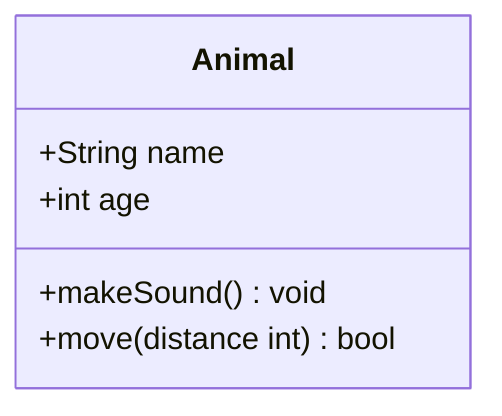

Members are listed inside `{ }`. Fields list type then name; methods add parentheses and an optional return type.

### Member visibility

| Symbol | Visibility |
|--------|------------|
| `+` | Public |
| `-` | Private |
| `#` | Protected |
| `~` | Package / internal |

Append `$` to mark a member as **static**, or `*` to mark it as **abstract**:

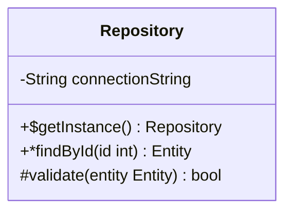

### Relationships

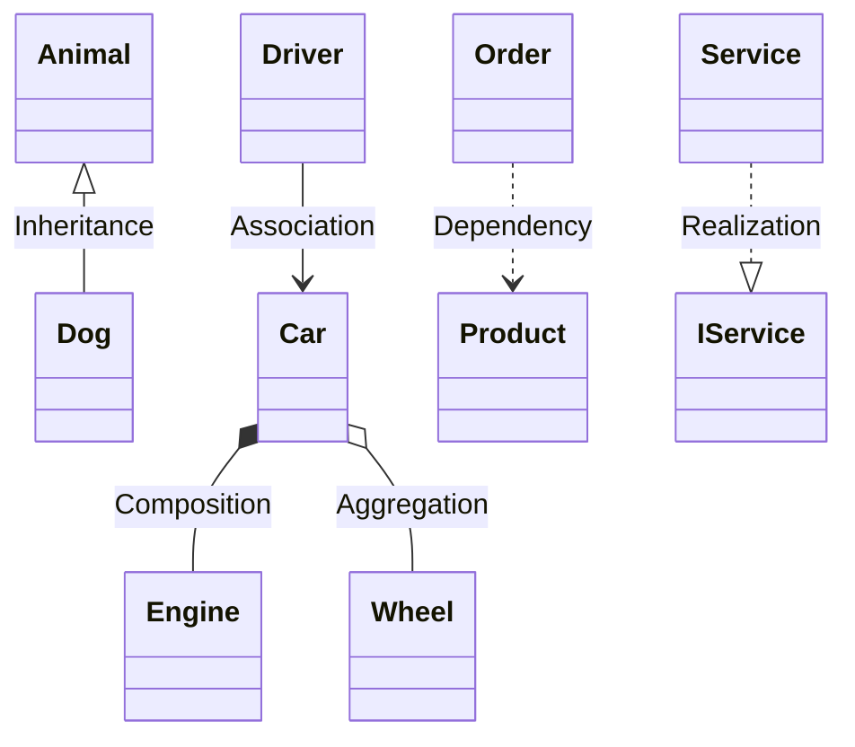

| Syntax | Relationship |
|--------|--------------|
| `A <\|-- B` | B inherits from A (generalization) |
| `A *-- B` | A is composed of B (composition) |
| `A o-- B` | A aggregates B (aggregation) |
| `A --> B` | A has an association to B |
| `A -- B` | Link (undirected) |
| `A ..> B` | A depends on B |
| `A ..*` | Composition via dotted |
| `A ..\|> B` | A realizes interface B |

All relationships can be reversed by swapping the symbols.

### Cardinality labels

Add cardinality to either end of a relationship:

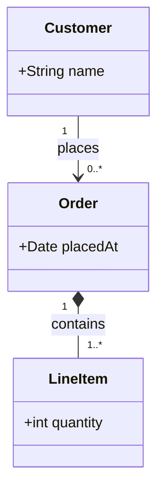

Common cardinality strings: `1`, `0..*`, `1..*`, `0..1`, `n`, `1..n`.

### Relationship labels

Add a label after the relationship using `:` with a quoted or unquoted string:

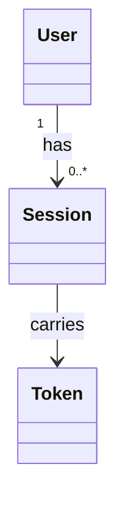

### Annotations

Annotations mark the stereotype of a class. Place them inside the class body with `<<...>>`:

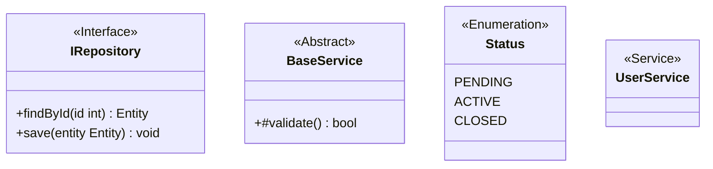

Common annotations: `<<Interface>>`, `<<Abstract>>`, `<<Enumeration>>`, `<<Service>>`, `<<Repository>>`, `<<Component>>`.

### Namespaces

Group related classes inside a named namespace:

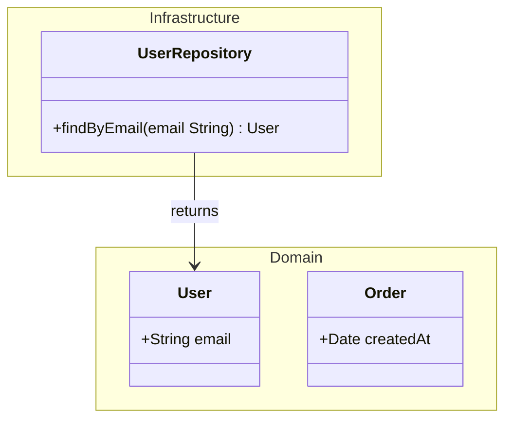

### Class diagram direction

Control layout with a leading `direction` declaration:

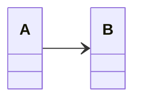

Accepted values: `TB`, `BT`, `LR`, `RL`.

---

## State diagrams

State diagrams model the lifecycle of an object — which states it can be in and the transitions between them.

### Basic transitions

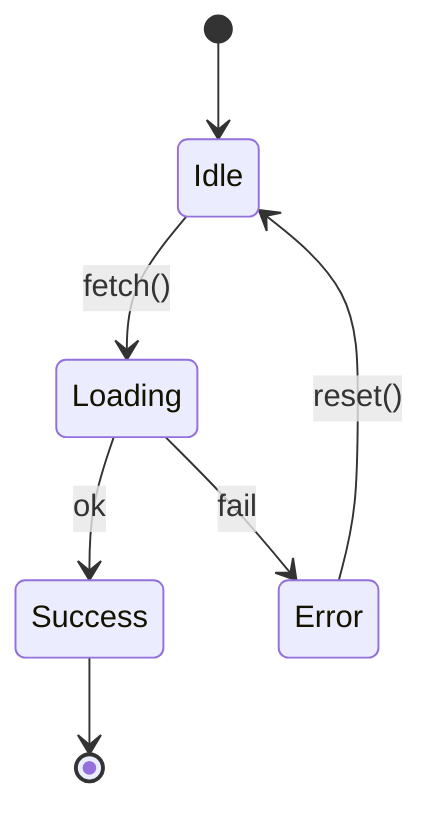

`[*]` is the special initial / final state marker. A transition out of `[*]` is the entry; a transition into `[*]` is the exit.

### State descriptions

Add a description to a state using `state_id : description`:

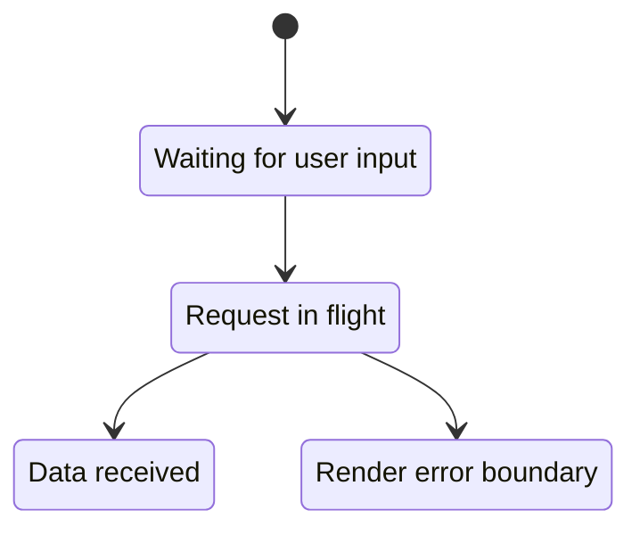

### Named states

Give a long-form display name to a state using `state "label" as id`:

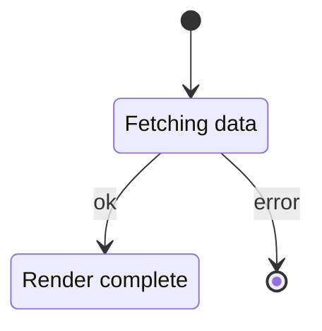

### Composite (nested) states

A composite state groups sub-states inside `state id { ... }`:

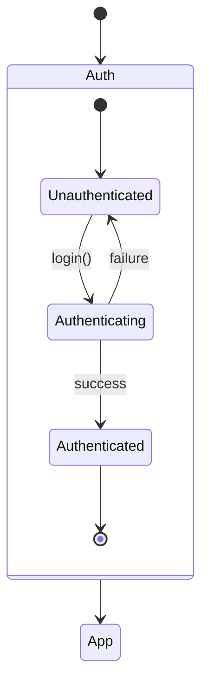

### Fork and join

Model parallel execution with `<<fork>>` and `<<join>>`:

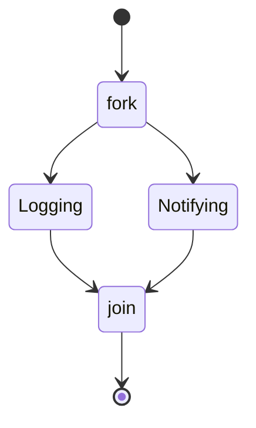

### Choice (conditional)

Branch based on a condition with `<<choice>>`:

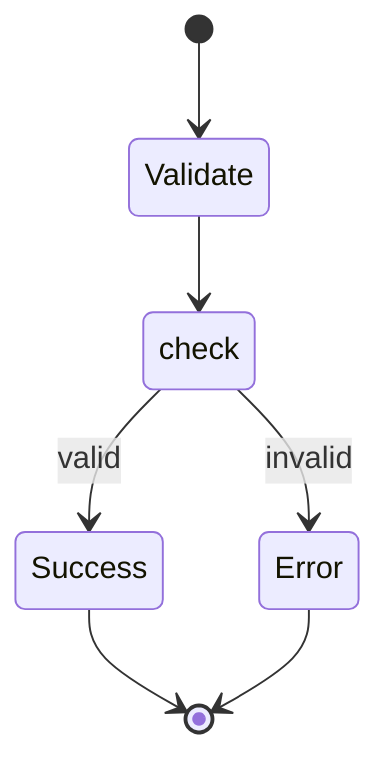

### Concurrency

Split a composite state into concurrent regions with `--`:

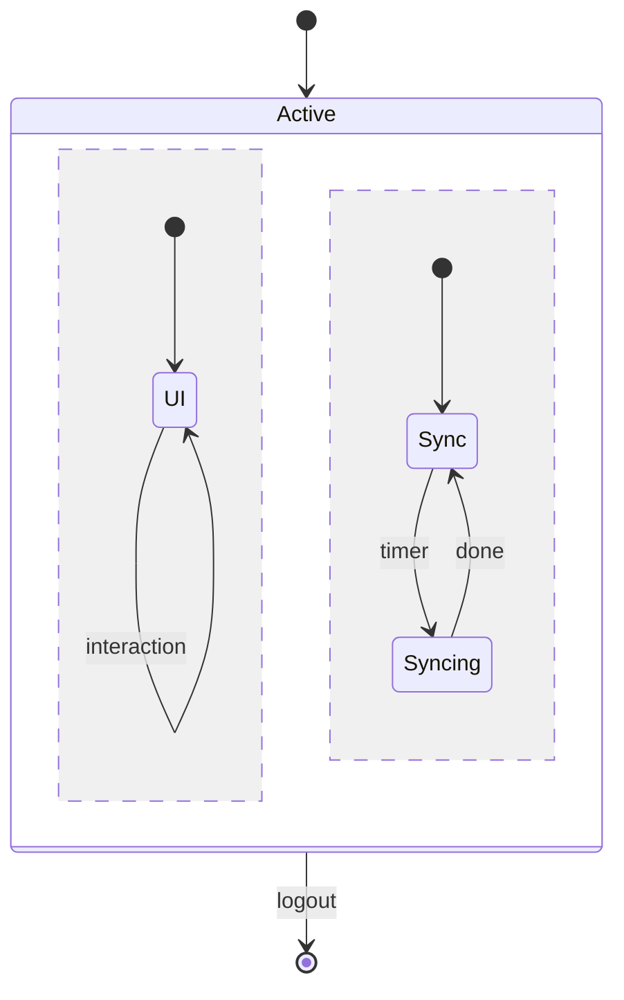

### Notes

Annotate a state with a free-form note:

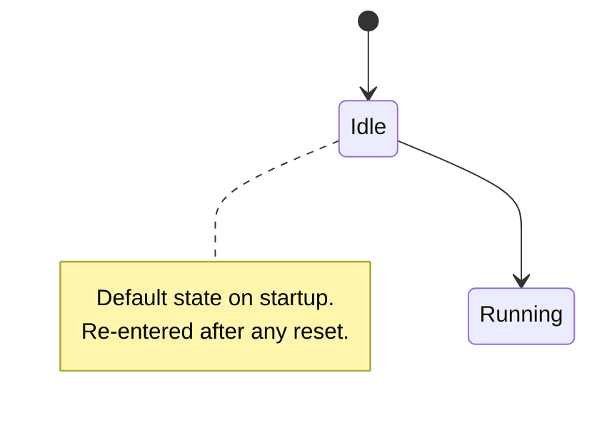

### Direction

```mermaid
stateDiagram-v2
  direction LR
  [*] --> A --> B --> [*]
```

## Rendering with @domphy/mermaid

```ts
import { renderMermaidToSvg } from "@domphy/mermaid"

const classSvg = await renderMermaidToSvg(`classDiagram
  class IStore {
    <<Interface>>
    +get(key String) T
    +set(key String, value T) void
  }
  class RecordState {
    +get(key String) T
    +set(key String, value T) void
  }
  IStore <|.. RecordState : implements`, { theme: "neutral" })

const stateSvg = await renderMermaidToSvg(`stateDiagram-v2
  [*] --> Idle
  Idle --> Loading : query.fetch()
  Loading --> Success : data received
  Loading --> Error : network fail
  Error --> Idle : retry()
  Success --> [*]`, { theme: "neutral" })
```
