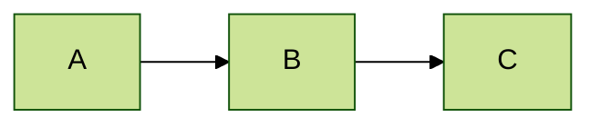
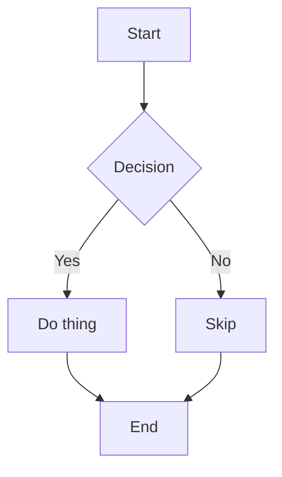
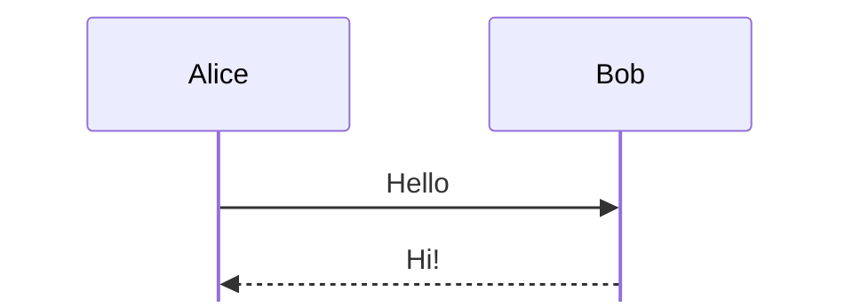

# Configuration & Themes

## Global configuration

Pass options to `mermaidClient` to apply settings to all diagrams on the page. The `theme` key is top-level; anything else that Mermaid accepts goes inside `mermaidConfig`:

```ts
import { mermaidClient } from "@domphy/mermaid"

const DiagramPage = {
  div: DiagramContent,
  $: [mermaidClient({
    theme: "default",
    mermaidConfig: {
      fontFamily: "Inter, sans-serif",
      fontSize: 14,
      startOnLoad: false,
    },
  })],
}
```

## Built-in themes

Mermaid ships five built-in themes:

| Theme | Description |
|-------|-------------|
| `"default"` | Light blue palette — works on light backgrounds |
| `"neutral"` | Gray tones — subtle, professional |
| `"dark"` | Dark background — for dark mode |
| `"forest"` | Green tones |
| `"base"` | Minimal — best base for custom theming |

```ts
import { mermaidClient } from "@domphy/mermaid"

const DiagramBlock = {
  div: null,
  $: [mermaidClient({ theme: "dark" })],
}
```

## Theme variables (custom theme)

Use the `"base"` theme with `themeVariables` inside `mermaidConfig` for full control:

```ts
import { mermaidClient } from "@domphy/mermaid"

const DiagramBlock = {
  div: null,
  $: [mermaidClient({
    theme: "base",
    mermaidConfig: {
      themeVariables: {
        primaryColor: "#7c3aed",        // node fill
        primaryTextColor: "#ffffff",    // node text
        primaryBorderColor: "#5b21b6",  // node border
        lineColor: "#6b7280",           // edge color
        secondaryColor: "#f3f4f6",      // secondary node fill
        tertiaryColor: "#fef3c7",       // tertiary node fill
        background: "#ffffff",          // diagram background
        mainBkg: "#ede9fe",             // main node background
        nodeBorder: "#7c3aed",
        clusterBkg: "#f5f3ff",
        titleColor: "#1f2937",
        edgeLabelBackground: "#ffffff",
        fontFamily: "Inter, sans-serif",
      },
    },
  })],
}
```

## Per-diagram directives

Embed configuration directly in the diagram source using `%%{init: ...}%%`:

```markdown

```

Directives override global config for that single diagram.

## Flowchart direction

```markdown

```

Curve options: `"basis"`, `"linear"`, `"cardinal"`, `"step"`, `"stepBefore"`, `"stepAfter"`.

## Sequence diagram config

```markdown

```

## Dark mode integration

Reactively switch diagram theme when the Domphy theme changes:

```ts
import { mermaidClient } from "@domphy/mermaid"
import { themeName } from "@domphy/theme"
import { toState } from "@domphy/core"

const diagramTheme = toState<"default" | "dark">("default")

const DiagramBlock = {
  div: null,
  $: [(l) => mermaidClient({ theme: diagramTheme.get(l) })],
}

// Update diagramTheme whenever the page theme changes
function syncTheme(node: ElementNode) {
  const name = themeName(node)
  diagramTheme.set(name === "dark" ? "dark" : "default")
}
```

## Render options

```ts
import { mermaidClient } from "@domphy/mermaid"

const DiagramBlock = {
  div: null,
  $: [mermaidClient({
    mermaidConfig: {
      securityLevel: "strict",    // or "loose" for trusted HTML in labels
      maxTextSize: 50_000,        // max characters — raise for large diagrams
      maxEdges: 500,              // max edges before truncation warning
      logLevel: "error",          // "fatal"|"error"|"warn"|"info"|"debug"
    },
  })],
}
```

## Accessibility

Mermaid generates `<title>` and `<desc>` elements inside each SVG — screen readers pick these up automatically. Add them with the `accTitle` and `accDescr` directives:

```markdown
```mermaid
---
title: Deployment flow
---
accTitle: Deployment pipeline diagram
accDescr: Shows stages from commit to production
flowchart LR
  Commit --> CI --> Staging --> Production
```
```
