# Supported Diagrams

`@domphy/mermaid` renders any diagram type that [Mermaid.js](https://mermaid.js.org) supports. Below is a quick reference for the most commonly used types with Domphy usage examples.

## Flowchart

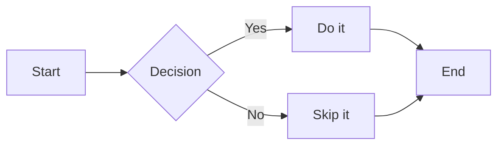

```ts
import { renderMermaidInTree } from "@domphy/mermaid"

const diagram = await renderMermaidInTree({
  pre: [{ code: `flowchart LR
  A[Start] --> B{Decision}
  B -- Yes --> C[Do it]
  B -- No --> D[Skip it]` }],
})
```

Flowchart directions: `TB` (top→bottom), `LR` (left→right), `BT`, `RL`.

## Sequence diagram

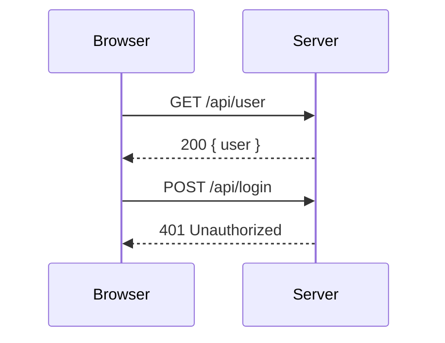

```ts
const source = `sequenceDiagram
  participant Browser
  participant Server
  Browser->>Server: GET /api/user
  Server-->>Browser: 200 { user }`
```

## Class diagram

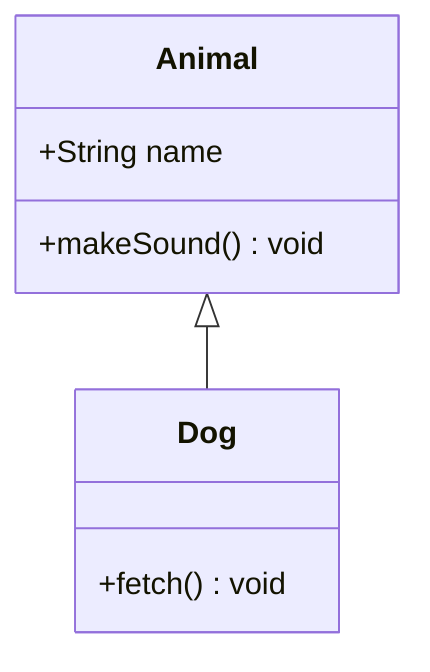

## State diagram

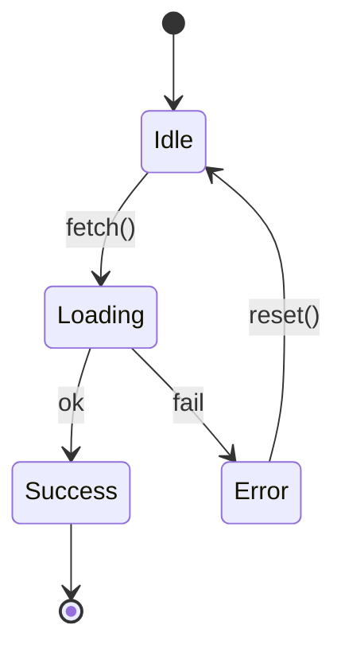

Useful for documenting `@domphy/query` state transitions.

## Entity-relationship (ERD)

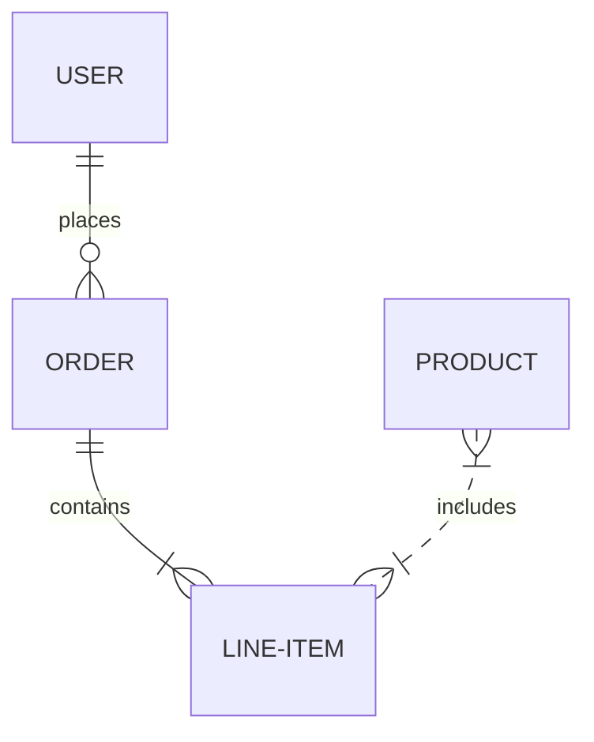

## Gantt chart

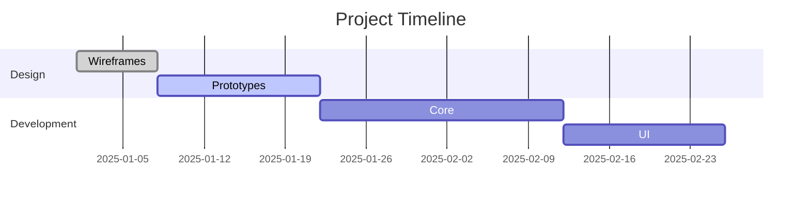

## Pie chart

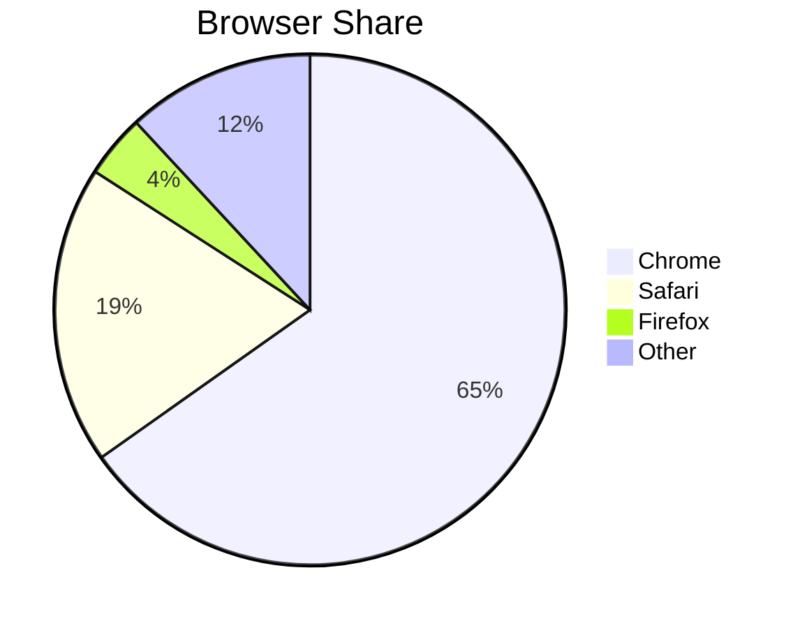

## Git graph

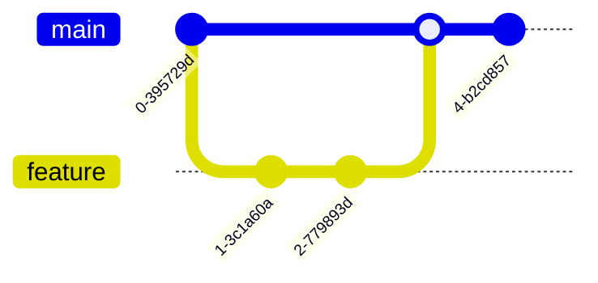

## Mind map

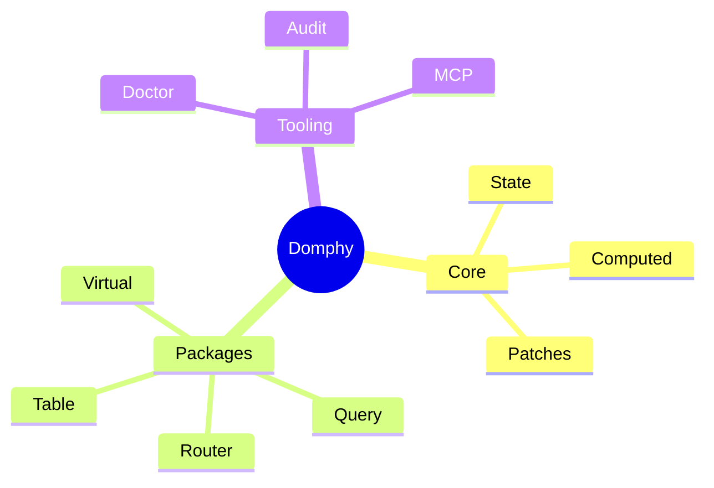

## Timeline

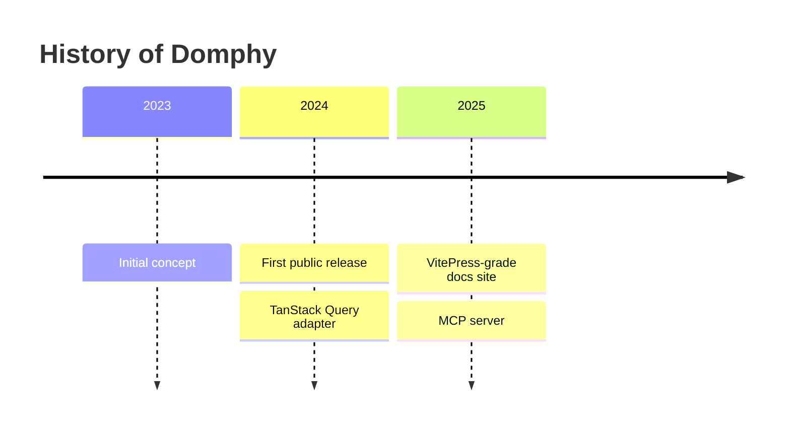

## Block diagram

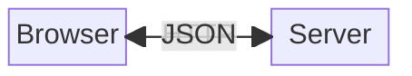

## Quadrant chart

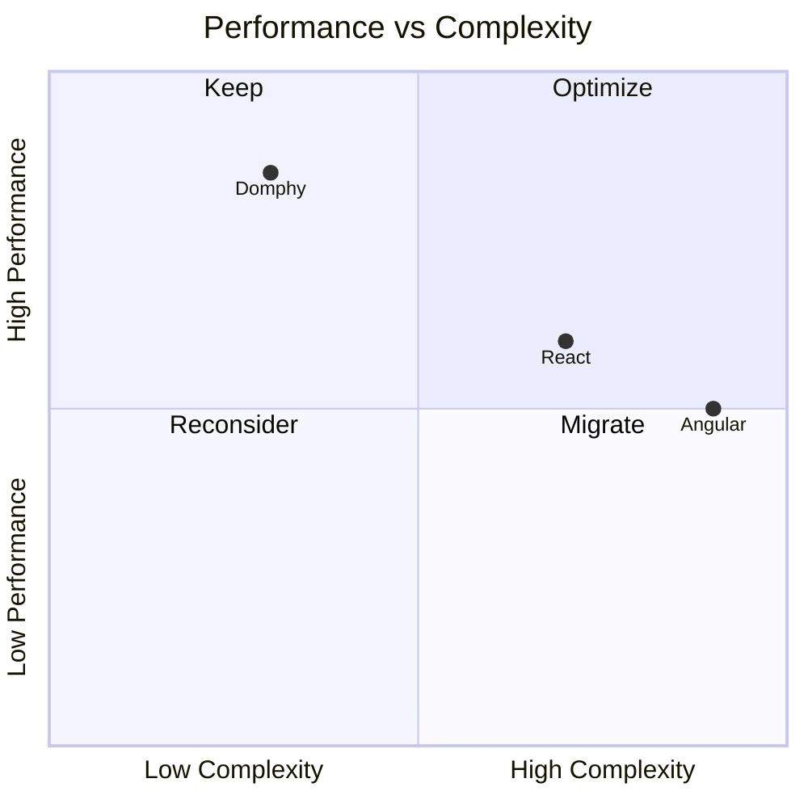

## XY Chart

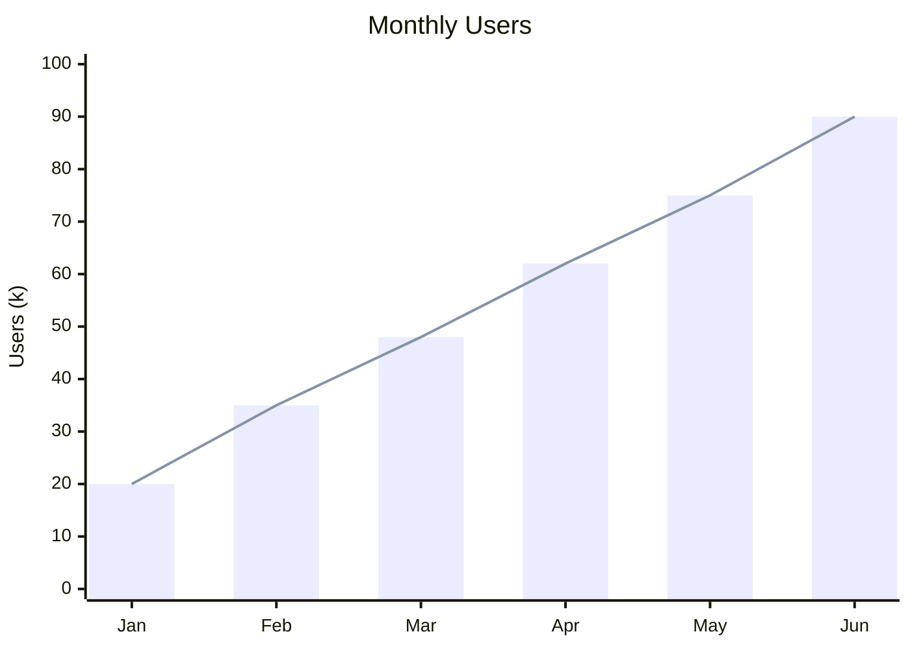

## Kanban

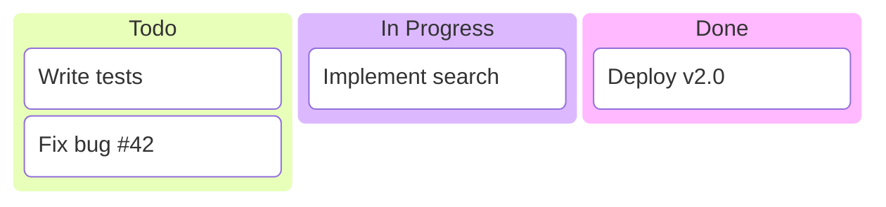

## Theming diagrams

Override the Mermaid theme per diagram using `%%{init: ...}%%`:

```ts
const source = `%%{init: {'theme': 'dark', 'themeVariables': {'primaryColor': '#6366f1'}}}%%
flowchart LR
  A --> B`

const svg = await renderMermaidToSvg(source, { theme: "dark" })
```

Available themes: `default`, `dark`, `neutral`, `forest`, `base` (most customizable).

## Build-time vs client-side

| Method | When to use |
|--------|-------------|
| `renderMermaidInTree()` | Static docs, SSG — SVG in HTML, no runtime |
| `mermaidClient()` patch | Dynamic diagrams, user input, live preview |

Build-time is recommended for most docs: smaller page weight, no layout shift, works without JavaScript.

## All supported types

Every Mermaid diagram type works with `@domphy/mermaid`:

flowchart, sequenceDiagram, classDiagram, stateDiagram-v2, erDiagram, gantt, pie, gitGraph, mindmap, timeline, xychart-beta, block-beta, quadrantChart, requirementDiagram, C4Context, sankey-beta, kanban, architecture-beta, packet-beta, radar, treemap, eventModel, wardleyMap, vennDiagram, ZenUML

See [mermaid.js.org](https://mermaid.js.org) for full syntax documentation for each type.
