# ER, Gantt, Pie & Git Graphs

## Entity-relationship diagrams

ER diagrams model the data structure of a system — entities, their attributes, and how they relate.

### Basic syntax

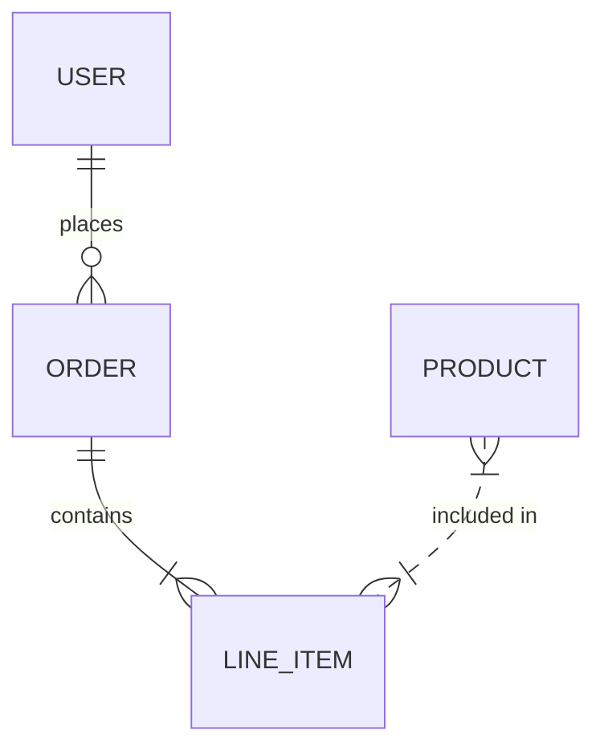

### Cardinality notation

Cardinality is written on both sides of the `--` connector:

| Symbol | Meaning |
|--------|---------|
| `\|\|` | Exactly one |
| `o\|` | Zero or one |
| `}\|` | One or more |
| `}o` | Zero or more |

Combine left and right sides with `--` (identifying) or `..` (non-identifying):

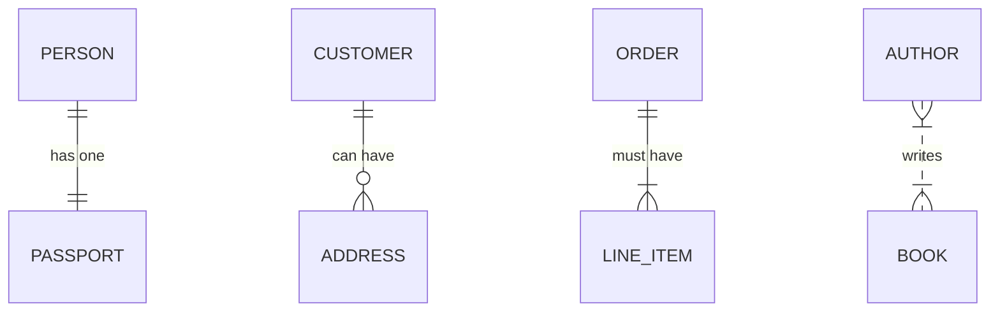

### Entity attributes

List attributes inside `{ }`. Each attribute declares a type, a name, and optional key / comment:

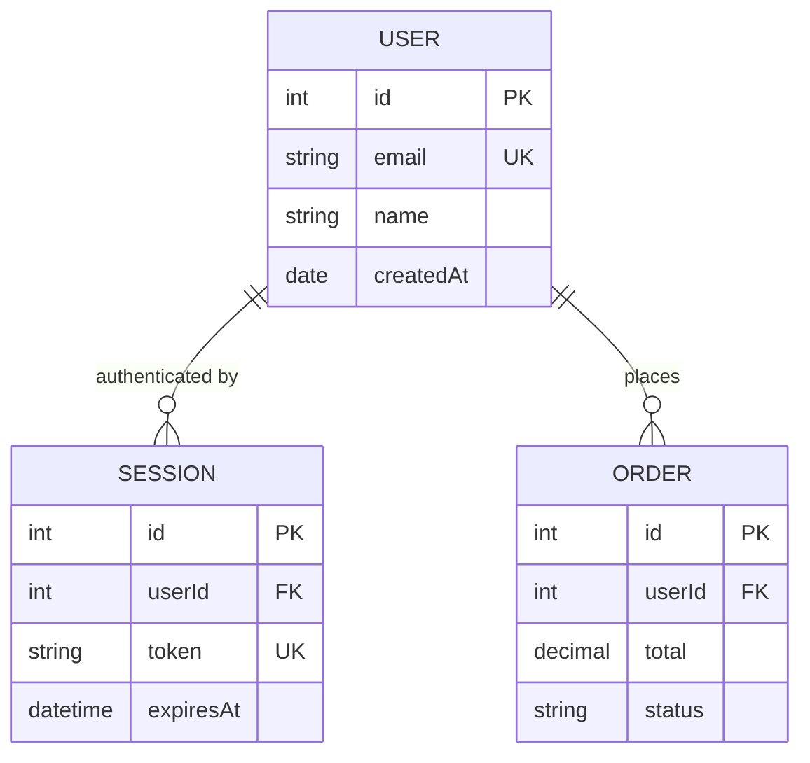

Key markers: `PK` (primary key), `FK` (foreign key), `UK` (unique key). You can append a comment string after the key marker:

```text
USER {
  int id PK "Auto-increment"
  string email UK "Normalized lowercase"
}
```

---

## Gantt charts

Gantt charts display project schedules with tasks laid out on a time axis.

### Basic syntax

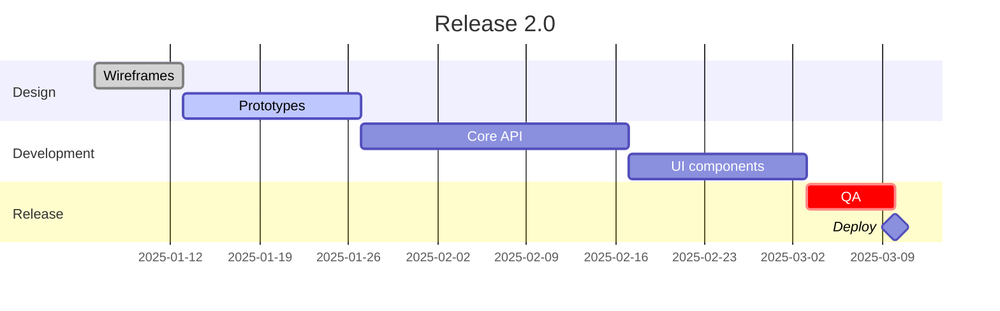

### Date formats

The `dateFormat` directive controls how dates are parsed in task definitions:

| Format token | Example |
|--------------|---------|
| `YYYY-MM-DD` | `2025-03-15` |
| `DD/MM/YYYY` | `15/03/2025` |
| `MM/DD/YYYY` | `03/15/2025` |
| `X` | Unix timestamp (seconds) |

Control the display format on the axis with `axisFormat`:

```text
axisFormat %Y-%m
```

Common `axisFormat` tokens: `%Y` year, `%m` month (0-padded), `%b` abbreviated month name, `%d` day.

### Task syntax

```text
Task label  :status, taskId, startDate, duration
Task label  :status, taskId, after otherTaskId, duration
```

- **startDate** — absolute date matching `dateFormat`, or `after taskId` for a dependency
- **duration** — number followed by `d` (days), `w` (weeks), `h` (hours), or `m` (minutes)
- **taskId** — optional identifier used by `after` references
- **status** — optional comma-separated flags

### Task status flags

| Flag | Meaning |
|------|---------|
| `done` | Completed task (gray fill) |
| `active` | In progress (blue fill) |
| `crit` | Critical path (red fill) |
| `milestone` | Zero-duration diamond marker |

Flags are combinable: `:done, crit,` renders a completed critical task.

### Sections

Group tasks under a named section with the `section` keyword. Each section is a horizontal band:

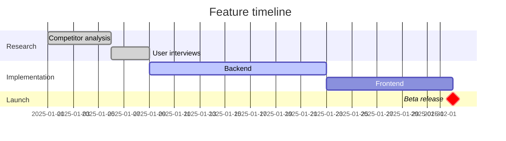

### Exclude weekends and specific days

```text
excludes weekends
excludes monday wednesday 2025-12-25
```

Place `excludes` before the first section.

### Today marker

Show a vertical line at the current date:

```text
todayMarker on
```

---

## Pie charts

Simple proportional charts with labeled slices.

### Basic syntax

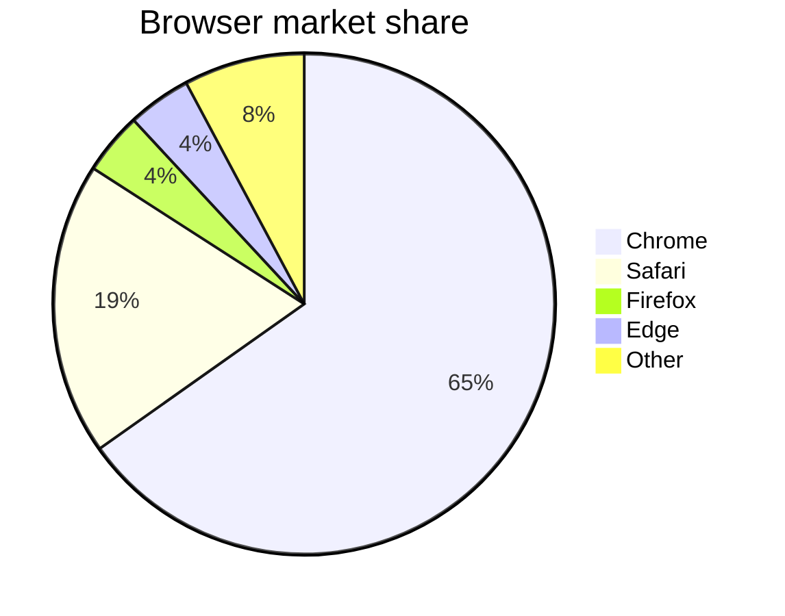

### Show raw values

Append `showData` after `pie` to display numeric values alongside percentages:

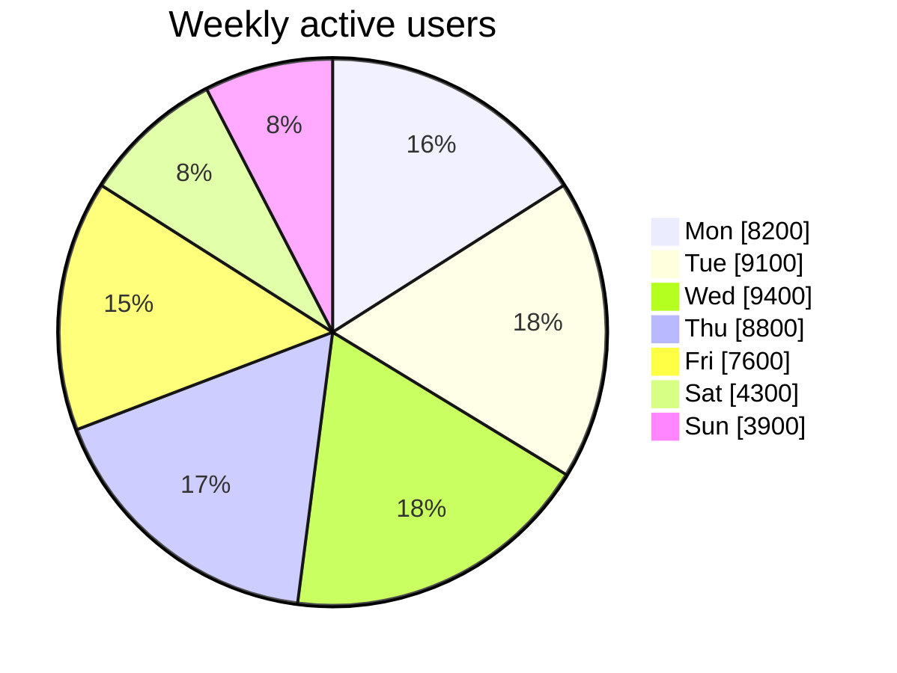

Values are proportional (not percentages) — Mermaid normalizes them.

---

## Git graphs

Git graphs visualize branch and merge history.

### Basic syntax

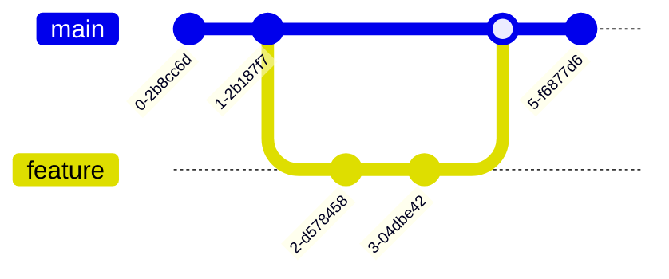

### Commit metadata

Add an `id` label, a `tag`, or a `type` to a commit:

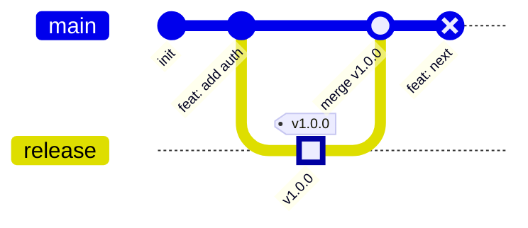

Commit types: `NORMAL` (default), `REVERSE` (dotted border), `HIGHLIGHT` (filled).

### Multiple branches

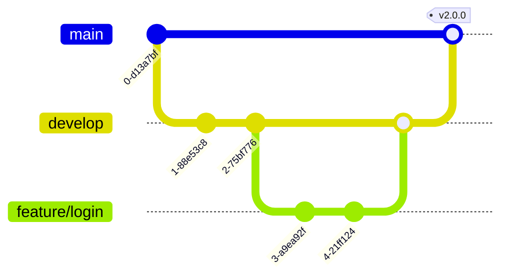

### Cherry-pick

Copy a specific commit to the current branch:

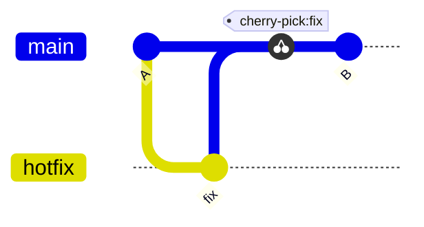

### Orientation

Switch from the default left-to-right to top-to-bottom with `LR` → `TB`:


## Rendering with @domphy/mermaid

All four diagram types use the same API. Build-time with cache:

```ts
import { renderMermaidCached } from "@domphy/mermaid"

const erSvg = await renderMermaidCached(`erDiagram
  USER ||--o{ ORDER : places
  ORDER ||--|{ LINE_ITEM : contains`, { theme: "neutral" })

const ganttSvg = await renderMermaidCached(`gantt
  title Sprint 12
  dateFormat YYYY-MM-DD
  section Backend
    Auth refactor :done, a1, 2025-06-01, 5d
    API v2        :active, a2, after a1, 10d`, { theme: "default" })

const pieSvg = await renderMermaidCached(`pie title Errors by type
  "Validation" : 42
  "Network"    : 28
  "Auth"       : 18
  "Other"      : 12`, { theme: "neutral" })
```

Embed the resulting SVG strings in Domphy elements:

```ts
const DiagramRow = {
  div: [
    { div: erSvg, class: "mermaid", ariaLabel: "Entity relationships" },
    { div: ganttSvg, class: "mermaid", ariaLabel: "Sprint timeline" },
    { div: pieSvg, class: "mermaid", ariaLabel: "Error breakdown" },
  ],
  style: { display: "grid", gridTemplateColumns: "repeat(3, 1fr)", gap: "1.5rem" },
}
```

Client-side for any of these types:

```ts
import { mermaidClient } from "@domphy/mermaid"

const PieChart = {
  pre: [{ code: `pie title Q1 Revenue\n  "Product A" : 40\n  "Product B" : 35\n  "Other" : 25` }],
  $: [mermaidClient({ theme: "neutral" })],
}
```
