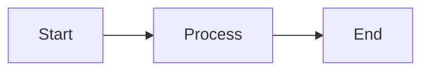
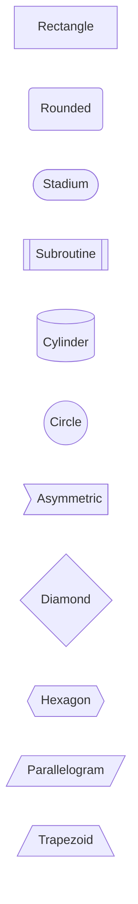
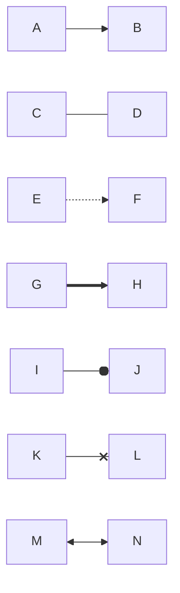
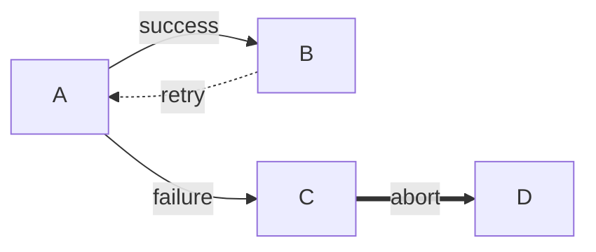
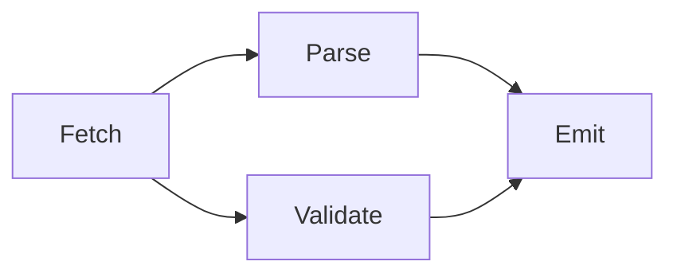
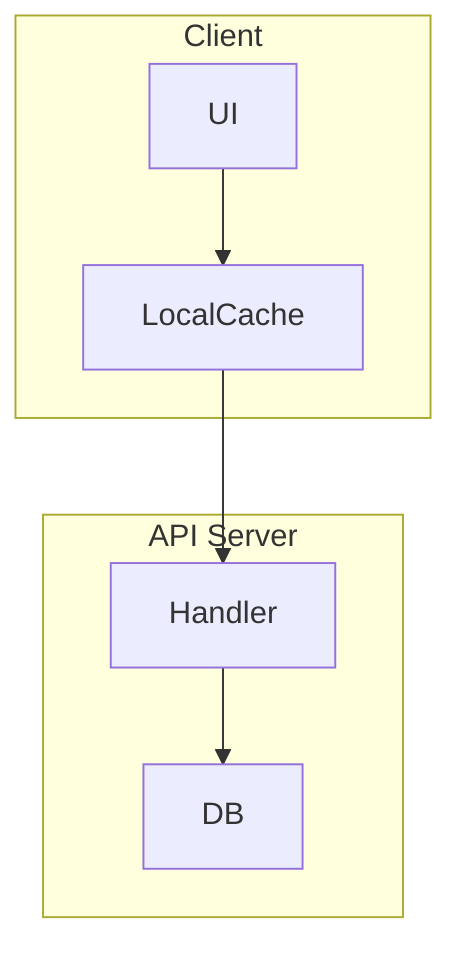
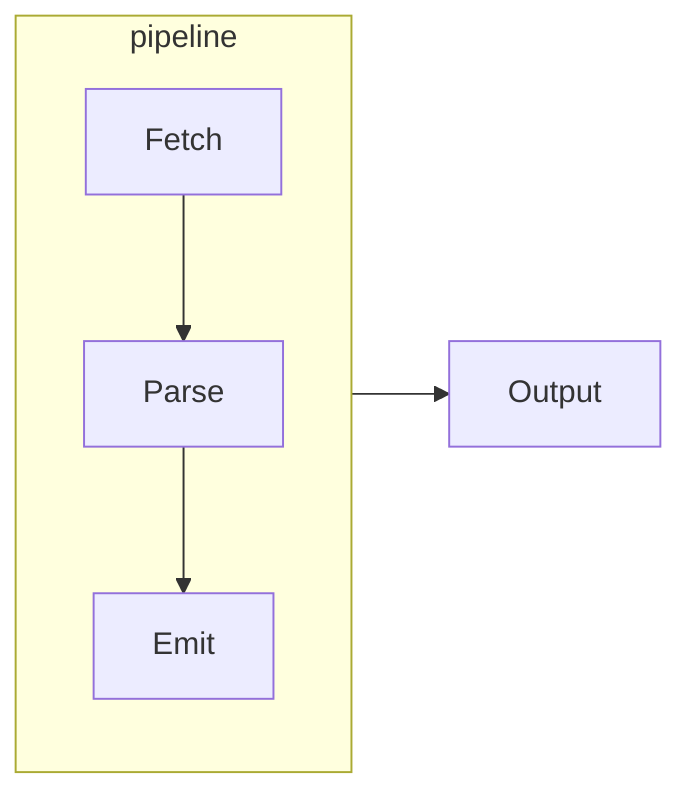
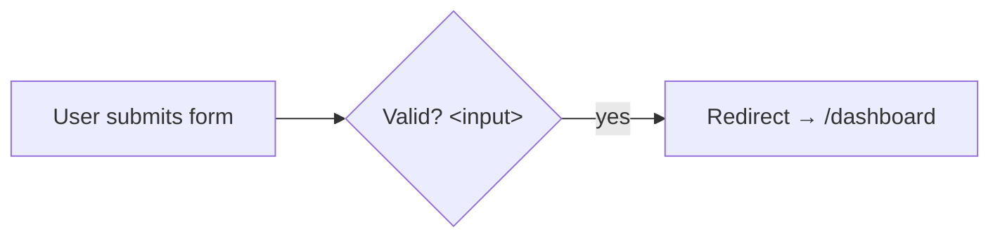
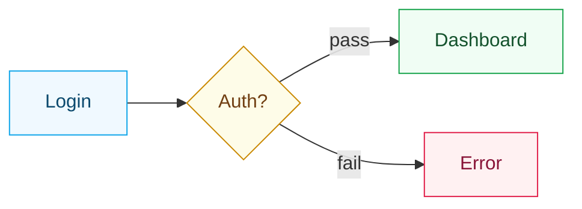

# Flowchart

Flowcharts model processes, decision trees, and data flows. Use `flowchart` (alias: `graph`) followed by a direction keyword.

## Direction



| Keyword | Direction |
|---------|-----------|
| `TB` or `TD` | Top → bottom |
| `BT` | Bottom → top |
| `LR` | Left → right |
| `RL` | Right → left |

## Node shapes

The characters surrounding the label choose the shape.



| Shape | Syntax |
|-------|--------|
| Rectangle | `id[text]` |
| Rounded | `id(text)` |
| Stadium / pill | `id([text])` |
| Subroutine | `id[[text]]` |
| Cylinder / database | `id[(text)]` |
| Circle | `id((text))` |
| Asymmetric | `id>text]` |
| Diamond / decision | `id{text}` |
| Hexagon | `id{{text}}` |
| Parallelogram | `id[/text/]` |
| Alt parallelogram | `id[\text\]` |
| Trapezoid | `id[/text\]` |
| Alt trapezoid | `id[\text/]` |

## Edge types



| Syntax | Renders as |
|--------|-----------|
| `-->` | Arrow |
| `---` | Open line |
| `-.->` | Dotted arrow |
| `-.-` | Dotted line |
| `==>` | Thick arrow |
| `===` | Thick line |
| `--o` | Circle arrowhead |
| `--x` | Cross arrowhead |
| `<-->` | Bidirectional arrow |
| `o--o` | Bidirectional circles |
| `x--x` | Bidirectional crosses |

## Edge labels

Place a label inline with the edge definition. Both syntaxes work:



Use double quotes when the label contains spaces or special characters:

```text
A -- "user signed in" --> B
```

## Multi-target shorthand

Fan out or fan in multiple connections with `&`:



This is shorthand for four individual edges: `Fetch --> Parse`, `Fetch --> Validate`, `Parse --> Emit`, `Validate --> Emit`.

## Subgraphs

Group related nodes in a labeled box:



```text
subgraph id["Display title"]
  ...nodes and edges...
end
```

Subgraphs nest freely. Give a subgraph its own direction with a nested `direction` declaration:



## Special characters in labels

Wrap labels in quotes to use spaces, hyphens, or Unicode. Use HTML entities for `<` (`&lt;`) and `>` (`&gt;`):



## Inline styling

Define reusable CSS classes with `classDef` and apply them using `:::` after the node ID:



Apply a class to several nodes at once with:
```text
class A,B,C stepClass
```

Set defaults for all unlabelled nodes:
```text
classDef default fill:#f9f9f9,stroke:#d1d5db
```

## Click interactions

Attach a URL or a JavaScript callback to a node:

```text
flowchart LR
  Docs --> API --> Code

  click Docs "https://domphy.com/docs" "Open docs"
  click API callback "Invoke JS callback"
```

Click interactions are only active in the browser rendering path. For callback-based clicks, pass `securityLevel: "loose"` in `mermaidConfig`:

```ts
import { mermaidClient } from "@domphy/mermaid"

const DiagramWithClicks = {
  pre: [{ code: `flowchart LR
  A --> B
  click A callback` }],
  $: [mermaidClient({ mermaidConfig: { securityLevel: "loose" } })],
}
```

## Build-time rendering

Render a flowchart to inline SVG at build time:

```ts
import { renderMermaidToSvg } from "@domphy/mermaid"

const source = `flowchart LR
  A[Client] --> B{Cache hit?}
  B -->|yes| C[Return cached]
  B -->|no| D[Fetch from API]
  D --> E[Store in cache]
  E --> C`

const svg = await renderMermaidToSvg(source, { theme: "neutral" })

// A single-root SVG string is rendered as inline HTML in a Domphy element.
const DiagramBlock = {
  div: svg,
  class: "mermaid",
  ariaLabel: "Cache lookup flowchart",
}
```

Use `renderMermaidCached` in build scripts to skip re-rendering unchanged diagrams:

```ts
import { renderMermaidCached } from "@domphy/mermaid"

const svg = await renderMermaidCached(source, { theme: "neutral" })
```

## Client-side rendering

Mount a flowchart in the browser at element mount time:

```ts
import { mermaidClient } from "@domphy/mermaid"

const source = `flowchart TD
  Login --> Auth{Authenticated?}
  Auth -->|yes| Dashboard
  Auth -->|no| LoginForm`

const DiagramView = {
  pre: [{ code: source }],
  $: [mermaidClient({ theme: "default" })],
}
```

The patch reads the `<code>` element's text at mount time and replaces the element's content with the SVG. See the [Client-side rendering](/docs/mermaid/client) page for reactive and dynamic usage patterns.
