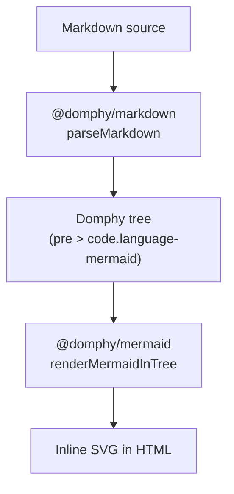

# Mermaid

`@domphy/mermaid` renders [Mermaid](https://mermaid.js.org/) diagrams for Domphy. It has two complementary paths:

- **Build-time / SSG** — render each diagram to inline SVG with a headless browser, with an on-disk cache and a tree integration for [`@domphy/markdown`](/docs/markdown/). The browser ships **no Mermaid runtime** — diagrams are just SVG in your HTML.
- **Client-side** — the `mermaidClient()` patch renders a diagram in the browser at mount time, using the `mermaid` library (an optional peer dependency).

This page is built by DomphyPress, so the diagram below was rendered to SVG at build time by the markdown integration:



## Install

::: code-group
```bash [pnpm]
pnpm add @domphy/mermaid
```
```bash [NPM]
npm install @domphy/mermaid
```
:::

`@domphy/core` is a peer dependency. `@mermaid-js/mermaid-cli` is a **direct** dependency that powers the build-time path; it manages its own headless browser (Puppeteer / Chrome) internally, so you do not install or configure Puppeteer yourself. `mermaid` is an **optional** peer dependency, needed only for the client-side patch.

## Build-time rendering

`renderMermaidToSvg(code, options?)` renders a single diagram to an SVG string:

```ts
import { renderMermaidToSvg } from "@domphy/mermaid"

const svg = await renderMermaidToSvg("graph TD; A-->B;", {
  theme: "dark",
  background: "transparent",
})
// svg === "<svg ...>...</svg>"
```

Mermaid syntax errors are thrown as an `Error` that includes the diagram source — they are never silently swallowed.

### Options

| Option | Type | Default |
| --- | --- | --- |
| `theme` | `"default" \| "dark" \| "neutral" \| "forest"` | `"default"` |
| `background` | `string` (`"transparent"` for none) | `"transparent"` |
| `mermaidConfig` | `Record<string, unknown>` | — |
| `css` | `string` (injected into the render page) | — |
| `puppeteer` | `Record<string, unknown>` (launch options) | — |

## Render cache

`renderMermaidCached(code, options?)` renders once and reads the SVG back from disk on later calls with the same source and options:

```ts
import { renderMermaidCached } from "@domphy/mermaid"

const svg = await renderMermaidCached("graph TD; A-->B;", {
  cacheDir: "node_modules/.cache/domphy-mermaid", // default
})
```

The cache key is a stable SHA-256 hash of the normalized source plus the output-affecting options (no time or randomness), so repeated builds are fast. Pass `cache: false` to bypass it.

## Markdown integration

`@domphy/markdown` emits a fenced ` ```mermaid ` block as a regular code node:

```js
{ pre: [{ code: "<escaped source>", dataLanguage: "mermaid", class: "language-mermaid" }] }
```

`renderMermaidInTree(elements, options?)` finds those blocks anywhere in the tree, renders each to SVG (through the cache), and replaces the node with an SVG-wrapping element:

```js
{ div: "<svg ...>...</svg>", class: "mermaid", ariaLabel: "diagram" }
```

```ts
import { parseMarkdown } from "@domphy/markdown"
import { renderMermaidInTree } from "@domphy/mermaid"

const { body } = parseMarkdown(markdownSource)
const rendered = await renderMermaidInTree(body, { theme: "neutral" })
```

All other nodes — siblings, nesting, attributes — are left untouched. Identical diagram sources are rendered only once, and distinct diagrams render concurrently. Inject a custom `renderer` to test the tree walk without a browser:

```ts
await renderMermaidInTree(body, {
  renderer: async (code) => `<svg data-src="${code}"></svg>`,
})
```

`TreeOptions` extends the cache options, plus `renderer` and a `className` for the wrapping element (default `"mermaid"`).

## Client-side patch

To render in the browser at mount time instead of at build time, attach `mermaidClient()` with `$`:

```ts
import { mermaidClient } from "@domphy/mermaid"

const App = {
  pre: [{ code: "graph TD; A-->B;" }],
  $: [mermaidClient({ theme: "dark" })],
}
```

On mount the patch reads the source from the element (preferring an inner `<code>`), renders it with the `mermaid` library, and swaps in the SVG. Install `mermaid` to use this path:

```bash
pnpm add mermaid
```

::: tip
Prefer the build-time path for documentation and content sites: the SVG is in the HTML on first paint, with no Mermaid runtime, no layout shift, and no client work. Reach for `mermaidClient()` only when the diagram source is dynamic in the browser.
:::
