# Sequence Diagrams

Sequence diagrams show how components communicate over time. Each actor is laid out as a vertical lifeline; messages pass between lifelines horizontally.

## Basic syntax

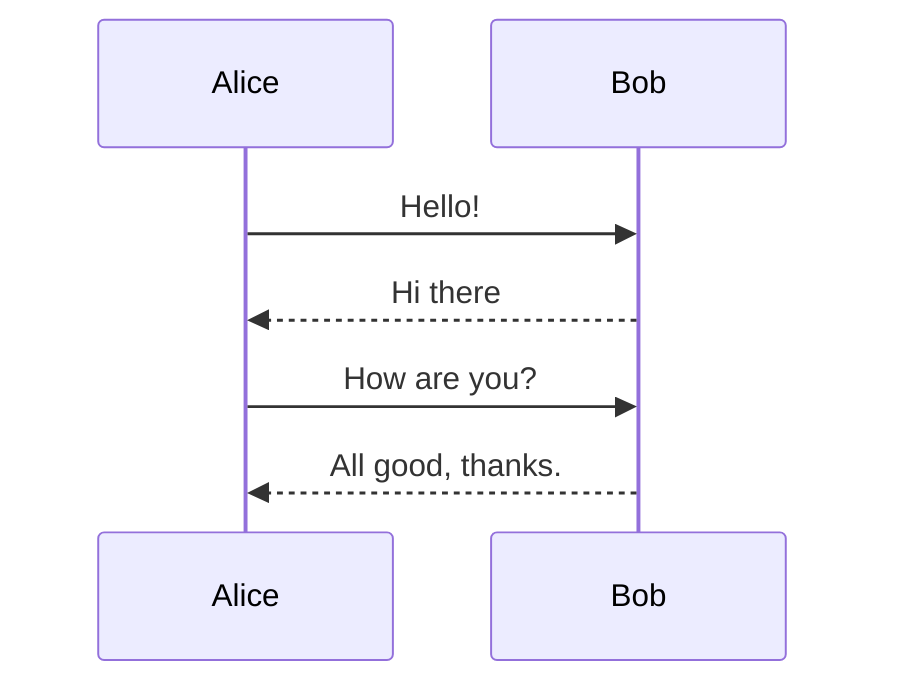

## Participants

Declare participants explicitly to fix their order and give them readable labels:

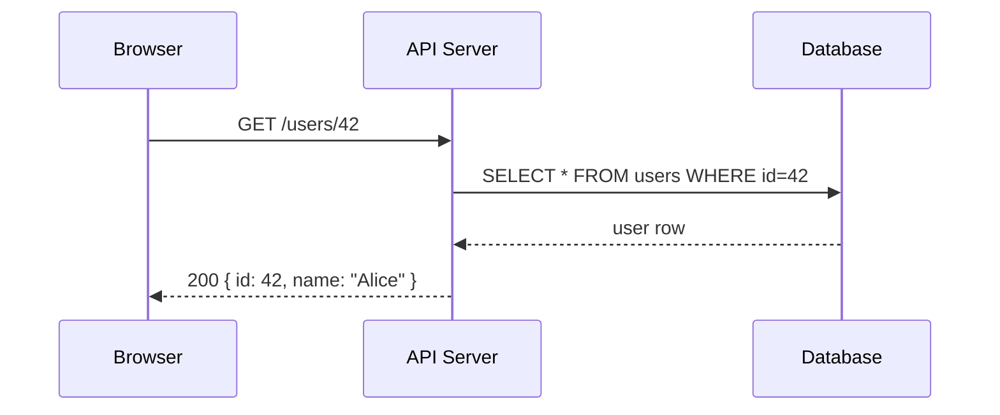

Use `actor` instead of `participant` to render a stick-person icon:

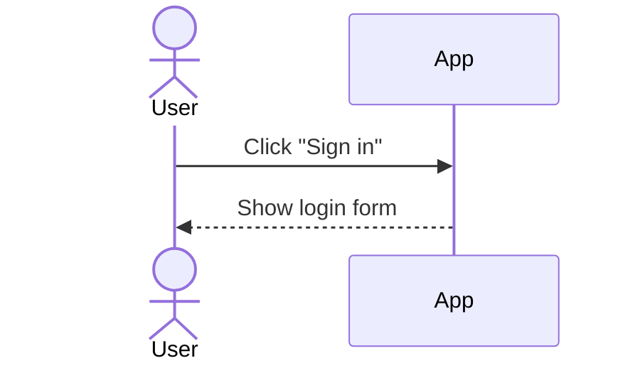

## Message arrow types

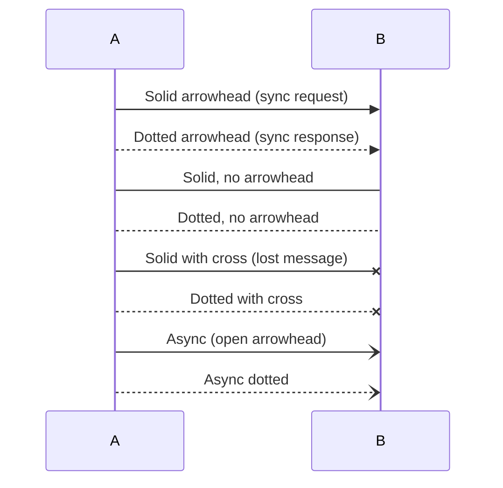

| Syntax | Meaning |
|--------|---------|
| `->>` | Synchronous call (solid arrowhead) |
| `-->>` | Synchronous response (dotted arrowhead) |
| `->` | Solid, no arrowhead |
| `-->` | Dotted, no arrowhead |
| `-x` | Lost / dropped message |
| `--x` | Lost / dropped dotted |
| `-)` | Asynchronous (open arrowhead) |
| `--)` | Asynchronous dotted |

## Activation boxes

Activation boxes indicate when a participant is actively processing. Use the `+`/`-` shorthand directly on the message:

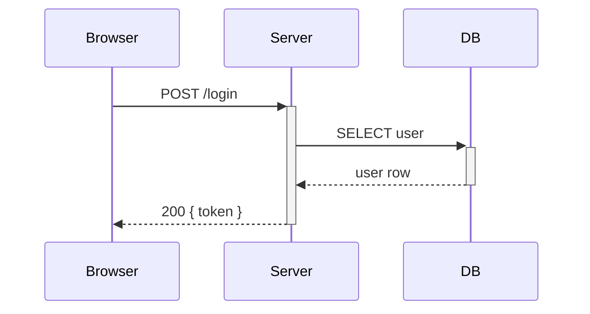

Or use explicit `activate` / `deactivate`:

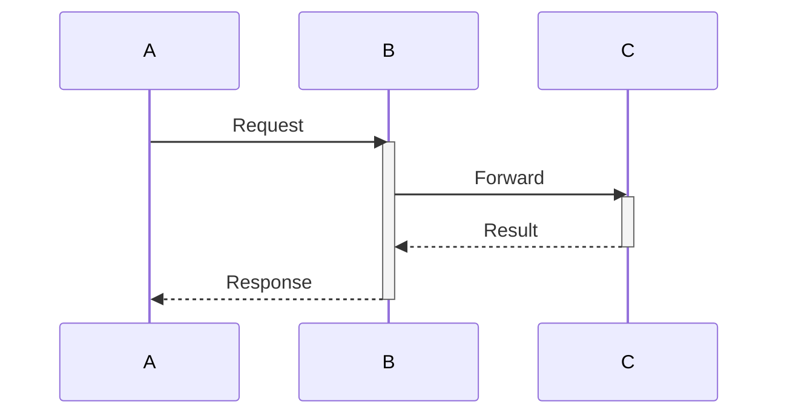

Nested `+`/`-` on the same participant creates stacked boxes to show re-entrant calls:

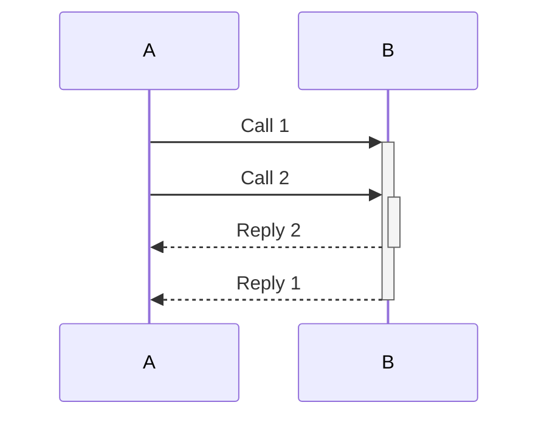

## Notes

Annotate the diagram with free-form notes:

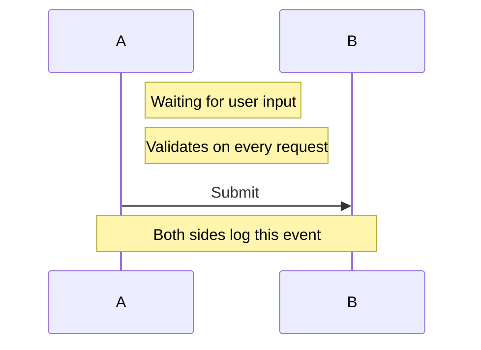

| Syntax | Position |
|--------|----------|
| `Note right of X` | Right of X |
| `Note left of X` | Left of X |
| `Note over X` | Centred above X |
| `Note over X,Y` | Spanning X to Y |

## Loop

Repeat a block of messages:

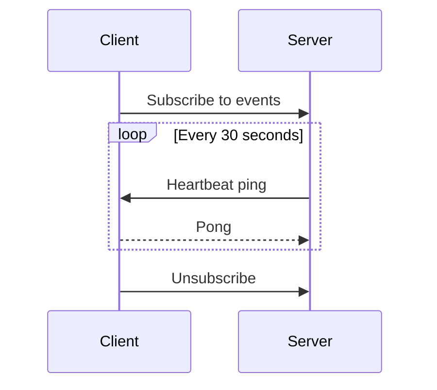

## Alt / else

Model branching flows — `alt` with one or more `else` clauses:

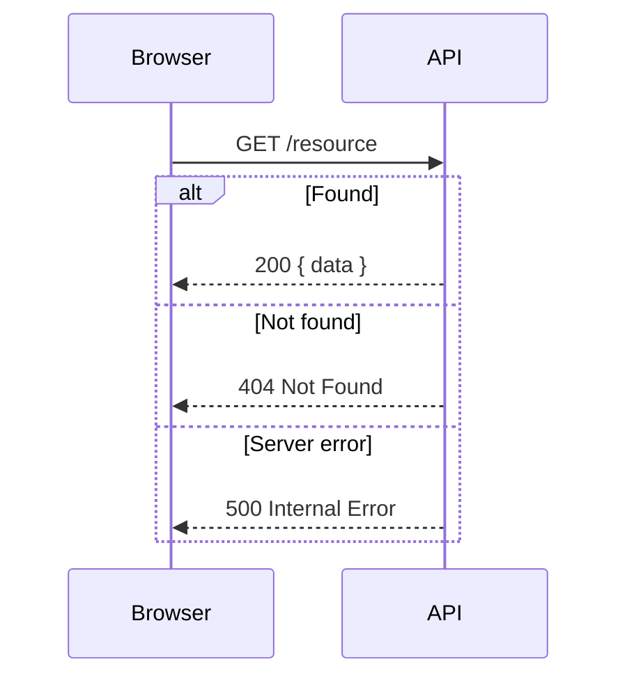

## Opt

An optional block (shown only when the condition holds):

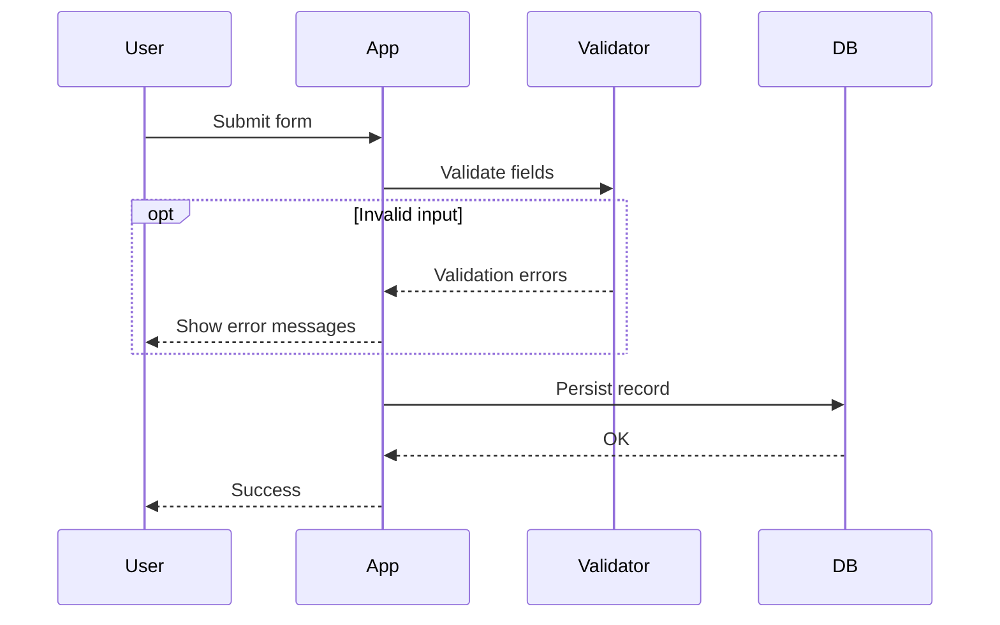

## Par

Show parallel concurrent activity:

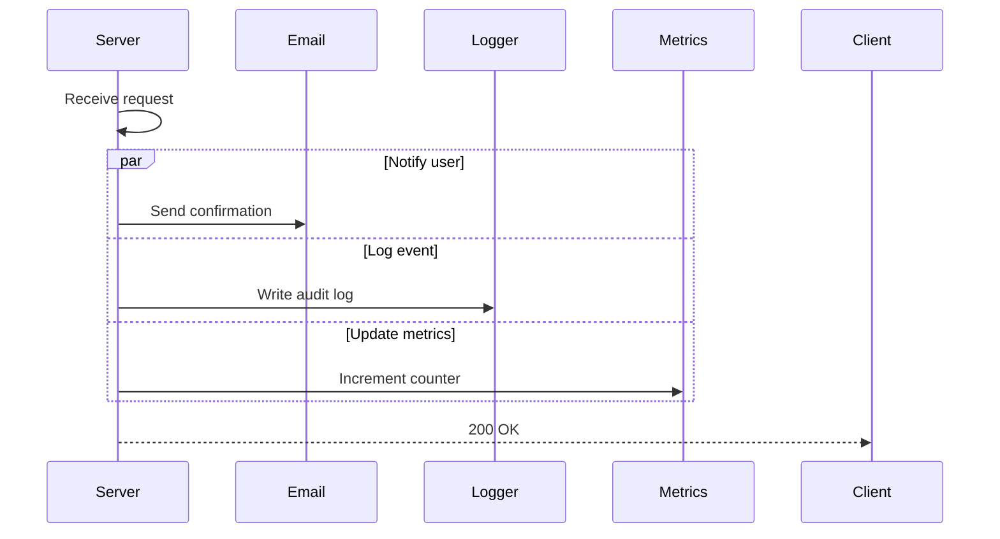

## Critical

A `critical` block marks a section that must succeed, with `option` branches for alternative outcomes:

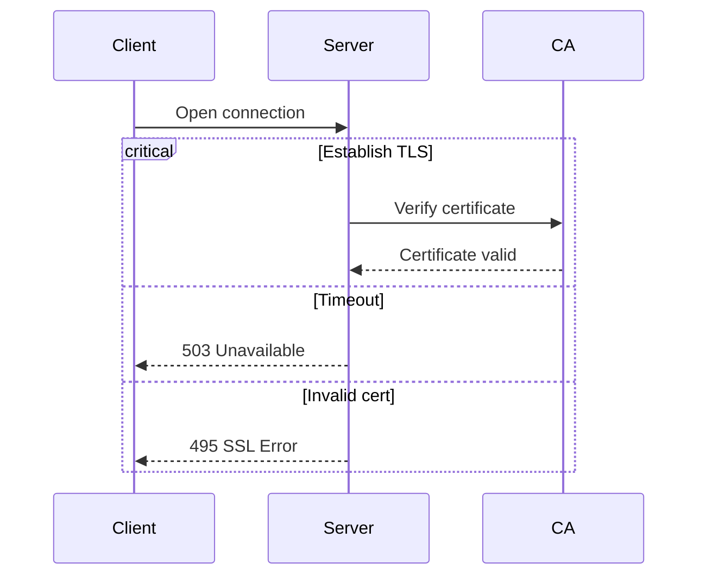

## Break

Model an early exit from a sequence:

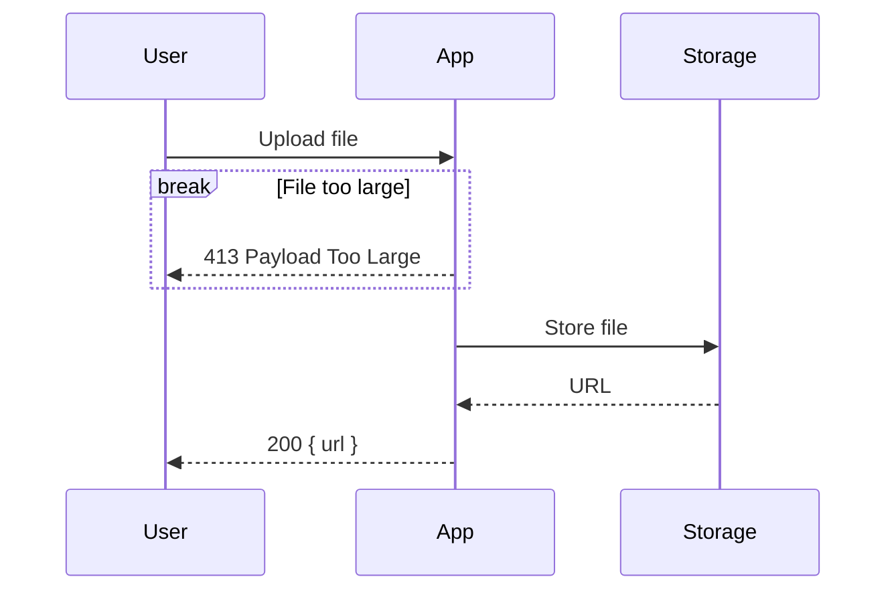

## Autonumber

Prefix every message with an incrementing sequence number:

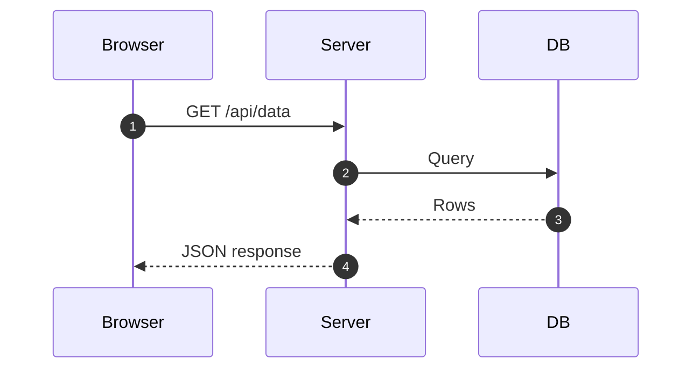

## Box grouping

Group participants in a colored background box:

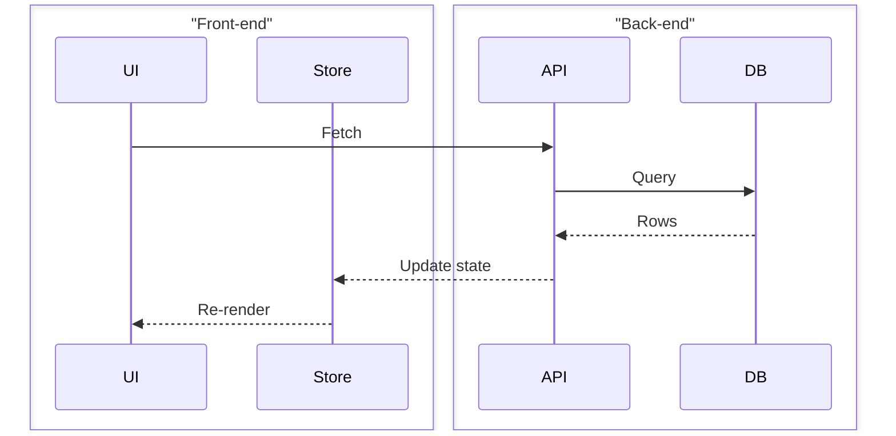

## Rendering with @domphy/mermaid

Build-time:

```ts
import { renderMermaidToSvg } from "@domphy/mermaid"

const svg = await renderMermaidToSvg(`sequenceDiagram
  autonumber
  actor User
  participant App
  participant Auth

  User->>App: Sign in
  App->>+Auth: Verify credentials
  Auth-->>-App: JWT token
  App-->>User: Redirect to /dashboard`, { theme: "default" })
```

Client-side (for dynamic or user-authored diagrams):

```ts
import { mermaidClient } from "@domphy/mermaid"

const SequenceView = {
  pre: [{ code: `sequenceDiagram
  A->>B: Hello
  B-->>A: Hi` }],
  $: [mermaidClient({ theme: "neutral" })],
}
```
