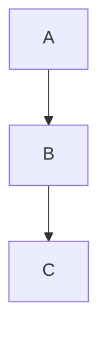

# Markdown Features

## Custom Containers

::: tip
14 container types: `tip`, `info`, `note`, `warning`, `danger`, `success`, `question`, `failure`, `bug`, `example`, `quote`, `abstract`, `details` (collapsible), `steps`.
:::

```md
::: tip Custom Title
This is a tip.
:::

::: details Click to expand
Hidden content.
:::
```

## Steps

```md
::: steps
1. Install the package
2. Configure `press.config.ts`
3. Run `domphy-press build`
:::
```

## Code Groups

```md
::: code-group
\`\`\`bash [npm]
npm install @domphy/press
\`\`\`
\`\`\`bash [pnpm]
pnpm add @domphy/press
\`\`\`
:::
```

## Line Highlighting

~~~md
```ts{2,4-6}
const a = 1  // normal
const b = 2  // highlighted
const c = 3  // normal
const d = 4  // highlighted
const e = 5  // highlighted
const f = 6  // highlighted
```
~~~

## Diff Annotations

~~~md
```ts
const a = 1  // [!code --]
const b = 2  // [!code ++]
```
~~~

## Code Annotations

Use `[!code ...]` comments to annotate individual lines. They are stripped from the rendered output.

~~~md
```ts
function highlight() {} // [!code highlight]
function focused() {}   // [!code focus]
throw new Error()       // [!code error]
console.warn()          // [!code warning]
```
~~~

## Line Numbers

Add `:line-numbers` to the fence info string:

~~~md
```ts:line-numbers
const a = 1
const b = 2
```
~~~

## `<Badge>` Component

Render an inline badge label in prose. Works anywhere in a paragraph or heading.

```md
Available since <Badge type="tip" text="v2.0" />

Breaking change: <Badge type="danger" text="Breaking" />
```

Available types: `tip` (default), `info`, `warning`, `danger`.

Self-closing with `text` attribute is the supported form. The badge is rendered as a styled `<span class="dp-badge dp-badge-{type}">` — no JavaScript required.

## Card Containers

```md
::: card My Card Title
Card body content.
:::

::: card-grid
::: card First
Content A.
:::
::: card Second
Content B.
:::
:::
```

For clickable cards with a link:

```md
::: link-card [Visit Docs](https://example.com)
Learn more about the project.
:::
```

## File Imports

```md
<<< ./path/to/file.ts

<<< @/packages/ui/src/patches/button.ts [button]
```

`@/` resolves to the parent of `srcDir`.

## Emoji

```md
:tada: :smile: :rocket:  →  🎉 😄 🚀
```

## Task Lists

```md
- [x] Done
- [ ] Todo
```

## Mark / Sub / Sup

```md
==highlighted==
H~2~O
E=mc^2^
```

## External Links

Links to `http://` and `https://` automatically get `target="_blank" rel="noopener noreferrer"` and a `↗` suffix in the CSS.

## Mermaid

Enable in config with `mermaid: true`:

````md

````

Requires `themeConfig.mermaid: true` in `press.config.ts`. Renders via CDN on the client.

## Frontmatter

```yaml
---
title: Custom Page Title
description: SEO meta description
layout: home     # or "doc" (default)
aside: false     # hide TOC
badge: { text: "New", type: "tip" }
---
```

## Home Page

```yaml
---
layout: home
hero:
  name: My Project
  text: The tagline
  tagline: Short description
  actions:
    - theme: brand
      text: Get Started
      link: /guide/
    - theme: alt
      text: View on GitHub
      link: https://github.com/…
features:
  - icon: ⚡
    title: Fast
    details: Description here.
---
```

`features[].icon` also accepts a `DomphyElement` (e.g. an inline SVG icon)
when features are composed from code rather than YAML.

Add `fullBleed: true` to drop the fixed-width main column: every top-level
prose block then centers itself at the landing width, while bare island
placeholders (live demos — e.g. a full-screen WebGL hero) span edge-to-edge.
Use it when the home page is led by a demo instead of a frontmatter `hero`.

## Fonts

The generated stylesheet reads three font hooks — `var(--dp-font-sans, …)`
for body text, `var(--dp-font-mono, …)` for code, and
`var(--dp-font-display, inherit)` for the hero headline and content h1/h2.
Define them in `head` to re-skin typography (the `var()` indirection means
source order against the generated `<style>` does not matter):

```ts
head: [
  `<link rel="stylesheet" href="https://fonts.googleapis.com/css2?family=Inter:wght@400;600&family=Space+Grotesk:wght@700&display=swap">`,
  `<style>:root{--dp-font-sans:"Inter",sans-serif;--dp-font-display:"Space Grotesk","Inter",sans-serif}</style>`,
]
```

## Include Files

```md
!!!include(./snippets/install.md)!!!
```
