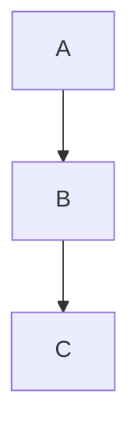

# Markdown Features

## Custom Containers

::: tip
14 container types: `tip`, `info`, `note`, `warning`, `danger`, `success`, `question`, `failure`, `bug`, `example`, `quote`, `abstract`, `details` (collapsible), `steps`.
:::

```md
::: tip Custom Title
This is a tip.
:::

::: details Click to expand
Hidden content.
:::
```

## Steps

```md
::: steps
1. Install the package
2. Configure `press.config.ts`
3. Run `domphy-press build`
:::
```

## Code Groups

```md
::: code-group
\`\`\`bash [npm]
npm install @domphy/press
\`\`\`
\`\`\`bash [pnpm]
pnpm add @domphy/press
\`\`\`
:::
```

## Line Highlighting

~~~md
```ts{2,4-6}
const a = 1  // normal
const b = 2  // highlighted
const c = 3  // normal
const d = 4  // highlighted
const e = 5  // highlighted
const f = 6  // highlighted
```
~~~

## Diff Annotations

~~~md
```ts
const a = 1  // [!code --]
const b = 2  // [!code ++]
```
~~~

## File Imports

```md
<<< ./path/to/file.ts

<<< @/packages/ui/src/patches/button.ts [button]
```

`@/` resolves to the parent of `srcDir`.

## Emoji

```md
:tada: :smile: :rocket:  →  🎉 😄 🚀
```

## Task Lists

```md
- [x] Done
- [ ] Todo
```

## Mark / Sub / Sup

```md
==highlighted==
H~2~O
E=mc^2^
```

## External Links

Links to `http://` and `https://` automatically get `target="_blank" rel="noopener noreferrer"` and a `↗` suffix in the CSS.

## Mermaid

Enable in config with `mermaid: true`:

````md

````

Requires `themeConfig.mermaid: true` in `press.config.ts`. Renders via CDN on the client.

## Frontmatter

```yaml
---
title: Custom Page Title
description: SEO meta description
layout: home     # or "doc" (default)
aside: false     # hide TOC
badge: { text: "New", type: "tip" }
---
```

## Home Page

```yaml
---
layout: home
hero:
  name: My Project
  text: The tagline
  tagline: Short description
  actions:
    - theme: brand
      text: Get Started
      link: /guide/
    - theme: alt
      text: View on GitHub
      link: https://github.com/…
features:
  - icon: ⚡
    title: Fast
    details: Description here.
---
```

## Include Files

```md
!!!include(./snippets/install.md)!!!
```
