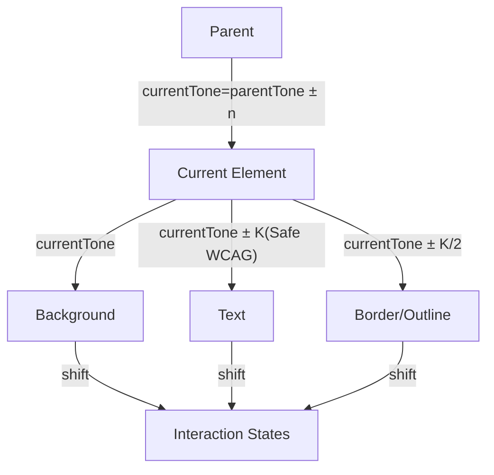

# Tone

These color conventions converge with IBM Carbon, Adobe Spectrum, and USWDS —
not by copying them, but because the contrast span K already existed implicitly in their palette structures.
It was never formally identified until derived from first principles. See [paper](https://github.com/chromametry/chromametry/blob/main/paper/paper.pdf) for full benchmark analysis.

Use `themeColor(listener, shift, color?)` from `@domphy/ui` — one function replaces all tons of color tokens and configurations.

## Contrast Span K

Each color family has N steps ordered by lightness. The contrast span K is the minimum step distance that guarantees WCAG 4.5:1 for all valid pairs:

```
K = N / 2
```

For a 12-step palette, `K = 6`. Any two colors separated by 6 steps are guaranteed accessible — no runtime contrast check needed. Benchmarking across 11 industry design systems confirms this ratio is consistent, though previously unrecognized.

**N should be an even number.** With an even N, there always exists at least one pair at any position that satisfies WCAG 4.5:1 — regardless of which step is the base. 12 is the recommended default: divisible by 2, 3, and 4, making shift values easy to reason about while coding (`K=6`, `K/2=3`, `K/3=2`, `K/4=~1.5→2`).

| #   | span | 0      | 1      | 2      | 3      | 4      | 5      | 6      | 7      | 8      | 9      | 10      | 11      |
| --- | ---- | ------ | ------ | ------ | ------ | ------ | ------ | ------ | ------ | ------ | ------ | ------- | ------- |
| 1   | 0–6  | **[0** | 1      | 2      | 3      | 4      | 5      | **6]** | 7      | 8      | 9      | 10      | 11      |
| 2   | 1–7  | 0      | **[1** | 2      | 3      | 4      | 5      | 6      | **7]** | 8      | 9      | 10      | 11      |
| 3   | 2–8  | 0      | 1      | **[2** | 3      | 4      | 5      | 6      | 7      | **8]** | 9      | 10      | 11      |
| 4   | 3–9  | 0      | 1      | 2      | **[3** | 4      | 5      | 6      | 7      | 8      | **9]** | 10      | 11      |
| 5   | 4–10 | 0      | 1      | 2      | 3      | **[4** | 5      | 6      | 7      | 8      | 9      | **10]** | 11      |
| 6   | 5–11 | 0      | 1      | 2      | 3      | 4      | **[5** | 6      | 7      | 8      | 9      | 10      | **11]** |

## Shift System

`themeColor(listener, shift, color?)` shift keys:

- `"shift-N"` — absolute step N (N = 0–11), resolves toward wider index range
- `"increase-N"` / `"decrease-N"` — relative from current context base
- `"inherit"` — current base color
- `"base"` — exact base index of the color family

`dataTone` accepts the same keys: `"shift-N"` | `"increase-N"` | `"decrease-N"` | `"inherit"` | `"base"`. Every combination is valid.

```typescript
backgroundColor: (l) => themeColor(l, "shift-0")   // base surface
color:           (l) => themeColor(l, "shift-6")    // text — WCAG 4.5:1 vs shift-0
outline:         (l) => `1px solid ${themeColor(l, "shift-3")}` // border ≈ K/2
```

Full element example — button w=1 with all color roles:

```typescript
const button = {
    button: "Buy",
    style: {
        // size
        fontSize:      (l) => themeSize(l, "inherit"),
        paddingBlock:  themeSpacing(1),
        paddingInline: themeSpacing(3),
        borderRadius:  themeSpacing(2),
        // color
        backgroundColor: (l) => themeColor(l, "inherit", "primary"),
        color:           (l) => themeColor(l, "shift-6", "primary"),  // WCAG guaranteed
        outline:         (l) => `1px solid ${themeColor(l, "shift-3", "primary")}`,
        // hover state
        "&:hover": {
            backgroundColor: (l) => themeColor(l, "increase-1", "primary"),
        },
        "&:focus-visible": {
            boxShadow: (l) => `0 0 0 2px ${themeColor(l, "shift-4", "primary")}`,
        },
    }
}
```

## Color Assignment

Each element derives its colors from a single base index `n` (inherited from parent via `dataTone`):



| Category                  | Shift                  | n=0 | n=1 | n=2 | n=3 | n=4 |
| ------------------------- | ---------------------- | --- | --- | --- | --- | --- |
| Background                | parent ± n             | 0   | 1   | 2   | 3   | 4   |
| Text                      | background + K         | 6   | 7   | 8   | 9   | 10  |
| Border / Outline          | background + K/2       | 3   | 4   | 5   | 6   | 7   |
| Hover                     | background + 2K/3      | 4   | 5   | 6   | 7   | 8   |
| Selected / Active / Focus | one of the above ± K/3 | 2   | 3   | 4   | 5   | 6   |

## State Tone

Interaction states (hover, focus, selected, active, pressed) are highly diverse — what changes and how much depends on the element type, design intent, and aesthetic. There is no single formula.

The general principle: **any state change should shift by K/3 to 2K/3** (2 to 4 steps for K=6). This range is:

- Large enough to be perceived as a meaningful change
- Small enough to remain within the same tone family without jumping to an unrelated lightness zone

```typescript
"&:hover": {
    backgroundColor: (l) => themeColor(l, "increase-1", "primary"), // +1 step — subtle
},
"&:active": {
    backgroundColor: (l) => themeColor(l, "increase-2", "primary"), // +2 steps — stronger
},
"&:focus-visible": {
    boxShadow: (l) => `0 0 0 2px ${themeColor(l, "shift-4", "primary")}`, // outline only
},
"&[aria-selected=true]": {
    color: (l) => themeColor(l, "shift-7", "primary"), // shift text instead of background
},
```

Whether the shift applies to `backgroundColor`, `color`, `outline`, or `boxShadow` is a design decision — the shift magnitude principle applies to whichever property changes.

`ThemeColor` = `"neutral"` | `"primary"` | `"secondary"` | `"info"` | `"success"` | `"warning"` | `"error"` | `"highlight"`

When no color is passed, `themeColor` inherits from the nearest `dataTone` context ancestor.

## Context Tone

`dataTone` propagates down the DOM tree — all descendants read the correct tone automatically, no prop drilling needed. This enables multi-theme on the same page with zero configuration, and works identically in SSR and CSR.

```typescript
// parent sets tone — shift within color family
{ div: [...], dataTone: "shift-1" }

// child reads automatically — no extra config
{ span: "Error", style: { color: (l) => themeColor(l, "shift-6", "error") } }
```

## Recommendation

**Only inline elements (leaf nodes with no children) should shift `backgroundColor` directly.** For all other elements, always set `backgroundColor` to `inherit` and use `dataTone` to control tone. This ensures all descendant elements remain context-aware and can resolve their own colors correctly.

```typescript
// ❌ setting backgroundColor directly on a container — breaks child context
{ div: [Button, Text], style: { backgroundColor: (l) => themeColor(l, "shift-1", "danger") } }

// ✅ use dataTone — children resolve their own colors automatically
{ div: [Button, Text], dataTone: "shift-1", style: { backgroundColor: (l) => themeColor(l, "inherit", "danger") } }

// ✅ inline leaf — no children, safe to shift directly
{ span: "Label", style: { backgroundColor: (l) => themeColor(l, "shift-1", "danger") } }
```

**Prefer `dataTone` over `dataTheme` in most cases.** Although `dataTheme` can be used at any container level, it should only be used when genuinely comparing or contrasting two different themes side by side (e.g., a live theme preview, a light/dark comparison panel). For all other cases — darkening a card, tinting a section — `dataTone` with a shift is simpler, lighter, and sufficient.

## Local Theme Override

`dataTheme` can be set at any level — not just the root. This allows a container to run a completely different theme from its surroundings, with all descendants inside adapting automatically.

```typescript
// light section inside a dark page
{ div: [Header, Body, Footer], dataTheme: "light" }

// dark card inside a light page
{ div: [Title, Content], dataTheme: "dark" }
```

Apply the theme by calling `themeApply()` on mount. If no `styleTag` is provided, it automatically creates one in `<head>`. Pass a `styleTag` only when theme isolation is needed (e.g., Shadow DOM):

```typescript
// standard usage — injects into <head> automatically
{ div: [...], dataTheme: "dark", _onMount: (node) => themeApply() }

// shadow DOM — isolated style tag
{ div: [...], dataTheme: "dark", _onMount: (node) => themeApply(myStyleTag) }
```

This works at any nesting depth — page, section, card, or any container level.

## Discussion

**Why is there no `dataColor` context?**

`dataTone` controls shift — a positional offset along the lightness axis. Color family (`"danger"`, `"primary"`, etc.) is passed explicitly as the third argument to `themeColor` because a single element typically uses multiple color families simultaneously:

```typescript
// one element, multiple colors — no single "context color" makes sense
style: {
    backgroundColor: (l) => themeColor(l, "inherit", "neutral"),
    color:           (l) => themeColor(l, "shift-6", "neutral"),
    outline:         (l) => `1px solid ${themeColor(l, "shift-3", "primary")}`, // different family
    boxShadow:       (l) => `0 0 0 2px ${themeColor(l, "shift-4", "danger")}`,  // another family
}
```

A `dataColor: "danger"` context would only cover one of these — the rest still need explicit color arguments. There is no meaningful default. Color family is therefore always explicit, while shift is contextual.

Color also has no natural concept of "shift" the way lightness does — shifting a hue family means changing identity, not intensity. `dataTone` shifts position within a family; there is no equivalent operation across families.

---

UI color has the same two unsolved problems as sizing: deciding what values to use, and keeping them consistent across variants, states, and themes. Token-based systems require manual contrast verification and per-theme overrides.

Tone solves both. Every color of every element is fully determined by one shift value derived from K, and one root `dataTone` context. Change `dataTone` and the entire subtree — background, text, border, all interaction states — adapts automatically. WCAG 4.5:1 is guaranteed by palette structure, not by runtime checks. Multi-theme on the same page requires no configuration — just different `dataTheme` at different roots.

